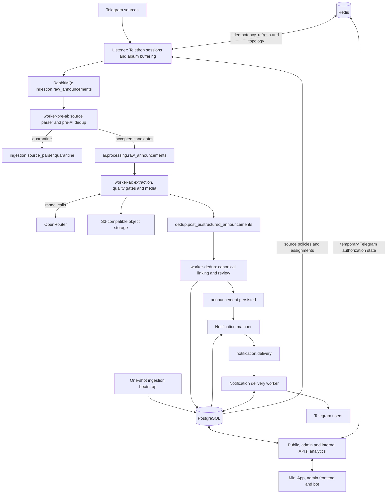

# EstateFlow

EstateFlow is an event-driven real-estate aggregation platform for Uzbekistan, built with Python, PostgreSQL, RabbitMQ, Redis, and Telegram. It combines source-specific parsing, AI-assisted extraction, deduplication, and asynchronous delivery, with an emphasis on database integrity, explicit service boundaries, and observable processing decisions.

## Overview

Telegram listings arrive as unstructured messages, edits, forwards, and albums. EstateFlow converts them into structured candidates while retaining source provenance. Cheap duplicate checks precede AI calls; structured matching then links repeated listings to canonical announcements or sends ambiguous cases to review. PostgreSQL stores domain state, while separate queue workers handle ingestion, extraction, persistence, and notifications. Search, administration, analytics, a Telegram bot, and web interfaces use the shared backend.

## Architecture



Queue labels are the actual routing keys on the default `estateflow.events` exchange. Each stage has a corresponding `.dlq`; parser quarantine is a separate retained branch with no automatic consumer. See [architecture and evidence](docs/architecture.md).

## Processing Pipeline

1. The standalone ingestion deployment runs migration and source bootstrap before listener startup. The listener resolves source parser bindings and publishes versioned raw events with media references.
2. The pre-AI worker applies source policies, emits zero or more candidates, quarantines uncertain input, and filters high-confidence duplicates.
3. The AI worker calls the configured OpenRouter model sequence, normalizes results, checks listing/rental quality, and handles media downloads and storage. Missing required fields can trigger a fallback model or manual review.
4. Post-AI deduplication compares structured signals, persists canonical/child announcements and review decisions, and publishes eligible announcement events.
5. The notification matcher evaluates saved filters; a separate delivery worker records attempts and calls Telegram.

## Core Components

| Component | Responsibility |
| --- | --- |
| Listener / ingestion | Account/session coordination, source configuration, message lifecycle and albums |
| RabbitMQ | Durable stage handoffs, acknowledgements, bounded retries and dead letters |
| Pre-AI dedup | Exact/near-text, forward-origin and available media signals |
| Source parsing / AI | Versioned recipes, candidate fan-out, structured extraction and quality gates |
| Media | Format/size checks, hashes, download resolution and S3-compatible uploads |
| Post-AI dedup / PostgreSQL | Canonical linking, persistence, manual review and decision audit |
| APIs and applications | Search, saved filters, admin operations, internal callbacks, bot and web surfaces |
| Notifications | Matching, delivery state and attempt records |
| Redis | Ingestion idempotency, listener refresh/topology and temporary authorization state |

Media handling has a known limitation: the current byte-limiting routine is not an image encoder. See [operations](docs/operations.md) before relying on resizing or compression.

## Database & Data Model

PostgreSQL is the system of record. SQLAlchemy models and repositories coexist with asyncpg-backed deduplication repositories; Alembic owns the current schema. Main entities include sources and listener assignments, users, announcements and media, saved filters, notification jobs/attempts, manual reviews, merge audits, feature flags, and analytics events.

Unique idempotency keys and a partial source-message identity index protect persistence boundaries. Partial indexes target active canonical search and dedup candidates; GIN indexes cover audience tags. Parent/child links retain repeated-source provenance. Feature-flag updates use explicit versions and optimistic concurrency checks; this is not universal versioning for every table. See [database migrations](docs/database-migrations.md).

## Source Parsing

The current implementation includes `single_listing`, `digest_blocks`, `album_caption`, and `mixed_feed` recipes with per-source key, version, validated JSON configuration, and `active` / `shadow` / `disabled` modes. Candidate identity and raw-message provenance survive AI processing and persistence. Generic compatibility handling, durable quarantine, admin preview, and labeled replay evaluation are implemented. Cross-message parser buffering is not persistent and currently fails open. See [source parser policies](docs/source_parser_policies.md).

## Reliability & Queue Semantics

RabbitMQ declares durable direct exchanges and queues and publishes persistent messages. Consumers acknowledge completed handling; raised errors trigger immediate retry publication before acknowledgement, up to `RABBITMQ_MAX_RETRIES`, then rejection to the stage DLQ. Malformed broker payloads are rejected without requeue. Idempotency checks and database constraints reduce replay duplication, but database writes and event publication are separate operations: there is no transactional outbox or end-to-end exactly-once guarantee. Some dedup/processing caches are process-local. See [operations](docs/operations.md) for recovery limits.

## Deployment

The base Compose stack runs Redis, RabbitMQ, and four ingestion processes; the `applications` profile adds APIs, frontends, the bot, and notification workers. PostgreSQL is supplied separately: local tooling starts a standalone PostgreSQL 16 container; the VPS example targets PostgreSQL on the host. Configurable database host/port also allow external endpoints, but managed-service TLS/CA configuration is not provided by the current templates.

`docker-compose.production.yml` overlays the base stack. `docker-compose.ingestion.yml` is a standalone, port-free ingestion deployment with migration/bootstrap gates. `docker-compose.vps-apps.yml` joins an existing ingestion backbone and an external `web` network. See [deployment](docs/deployment.md).

## Security / Configuration

Keep database/broker passwords, Telegram credentials and session files, application/admin tokens, OpenRouter keys, and object-storage keys outside Git. Examples contain placeholders or explicit local test defaults. Production settings validate role-dependent required values, disable debug mode, and require RabbitMQ for queue roles; presence validation does not establish credential strength or validity.

Service Dockerfiles use a non-root application user. Hardened Compose configurations apply read-only application filesystems, temporary writable directories, dropped capabilities, and `no-new-privileges`. Standalone ingestion publishes no ports; base development ports bind to loopback. Expose public HTTP through a configured TLS proxy and keep admin/internal services private. See [operations](docs/operations.md).

## Testing

Pytest covers unit, integration, and end-to-end flows; most integration/E2E cases use deterministic in-memory adapters. External sockets are blocked by default, with explicit smoke-test opt-ins. Docker-backed tests exercise disposable PostgreSQL migration/runtime paths; RabbitMQ acknowledgement/retry/DLQ testing uses `RABBITMQ_TEST_URL`. CI runs Ruff, MyPy, and pytest with a RabbitMQ service. Skipped infrastructure checks are not evidence of database or broker validation. See [testing](docs/testing.md).

## Running Locally

For a credential-free first check (Python 3.12+, PowerShell):

```powershell
python -m venv .venv
.venv\Scripts\python.exe -m pip install -e ".[dev]"
.venv\Scripts\python.exe scripts\smoke_check.py
.venv\Scripts\python.exe -m pytest
.venv\Scripts\python.exe scripts\evaluate_source_parser.py
```

For database-backed development, follow [local development](docs/local_development.md): configure `.env`, start standalone PostgreSQL and Compose infrastructure, apply Alembic migrations, then start the desired services. Live ingestion additionally needs authorized Telegram sessions, enabled sources, AI credentials, and object storage.

## Project Status

The ingestion and processing pipeline is the primary production-focused implementation path. Additional user-facing application surfaces continue to evolve. The repository includes implemented backend flows and deterministic regression coverage; operational rollout still requires infrastructure verification and the limitations documented in the runbooks to be addressed.

## Repository Structure

| Path | Contents |
| --- | --- |
| `src/estateflow/` | Domain services, adapters, contracts, models, repositories and runtime |
| `services/`, `apps/` | Worker/bootstrap and application entrypoints |
| `alembic/`, `migrations/` | Current migration chain and legacy SQL bridge references |
| `tests/`, `scripts/`, `.github/` | Regression fixtures, local tooling and CI |
| `frontend/`, `admin-frontend/` | Mini App and administration interfaces |
| `deploy/`, `Dockerfile*`, `docker-compose*.yml` | Image boundaries and deployment templates |
| `docs/` | Architecture, contracts and operational runbooks |

## Engineering Decisions

- Separate workers isolate stage dependencies and deployment lifecycles, at the cost of more queues and operational coordination.
- Pre-AI filtering limits unnecessary model calls; post-AI matching uses richer evidence and preserves ambiguous cases for review.
- Versioned source policies support conservative rollout and deterministic replay without hardcoding channel logic into the listener.
- PostgreSQL enforces durable identity and domain constraints; Redis holds coordination state and RabbitMQ carries work.
- Alembic upgrades are explicit release steps. Legacy databases require schema inspection before any reviewed stamp operation.

## License

[MIT](LICENSE).
