# 1. Introduction & Vision

**Document Version:** 2.0.0  
**Status:** Draft (Production Architecture)  
**Project Name:** Real Estate Super Aggregator  
**Last Updated:** YYYY-MM-DD

---

# 1.1 Introduction

Real Estate Super Aggregator — bu Telegram kanallari, guruhlar hamda ko‘chmas mulk e'lonlari joylashtiriladigan veb-saytlardan ma'lumotlarni avtomatik yig‘ish, sun'iy intellekt (AI/LLM) yordamida strukturaga keltirish, dublikatlarni aniqlash va foydalanuvchilarga yagona platforma orqali taqdim etishga mo‘ljallangan tizimdir.

Bugungi kunda ko‘chmas mulk bozori juda fragmentatsiyalashgan. Bir xil kvartira yoki uy bir vaqtning o‘zida bir nechta Telegram kanallarida, Facebook guruhlarida, OLX kabi platformalarda yoki boshqa mahalliy saytlarda e'lon qilinadi. Natijada foydalanuvchi bir xil e'lonni qayta-qayta ko‘radi, eng yangi e'lonlarni qo‘lda qidirishga majbur bo‘ladi va ko‘p vaqt sarflaydi.

Mazkur loyiha ushbu muammoni markazlashtirilgan platforma orqali hal qiladi. Tizim barcha manbalardan e'lonlarni yig‘adi, AI yordamida ularni standart formatga keltiradi, dublikatlarni aniqlaydi va foydalanuvchilarga faqat noyob, tartiblangan va filtrlangan e'lonlarni taqdim etadi.

Loyiha dastlab Telegram Bot orqali ishlaydi, ammo arxitektura kelajakda Web Dashboard, Mobile Application va Public API kabi yangi interfeyslarni qo‘llab-quvvatlay oladigan tarzda ishlab chiqiladi.

---

# 1.2 Problem Statement

Hozirgi ko‘chmas mulk bozorida bir nechta muhim muammolar mavjud.

## Fragmented Sources

Ko‘chmas mulk e'lonlari turli platformalarda tarqalgan bo‘ladi.

Misollar:

- Telegram kanallari
- Telegram guruhlari
- OLX
- UyBor
- Mahalliy agentlik saytlari
- Facebook Marketplace
- Boshqa ko‘chmas mulk portallari

Foydalanuvchi barcha platformalarni alohida kuzatishga majbur bo‘ladi.

---

## Duplicate Listings

Bitta kvartira yoki uy ko‘pincha:

- egasi tomonidan,
- makler tomonidan,
- bir nechta agentlik tomonidan,
- turli Telegram kanallarida

bir necha marta e'lon qilinadi.

Natijada foydalanuvchi:

- vaqt yo‘qotadi,
- bir xil e'lonlarni ko‘radi,
- haqiqiy yangi e'lonlarni topishi qiyinlashadi.

---

## Unstructured Information

Telegram postlari odatda erkin formatda yoziladi.

Masalan:

> Yunusobod 9-kvartal  
> 2 xona  
> 65 kv  
> 5/9  
> Remont yaxshi  
> 520$

yoki

> 2 xonali kvartira ijaraga beriladi. Chilonzor. Makler emas.

yoki

> Срочно сдаётся квартира.

Har bir kanal o‘z uslubida yozadi.

Natijada oddiy parser ishlatish qiyin.

---

## Manual Searching

Foydalanuvchi har kuni:

- o‘nlab Telegram kanallarini ochadi;
- yangi postlarni tekshiradi;
- narxlarni solishtiradi;
- dublikatlarni ajratadi.

Bu jarayon juda ko‘p vaqt talab qiladi.

---

## No Personalized Notifications

Aksariyat Telegram kanallarida barcha foydalanuvchilarga bir xil post yuboriladi.

Masalan:

Foydalanuvchi faqat:

- Yunusobod,
- 2 xonali,
- 600$ gacha

kvartiralarni qidirayotgan bo‘lsa ham, u barcha e'lonlarni ko‘rishga majbur bo‘ladi.

---

# 1.3 Proposed Solution

Mazkur loyiha yuqoridagi muammolarni quyidagi bosqichlar orqali hal qiladi.

## Step 1 — Data Collection

Tizim:

- Telegram kanallarini kuzatadi.
- Telegram guruhlarini kuzatadi.
- Veb-saytlarni periodik tekshiradi.

Har bir yangi e'lon avtomatik yig‘iladi.

---

## Step 2 — AI Processing

Yig‘ilgan post AI modeliga yuboriladi.

AI quyidagi ma'lumotlarni ajratib oladi:

- narx
- xonalar soni
- maydon
- qavat
- manzil
- telefon
- ta'mirlash holati
- egasi yoki makler
- ijara turi
- qo‘shimcha tavsif

Natijada barcha postlar yagona standart JSON formatiga o'tkaziladi.

---

## Step 3 — Deduplication

Yangi e'lon quyidagilar orqali tekshiriladi:

- telefon raqami
- rasm o‘xshashligi
- matn o‘xshashligi
- embedding similarity
- manzil
- parametrlar

Agar e'lon avval mavjud bo‘lsa, u yangi obyekt sifatida emas, balki mavjud obyektning yangi manbasi sifatida saqlanadi.

---

## Step 4 — Search & Filtering

Foydalanuvchi quyidagilar bo‘yicha qidiruv amalga oshirishi mumkin:

- narx
- tuman
- metro
- xonalar soni
- maydon
- qavat
- remont
- makler/egasi
- balkon
- mebel
- parking
- yangi qurilish
- boshqa parametrlar

---

## Step 5 — Notification

Har bir foydalanuvchi o‘z filtrlarini saqlaydi.

Masalan:

- Yunusobod
- 2 xona
- 600$ gacha

Mos e'lon kelishi bilan tizim avtomatik xabar yuboradi.

---

# 1.4 Vision

Loyihaning uzoq muddatli maqsadi oddiy Telegram bot yaratish emas.

Asosiy maqsad — O‘zbekiston ko‘chmas mulk bozori uchun markazlashtirilgan ma'lumotlar platformasini yaratish.

Kelajakda tizim:

- Real-time analytics
- Narxlar statistikasi
- Hududlar kesimida tahlillar
- AI tavsiyalari
- Investitsion imkoniyatlarni aniqlash
- Bozor trendlarini kuzatish

kabi imkoniyatlarni ham taqdim etadi.

Platforma asta-sekin quyidagi bosqichlarga rivojlanadi:

1. Telegram Bot
2. Web Platform
3. Mobile Application
4. Public API
5. Analytics Dashboard
6. AI Recommendation System

---

# 1.5 Target Audience

Platformadan foydalanadigan asosiy foydalanuvchilar quyidagilar.

| User Type | Description |
|------------|-------------|
| Tenant | Ijaraga uy qidirayotgan foydalanuvchilar |
| Buyer | Sotib olish uchun uy izlayotgan foydalanuvchilar |
| Property Owner | O'z e'lonlarini kuzatmoqchi bo'lgan mulk egalari |
| Real Estate Agents | Agentlik va maklerlar |
| Investors | Investitsiya uchun obyekt izlovchilar |
| Administrators | Platformani boshqaruvchilar |

---

# 1.6 Project Goals

Loyiha quyidagi asosiy maqsadlarga erishishni ko‘zlaydi.

### Functional Goals

- Telegram va saytlarni avtomatik kuzatish.
- AI yordamida ma'lumotlarni standartlashtirish.
- Dublikatlarni aniqlash.
- Kuchli qidiruv tizimi.
- Mos e'lonlar bo‘yicha bildirishnomalar.
- Administrator boshqaruvi.

### Technical Goals

- Asinxron ishlash.
- Horizontal scalability.
- Modular Architecture.
- Event-Driven Processing.
- Production-ready deployment.
- Fault tolerance.
- High availability.

### Business Goals

- Eng tezkor e'lonlar bazasi.
- Eng kam dublikatlar.
- Foydalanuvchiga moslashtirilgan tavsiyalar.
- Premium qidiruv imkoniyatlari.
- API orqali uchinchi tomon integratsiyasi.

---

# 1.7 Success Criteria

Loyiha muvaffaqiyatli hisoblanishi uchun quyidagi mezonlarga erishilishi kerak.

| Metric | Target |
|---------|--------|
| New Listing Processing Time | < 30 seconds |
| Duplicate Detection Accuracy | >95% |
| AI Parsing Accuracy | >90% |
| System Availability | 99.9% |
| Failed Parsing Rate | <2% |
| Average Search Response | <300 ms |
| Notification Delay | <10 seconds |

---

# 1.8 Scope

## In Scope

- Telegram monitoring
- Website scraping
- AI parsing
- OCR
- Image analysis
- Deduplication
- Search
- Saved searches
- Notifications
- Admin dashboard
- REST API
- Docker deployment

## Out of Scope (Current Version)

Quyidagi funksiyalar dastlabki versiyaga kirmaydi va keyingi bosqichlarda qo‘shilishi rejalashtiriladi.

- To‘lov tizimlari
- Mobil ilovalar
- Xarita orqali qidiruv
- AI Chat Assistant
- Avtomatik narx baholash
- CRM tizimi
- Reklama platformasi
- Broker kabineti
- Ko‘p davlatlarni qo‘llab-quvvatlash

---

# 2. Functional Requirements

## 2.1 Overview

Ushbu bo'lim tizimning bajarishi kerak bo'lgan barcha funksional talablarni tavsiflaydi.

Har bir talab tizim implementatsiyasi davomida bajarilishi shart bo'lgan biznes talab hisoblanadi.

Functional Requirements quyidagi modullar bo'yicha guruhlangan:

- Source Management
- Data Collection
- AI Processing
- Data Normalization
- Deduplication
- Search Engine
- Notification System
- User Management
- Telegram Bot
- Admin Panel
- Monitoring

---

# 2.2 Source Management

## FR-001 — Source Registration

Administrator yangi ma'lumot manbasini tizimga qo'sha olishi kerak.

Qo'llab-quvvatlanadigan manbalar:

- Telegram Channel
- Telegram Group
- Website

Har bir manba quyidagi ma'lumotlarga ega bo'ladi.

| Field | Description |
|---------|------------|
| Name | Manba nomi |
| Type | Telegram yoki Website |
| Identifier | Username yoki URL |
| Status | Active / Disabled |
| Parser Strategy | Adapter nomi |
| Last Check | Oxirgi tekshiruv vaqti |

---

## FR-002 — Enable / Disable Sources

Administrator istalgan manbani vaqtinchalik o'chirib qo'yishi mumkin.

Disabled manbadan yangi e'lonlar yig'ilmaydi.

Oldingi ma'lumotlar bazada saqlanib qoladi.

---

## FR-003 — Source Health Monitoring

Har bir source uchun quyidagilar kuzatiladi.

- Last Success
- Last Failure
- Failure Count
- Parsing Status
- Last Error
- Average Response Time

Agar Failure Count chegaradan oshsa, administrator ogohlantiriladi.

---

# 2.3 Telegram Listener

## FR-004 — Real-Time Listening

Tizim Telethon orqali Telegram kanallarini real vaqt rejimida kuzatadi.

Yangi post paydo bo'lishi bilan Event Queue'ga yuboriladi.

---

## FR-005 — Album Support

Telegram media group (album) quyidagi elementlarni bitta e'lon sifatida yig'ishi kerak.

Masalan

```
Photo
Photo
Photo
Caption
```

natijada bitta Listing hosil bo'ladi.

---

## FR-006 — Message Editing

Agar Telegram posti tahrirlansa:

- matn yangilanadi;
- AI qayta ishlatiladi;
- Deduplication qayta tekshiriladi;
- foydalanuvchilarga zarurat bo'lsa update yuboriladi.

---

## FR-007 — Message Deletion

Agar post o'chirilsa:

Announcement holati

```
ARCHIVED
```

ga o'tkaziladi.

---

# 2.4 Website Scraping

## FR-008 — Scheduled Crawling

Website adapterlari periodik ishlaydi.

Standart interval:

```
10 daqiqa
```

Har bir sayt uchun interval alohida sozlanishi mumkin.

---

## FR-009 — Incremental Crawling

Har safar butun sayt emas,

faqat yangi e'lonlar tekshiriladi.

---

## FR-010 — Dynamic Websites

JavaScript ishlatadigan saytlar

Playwright orqali yuklanadi.

---

## FR-011 — Retry Policy

Agar sayt javob bermasa

Worker quyidagicha retry qiladi.

```
1 min

5 min

15 min

30 min

1 hour
```

---

# 2.5 AI Processing

## FR-012 — Text Extraction

AI quyidagilarni ajratib olishi kerak.

- Price
- Currency
- Rooms
- Floor
- Total Floors
- Area
- District
- Address
- Phone
- Owner / Agent
- Description
- Building Type
- Renovation
- Furniture

---

## FR-013 — Vision Analysis

Rasmlardan quyidagilar aniqlanishi mumkin.

- Kitchen

- Bathroom

- Balcony

- Building exterior

- Interior condition

- Furniture

- Parking

---

## FR-014 — OCR

AI rasm ichidagi matnni ham o'qiy olishi kerak.

Misol

```
+998901234567
```

yoki

```
550$
```

---

## FR-015 — Confidence Score

Har bir AI response

Confidence Score qaytaradi.

```
0.00

...

1.00
```

Confidence past bo'lsa

Admin Review Queue'ga yuboriladi.

---

## FR-016 — Prompt Versioning

Har bir AI request uchun quyidagilar saqlanadi.

- Prompt Version

- Model Name

- Temperature

- Processing Time

- Token Usage

---

# 2.6 Data Normalization

## FR-017 — Currency Normalization

Narxlar yagona formatda saqlanadi.

Masalan

```
600$

7 mln

700 USD

700$
```

hammasi standart ko'rinishga o'tkaziladi.

---

## FR-018 — Phone Normalization

Telefonlar

```
90 1234567

+998901234567

998901234567
```

ko'rinishidan qat'i nazar

bir xil formatda saqlanadi.

---

## FR-019 — District Normalization

Masalan

```
Yunusobod

Юнусабад

yunusabad
```

hammasi

```
Yunusobod
```

ko'rinishiga o'tkaziladi.

---

# 2.7 Deduplication

## FR-020 — Phone Matching

Telefon raqami mos bo'lsa

Duplicate Score oshiriladi.

---

## FR-021 — Image Matching

pHash orqali

rasmlar o'xshashligi tekshiriladi.

---

## FR-022 — Semantic Matching

Embedding Similarity

hisoblanadi.

Threshold

```
0.90
```

dan yuqori bo'lsa

duplicate ehtimoli mavjud.

---

## FR-023 — Address Matching

AI yordamida

manzil o'xshashligi tekshiriladi.

---

## FR-024 — Duplicate Grouping

Duplicate topilsa

yangi Announcement yaratilmaydi.

Source

mavjud Listing'ga biriktiriladi.

---

# 2.8 Search Engine

## FR-025 — Full Text Search

Foydalanuvchi

oddiy matn orqali qidira oladi.

Masalan

```
Yunusobod 2 xona 600$
```

---

## FR-026 — Advanced Filters

Quyidagi filterlar mavjud bo'ladi.

- Price

- Rooms

- Area

- Floor

- District

- Metro

- Building Type

- Owner

- Agent

- Furniture

- Balcony

- Parking

- Renovation

---

## FR-027 — Sorting

Natijalar

quyidagicha tartiblanadi.

- Newest

- Cheapest

- Most Expensive

- Largest Area

- Recommended

---

# 2.9 Saved Searches

## FR-028 — Create Search

Foydalanuvchi

bir nechta filter saqlashi mumkin.

---

## FR-029 — Update Search

Saqlangan filter tahrir qilinadi.

---

## FR-030 — Delete Search

Filter o'chiriladi.

---

# 2.10 Notification System

## FR-031 — Match Detection

Yangi e'lon

Saved Search bilan mos kelsa

Notification Queue'ga yuboriladi.

---

## FR-032 — Telegram Notification

Bot foydalanuvchiga

mos e'lonni yuboradi.

---

## FR-033 — Duplicate Notification Prevention

Bir xil e'lon

bir foydalanuvchiga

ikki marta yuborilmaydi.

---

# 2.11 Favorites

## FR-034 — Add Favorite

Foydalanuvchi

e'lonni saqlab qo'yishi mumkin.

---

## FR-035 — Remove Favorite

Saqlangan e'lon o'chiriladi.

---

# 2.12 User Management

## FR-036 — Registration

Telegram foydalanuvchisi

birinchi marta botni ishga tushirganda

bazaga qo'shiladi.

---

## FR-037 — Premium Status

Premium foydalanuvchilar

qo'shimcha imkoniyatlarga ega bo'ladi.

---

# 2.13 Telegram Bot

## FR-038 — Main Menu

Bot quyidagi bo'limlarni taqdim etadi.

- Search

- Saved Searches

- Favorites

- Notifications

- Settings

- Help

---

## FR-039 — Inline Pagination

Ko'p natijalar

pagination bilan ko'rsatiladi.

---

## FR-040 — Search Wizard

Bot foydalanuvchini

bosqichma-bosqich filter tanlashga yo'naltiradi.

---

# 2.14 Admin Panel

## FR-041 — Dashboard

Dashboard quyidagilarni ko'rsatadi.

- Active Sources

- Total Listings

- Queue Size

- Failed Jobs

- Duplicate Rate

- AI Cost

---

## FR-042 — Manual Review

Confidence past bo'lgan e'lonlar

qo'lda tekshiriladi.

---

## FR-043 — Retry Jobs

Failed Processing

qayta ishga tushiriladi.

---

## FR-044 — Source Management

Admin

Source qo'shadi

tahrir qiladi

o'chiradi.

---

# 2.15 Audit & History

## FR-045 — History

Har bir e'lonning

o'zgarish tarixi saqlanadi.

---

## FR-046 — Audit Log

Administrator bajargan barcha amallar log qilinadi.

---

# 2.16 Functional Requirements Summary

| Module | Requirement Count |
|----------|------------------:|
| Source Management | 3 |
| Telegram Listener | 4 |
| Website Scraper | 4 |
| AI Processing | 5 |
| Data Normalization | 3 |
| Deduplication | 5 |
| Search Engine | 3 |
| Saved Searches | 3 |
| Notifications | 3 |
| Favorites | 2 |
| User Management | 2 |
| Telegram Bot | 3 |
| Admin Panel | 4 |
| Audit | 2 |

**Total Functional Requirements:** **46**

---

# 3. Non-Functional Requirements

## 3.1 Overview

Ushbu bo'lim tizimning funksional imkoniyatlaridan tashqari bajarilishi kerak bo'lgan texnik talablarni tavsiflaydi.

Non-Functional Requirements (NFR) tizimning:

- ishlash tezligi,
- barqarorligi,
- xavfsizligi,
- kengayuvchanligi,
- monitoringi,
- xizmat ko'rsatish qulayligi

kabi jihatlarini belgilaydi.

---

# 3.2 Performance Requirements

## NFR-001 — Event Processing Time

Telegram yoki Website orqali kelgan yangi e'lon AI tomonidan qayta ishlanib, bazaga yozilishi quyidagi vaqt ichida yakunlanishi kerak.

| Operation | Target |
|-----------|--------|
| Telegram Event → Queue | < 500 ms |
| Queue → Worker Start | < 2 sec |
| AI Parsing | < 15 sec |
| Deduplication | < 2 sec |
| Database Save | < 500 ms |
| Total Processing Time | **< 30 sec** |

---

## NFR-002 — Search Response Time

Qidiruv natijalari foydalanuvchiga tez qaytarilishi kerak.

| Query Type | Target |
|------------|--------|
| Simple Search | <150 ms |
| Advanced Filter | <300 ms |
| Full Text Search | <500 ms |

---

## NFR-003 — Notification Delay

Mos e'lon aniqlangandan keyin foydalanuvchiga yuborilish vaqti:

**Target:** 10 soniyadan kam.

---

# 3.3 Scalability

## NFR-004 — Horizontal Scalability

Tizim quyidagi komponentlarni alohida ko'paytirish imkonini berishi kerak.

- API
- Worker
- Listener
- Scraper

Masalan

```
Worker x1

↓

Worker x10
```

kodni o'zgartirmasdan ishlashi kerak.

---

## NFR-005 — Queue Based Architecture

AI Processing hech qachon Telegram Listener'ni bloklamasligi kerak.

Shu sababli barcha og'ir vazifalar Queue orqali bajariladi.

```
Listener

↓

Redis Queue

↓

Worker

↓

Database
```

---

## NFR-006 — Large Source Support

Tizim kamida:

- 500 Telegram kanal
- 100 Website
- 1 million Announcement

bilan ishlay olishi kerak.

---

# 3.4 Availability

## NFR-007 — High Availability

Yillik xizmat ko'rsatish darajasi:

```
99.9%
```

bo'lishi maqsad qilinadi.

---

## NFR-008 — Failure Isolation

Bitta kanal ishlamay qolsa,

qolgan kanallar ishlashda davom etishi kerak.

---

## NFR-009 — Graceful Degradation

AI Service vaqtinchalik ishlamasa:

- event yo'qolmaydi;
- Queue'da saqlanadi;
- keyinchalik qayta ishlanadi.

---

# 3.5 Reliability

## NFR-010 — Retry Policy

Har qanday tashqi servis uchun retry ishlatiladi.

Misollar:

- Gemini
- OpenAI
- Telegram API
- Website

Retry ketma-ketligi:

```
1 min

5 min

15 min

30 min

1 hour
```

---

## NFR-011 — Dead Letter Queue

Retry muvaffaqiyatsiz tugasa

event Dead Letter Queue'ga yuboriladi.

Administrator keyinchalik qayta ishga tushirishi mumkin.

---

## NFR-012 — No Data Loss

Redis yoki Worker qayta ishga tushganda

Queue'dagi eventlar yo'qolmasligi kerak.

---

# 3.6 Security

## NFR-013 — Secret Management

Hech qanday API Key

kod ichida yozilmasligi kerak.

Faqat

```
.env
```

yoki Secret Manager orqali boshqariladi.

---

## NFR-014 — SQL Injection Protection

Barcha Database Query

ORM orqali bajariladi.

Raw SQL faqat zarur hollarda ishlatiladi.

---

## NFR-015 — Prompt Injection Protection

AI'ga yuboriladigan matn

oldindan sanitizatsiya qilinadi.

Prompt foydalanuvchi matni bilan buzilmasligi kerak.

---

## NFR-016 — Rate Limiting

REST API

Telegram Bot

Admin Panel

uchun Rate Limit qo'llaniladi.

---

## NFR-017 — Authentication

Administrator API

JWT yoki Session Authentication orqali himoyalanadi.

---

# 3.7 Maintainability

## NFR-018 — Modular Design

Har bir modul mustaqil rivojlantirilishi kerak.

Misol

```
Parser

Deduplication

Notification

Search
```

bir-biridan maksimal darajada mustaqil bo'ladi.

---

## NFR-019 — Adapter Pattern

Har bir Telegram kanal

alohida Adapter orqali ishlaydi.

Yangi kanal qo'shish

mavjud kodni o'zgartirmasligi kerak.

---

## NFR-020 — Clean Architecture

Business Logic

Infrastructure

Presentation

qatlamlari bir-biridan ajratiladi.

---

# 3.8 Observability

## NFR-021 — Structured Logging

Har bir muhim event log qilinadi.

Misollar

- New Message

- AI Started

- AI Finished

- Duplicate Found

- Notification Sent

---

## NFR-022 — Metrics

Quyidagi metrikalar yig'iladi.

- Total Listings

- AI Requests

- Failed Jobs

- Queue Size

- Duplicate Rate

- Search Requests

- Notification Count

---

## NFR-023 — Error Tracking

Kutilmagan xatolar

Sentry kabi tizimga yuboriladi.

---

# 3.9 Monitoring

## NFR-024 — Health Check

Har bir servis

```
/health
```

endpointiga ega bo'ladi.

Tekshiriladi:

- Database
- Redis
- Queue
- AI Provider
- Telegram

---

## NFR-025 — Dashboard

Monitoring Dashboard

quyidagilarni ko'rsatadi.

- CPU

- RAM

- Queue

- Worker

- AI Cost

- Response Time

---

# 3.10 Database Requirements

## NFR-026 — Indexing

Quyidagi ustunlar indekslanadi.

- phone

- district

- rooms

- price

- created_at

- source_id

---

## NFR-027 — Full Text Search

Description ustuni

GIN Index orqali indekslanadi.

---

## NFR-028 — Database Migration

Schema o'zgarishlari

faqat Alembic orqali amalga oshiriladi.

---

# 3.11 Deployment

## NFR-029 — Docker

Barcha servislar Docker Container sifatida ishlaydi.

---

## NFR-030 — Environment Isolation

Development

Testing

Production

konfiguratsiyalari alohida bo'ladi.

---

## NFR-031 — Zero Downtime Deployment

Yangi versiya chiqarilganda

foydalanuvchilar xizmat uzilishini sezmasligi kerak.

---

# 3.12 Backup & Recovery

## NFR-032 — Database Backup

Har kuni avtomatik Backup olinadi.

---

## NFR-033 — Restore

Backup orqali

tizim to'liq tiklanishi mumkin bo'lishi kerak.

---

# 3.13 Compatibility

## NFR-034 — Operating Systems

Tizim quyidagilarda ishlashi kerak.

- Linux

- Docker

- Ubuntu Server

---

## NFR-035 — Supported Browsers

Admin Panel

Chrome

Firefox

Edge

brauzerlarini qo'llab-quvvatlaydi.

---

# 3.14 Quality Attributes Summary

| Attribute | Target |
|------------|--------|
| Availability | 99.9% |
| Processing Time | <30 sec |
| Search Response | <300 ms |
| Notification Delay | <10 sec |
| Duplicate Accuracy | >95% |
| AI Accuracy | >90% |
| Horizontal Scaling | Supported |
| Automatic Retry | Yes |
| Dead Letter Queue | Yes |
| Docker Deployment | Required |
| Structured Logging | Required |
| Monitoring | Required |

---

# 3.15 Acceptance Criteria

Quyidagi shartlar bajarilganda tizim Non-Functional Requirements talablariga javob beradi.

- Yangi e'lon 30 soniyadan kam vaqt ichida qayta ishlanadi.
- Tizim kamida 500 ta Telegram kanalini kuzata oladi.
- Bir milliondan ortiq e'lon bilan ishlay oladi.
- Qidiruv javobi 300 ms dan kam.
- AI yoki Telegram servisidagi vaqtinchalik nosozliklar tizimni to'xtatmaydi.
- Har bir servis monitoring va health check endpointiga ega.
- Barcha loglar strukturalangan holda saqlanadi.
- Deployment Docker orqali amalga oshiriladi.
- Ma'lumotlar muntazam zaxiralanadi va tiklash mexanizmi mavjud.

---

# 4. System Architecture

## 4.1 High-Level Architecture

### 4.1.1 Overview

Loyiha **Modular Monolith** va **Event-Driven Architecture** tamoyillari asosida quriladi.

Barcha biznes mantiqi bitta kod bazasida joylashadi, ammo modullar bir-biridan mustaqil ishlaydi. Og'ir va vaqt talab qiluvchi vazifalar Queue orqali Worker'lar tomonidan bajariladi.

Bu yondashuv quyidagi afzalliklarni beradi:

- Oddiy deployment
- Kamroq DevOps xarajati
- Oson debugging
- Yuqori maintainability
- Kelajakda Microservices'ga migratsiya qilish imkoniyati

---

## 4.1.2 Architectural Principles

Tizim quyidagi tamoyillarga asoslanadi.

### Modular Monolith

Har bir biznes modul alohida paket sifatida ishlab chiqiladi.

Masalan:

- User Management
- Announcement Management
- AI Processing
- Search
- Notifications

Modullar bir-biri bilan faqat Service Layer orqali ishlaydi.

---

### Event-Driven Processing

Og'ir vazifalar sinxron bajarilmaydi.

Misol:

```
Telegram Message

↓

Queue

↓

Worker

↓

AI

↓

Database
```

Bu API va Telegram Listener'ning bloklanishini oldini oladi.

---

### Adapter Pattern

Har bir ma'lumot manbasi uchun alohida Adapter yoziladi.

Masalan:

```
Telegram Channel A
↓

ChannelAAdapter

Telegram Channel B
↓

ChannelBAdapter

OLX
↓

OlxAdapter

UyBor
↓

UyBorAdapter
```

Bu yangi manba qo'shishni juda osonlashtiradi.

---

### Repository Pattern

Database bilan ishlash bevosita Service ichida amalga oshirilmaydi.

Har bir Entity uchun Repository mavjud bo'ladi.

Misol:

```
AnnouncementService

↓

AnnouncementRepository

↓

PostgreSQL
```

Natijada:

- kod soddalashadi;
- test yozish osonlashadi;
- ORM almashtirilishi mumkin.

---

### Dependency Injection

Barcha servislar FastAPI Dependency Injection orqali olinadi.

Bu test yozishni va modullarni almashtirishni osonlashtiradi.

---

# 4.1.3 High-Level Component Diagram

```text
                         +----------------------+
                         | Telegram Channels    |
                         +----------+-----------+
                                    |
                                    |
                         +----------v-----------+
                         | Telethon Listener    |
                         +----------+-----------+
                                    |
                                    |
                             Redis Event Queue
                                    |
          +-------------------------+------------------------+
          |                          |                       |
+---------v---------+      +---------v---------+    +--------v---------+
| AI Worker         |      | Scraper Worker    |    | Notification     |
|                   |      |                   |    | Worker           |
+---------+---------+      +---------+---------+    +--------+---------+
          |                          |                       |
          +------------+-------------+-----------------------+
                       |
              +--------v---------+
              | Business Services|
              +--------+---------+
                       |
              +--------v---------+
              | PostgreSQL       |
              +--------+---------+
                       |
         +-------------+-------------+
         |                           |
+--------v---------+        +--------v---------+
| FastAPI REST API |        | Telegram Bot     |
+------------------+        +------------------+
```

---

## 4.1.4 Technology Stack

| Layer | Technology |
|---------|------------|
| Language | Python 3.12 |
| Web API | FastAPI |
| Telegram Bot | Aiogram 3 |
| Telegram Listener | Telethon |
| Database | PostgreSQL |
| ORM | SQLAlchemy 2.0 |
| Queue | Redis |
| Worker | Arq (recommended) |
| Scraping | HTTPX + Playwright |
| AI | Gemini / GPT |
| Container | Docker |
| Reverse Proxy | Nginx |

---

# 4.2 Core Components

Tizim quyidagi asosiy komponentlardan tashkil topgan.

---

## 4.2.1 FastAPI Application

FastAPI tizimning markaziy REST API qatlami hisoblanadi.

Mas'uliyatlari:

- REST API
- Authentication
- Admin API
- Search API
- CRUD Operations
- Health Check

FastAPI og'ir vazifalarni bajarmaydi.

Barcha og'ir operatsiyalar Queue'ga yuboriladi.

---

## 4.2.2 Telegram Bot

Telegram Bot foydalanuvchilar bilan ishlaydi.

Asosiy imkoniyatlar:

- Search
- Saved Searches
- Favorites
- Notifications
- Settings
- Premium Features

Bot faqat API bilan ishlaydi.

Database'ga to'g'ridan-to'g'ri murojaat qilmaydi.

---

## 4.2.3 Telethon Listener

Listener doimiy ishlaydigan servis.

Mas'uliyatlari:

- Telegram kanalini kuzatish
- Yangi postlarni olish
- Album yig'ish
- Edit event
- Delete event
- Queue'ga yuborish

Listener AI ishlatmaydi.

Database bilan ham ishlamaydi.

---

## 4.2.4 Website Scraper

Website Scraper periodik ishlaydi.

Vazifalari:

- Website Crawl
- New Listing Detection
- HTML Download
- Queue'ga yuborish

Har bir sayt uchun Adapter ishlatiladi.

---

## 4.2.5 Worker

Worker eng muhim komponent hisoblanadi.

Vazifalari:

- AI Parsing
- OCR
- Validation
- Deduplication
- Database Save
- Notification Trigger

Bir vaqtning o'zida bir nechta Worker ishlashi mumkin.

---

## 4.2.6 Redis Queue

Redis vaqtinchalik Event Storage vazifasini bajaradi.

Queue quyidagi Eventlarni saqlaydi.

- Telegram Message
- Website Listing
- Retry Job
- Notification Job

Redis tizimni asinxron ishlashini ta'minlaydi.

---

## 4.2.7 PostgreSQL

Asosiy ma'lumotlar bazasi.

Saqlanadi:

- Users
- Listings
- Media
- Notifications
- AI Requests
- Saved Searches
- Logs
- Statistics

PostgreSQL barcha persistent ma'lumotlarni saqlaydi.

---

## 4.2.8 AI Service

AI Service tashqi LLM bilan ishlaydi.

Qo'llab-quvvatlanadigan modellar:

- Gemini
- GPT

Vazifalari:

- JSON Extraction
- Vision
- OCR
- Classification
- Confidence Score

AI Service to'g'ridan-to'g'ri Database bilan ishlamaydi.

---

## 4.2.9 Notification Service

Notification Service foydalanuvchilarga xabar yuboradi.

Qo'llab-quvvatlanadigan kanallar:

- Telegram
- Email (future)
- Push Notification (future)

---

## 4.2.10 Admin Panel

Administrator quyidagilarni boshqaradi.

- Sources
- Workers
- Failed Jobs
- Statistics
- Users
- AI Cost
- Queue

---

# 4.3 Component Responsibilities

## 4.3.1 Responsibility Matrix

| Component | Responsibility |
|------------|----------------|
| FastAPI | REST API va biznes servislarni boshqarish |
| Telegram Bot | Foydalanuvchi interfeysi |
| Telethon Listener | Telegram Eventlarini yig'ish |
| Website Scraper | Saytlardan e'lon yig'ish |
| Redis | Queue va Event Buffer |
| Worker | AI, Validation, Deduplication |
| PostgreSQL | Persistent Storage |
| AI Service | Structured Data Extraction |
| Notification Service | Foydalanuvchilarga xabar yuborish |
| Admin Panel | Operatsion boshqaruv |

---

## 4.3.2 Component Interaction Rules

Tizimda komponentlar quyidagi qoidalarga amal qiladi.

### Rule 1

Listener hech qachon AI chaqirmaydi.

---

### Rule 2

Listener hech qachon Database'ga yozmaydi.

---

### Rule 3

Worker Queue'dan tashqari hech qanday Event qabul qilmaydi.

---

### Rule 4

Bot faqat REST API orqali ishlaydi.

---

### Rule 5

Har bir Adapter faqat bitta Source turiga javob beradi.

---

### Rule 6

Business Logic faqat Service Layer ichida joylashadi.

---

### Rule 7

Repository faqat Database bilan ishlaydi.

---

### Rule 8

AI Provider almashtirilsa, Business Logic o'zgarmasligi kerak.

---

### Rule 9

Har bir tashqi servis (Telegram, AI, Website) Adapter orqali ishlatiladi.

---

### Rule 10

Hech bir komponent boshqa komponentning ichki implementatsiyasiga bog'lanmasligi kerak.

Barcha bog'lanishlar Interface yoki Service Layer orqali amalga oshiriladi.

---

## 4.3.3 Architectural Goals

Mazkur arxitektura quyidagi maqsadlarga xizmat qiladi:

- Yuqori ishlash tezligi (Performance)
- Oson kengaytirish (Scalability)
- Mustaqil modullar (Loose Coupling)
- Qulay testlash (Testability)
- Oson texnik xizmat ko'rsatish (Maintainability)
- Xatolarga bardoshlilik (Fault Tolerance)
- Kelajakda mikroservislarga migratsiya qilish imkoniyati

# 4.4 Event Flow

## 4.4.1 Overview

Tizim Event-Driven Architecture asosida ishlaydi.

Har qanday yangi ma'lumot (Telegram posti, Website e'loni, Notification va boshqalar) Event sifatida qaraladi.

Eventlar bevosita qayta ishlanmaydi.

Barcha Eventlar Queue orqali Worker'ga uzatiladi.

Bu quyidagi afzalliklarni beradi.

- Yuqori tezlik
- Loose Coupling
- Retry imkoniyati
- Scalability
- Fault Tolerance

---

## 4.4.2 Primary Event Flow

Asosiy Event oqimi quyidagicha ishlaydi.

```text
Telegram Channel
        │
        ▼
Telethon Listener
        │
        ▼
Channel Adapter
        │
        ▼
Redis Queue
        │
        ▼
Worker
        │
        ▼
parser_service
        │
        ▼
dedup_service
        │
        ▼
PostgreSQL
        │
        ▼
notification_service
        │
        ▼
Telegram Bot
```

---

## 4.4.3 Website Event Flow

Website manbalari quyidagi oqim bo'yicha ishlaydi.

```text
Website

↓

Website Adapter

↓

Redis Queue

↓

Worker

↓

parser_service

↓

dedup_service

↓

Database

↓

notification_service
```

Telegram va Website pipeline'lari bir nuqtadan keyin bir xil ishlaydi.

Bu biznes mantiqni bir joyda saqlash imkonini beradi.

---

## 4.4.4 Event Lifecycle

Har bir Event quyidagi bosqichlardan o'tadi.

| Stage | Description |
|---------|------------|
| Received | Event qabul qilindi |
| Queued | Queue'ga yozildi |
| Processing | Worker ishlamoqda |
| Parsed | AI parsing tugadi |
| Validated | Validation o'tdi |
| Deduplicated | Duplicate tekshirildi |
| Saved | Database'ga yozildi |
| Notification | Notification yaratildi |
| Completed | Jarayon yakunlandi |

---

## 4.4.5 Event Types

Tizim quyidagi Event turlarini qo'llab-quvvatlaydi.

| Event | Producer |
|---------|----------|
| TelegramMessageReceived | Listener |
| WebsiteListingFound | Scraper |
| AnnouncementParsed | parser_service |
| DuplicateDetected | dedup_service |
| AnnouncementCreated | Worker |
| NotificationCreated | notification_service |
| AnnouncementUpdated | Worker |
| AnnouncementArchived | Worker |

---

# 4.5 Service Communication

## 4.5.1 Communication Principles

Servislar o'zaro quyidagi tamoyillar asosida ishlaydi.

- Minimal bog'liqlik
- Asinxron ishlash
- Stateless Processing
- Retry Support
- Idempotency

---

## 4.5.2 Internal Communication

Ichki servislar Python metodlari orqali ishlaydi.

Misol.

```text
Worker

↓

parser_service.parse()

↓

dedup_service.check()

↓

notification_service.send()
```

Bu qo'shimcha network overhead'ni kamaytiradi.

---

## 4.5.3 External Communication

Tashqi servislar bilan aloqa HTTP API orqali amalga oshiriladi.

Masalan

- Gemini API
- OpenAI API
- Telegram API
- Website

Har bir tashqi chaqiriq Timeout va Retry bilan himoyalangan bo'lishi kerak.

---

## 4.5.4 Database Communication

Database bilan ishlash faqat Repository Layer orqali amalga oshiriladi.

```text
Service

↓

Repository

↓

SQLAlchemy

↓

PostgreSQL
```

Service ichida SQL yozilishi tavsiya etilmaydi.

---

## 4.5.5 AI Communication

AI Service quyidagi ma'lumotlarni qabul qiladi.

Input

- Text
- Images
- Metadata

Output

- Structured JSON
- Confidence Score

AI hech qachon Database bilan ishlamaydi.

---

# 4.6 Processing Flow

## 4.6.1 Telegram Processing

Telegram Event quyidagi bosqichlardan o'tadi.

```text
Receive Message

↓

Buffer

↓

Album Merge

↓

Channel Adapter

↓

Queue

↓

Worker

↓

AI Parsing

↓

Validation

↓

Deduplication

↓

Save

↓

Notification
```

---

## 4.6.2 Website Processing

```text
Fetch HTML

↓

Extract Raw Data

↓

Website Adapter

↓

Queue

↓

Worker

↓

AI

↓

Validation

↓

Deduplication

↓

Save
```

---

## 4.6.3 Duplicate Processing

Duplicate aniqlash oqimi.

```text
New Listing

↓

Phone Match

↓

Image Match

↓

Semantic Match

↓

Address Match

↓

Duplicate Score

↓

Decision
```

Agar Duplicate Score belgilangan chegaradan yuqori bo'lsa,

Announcement parent_id orqali mavjud obyektga bog'lanadi.

---

## 4.6.4 Notification Flow

```text
Announcement Saved

↓

Saved Searches

↓

Matching Engine

↓

Notification Queue

↓

Telegram Bot

↓

User
```

Notification hech qachon Worker'ni kutib turmasligi kerak.

---

# 4.7 Design Decisions

Mazkur loyiha davomida quyidagi arxitektura qarorlari qabul qilingan.

---

## Decision 1

### Queue majburiy.

Sabab.

AI chaqiruvlari sekin ishlashi mumkin.

Listener esa hech qachon bloklanmasligi kerak.

---

## Decision 2

### Har bir kanal uchun Adapter mavjud.

Sabab.

Telegram kanallarining formatlari bir xil emas.

Yangi kanal qo'shish mavjud kodni buzmasligi kerak.

---

## Decision 3

### AI faqat strukturaga o'tkazish uchun ishlatiladi.

Business qarorlar AI zimmasiga yuklanmaydi.

Masalan.

AI Duplicate topmaydi.

Duplicate tekshiruvini dedup_service bajaradi.

---

## Decision 4

### Worker Stateless.

Worker istalgan paytda o'chishi yoki qayta ishga tushishi mumkin.

Jarayon Queue orqali davom ettiriladi.

---

## Decision 5

### Notification alohida bosqich.

Notification muvaffaqiyatsiz tugasa,

Announcement saqlanishiga ta'sir qilmaydi.

---

## Decision 6

### Barcha tashqi servislar almashtiriladigan bo'lishi kerak.

Misollar.

Gemini

↓

OpenAI

↓

Claude

yoki

Playwright

↓

Selenium

Bu o'zgarish biznes logikaga ta'sir qilmasligi kerak.

---

## Recommendation

Hozirgi TDD'da Redis Queue ko'rsatilgan.

Production muhitida Queue'dagi har bir Event uchun quyidagi metadata saqlanishi tavsiya etiladi.

| Field | Description |
|---------|------------|
| event_id | Event UUID |
| event_type | Event turi |
| source | Telegram yoki Website |
| created_at | Yaratilgan vaqt |
| retry_count | Retry soni |
| priority | Priority |
| status | Waiting / Processing / Failed / Completed |

Bu metadata keyinchalik monitoring, retry va debugging jarayonlarini sezilarli darajada soddalashtiradi.

---

## Recommendation

Har bir Event `event_id` bilan log qilinishi tavsiya etiladi.

Shunda bitta e'lonning butun hayot siklini loglardan kuzatish mumkin bo'ladi:

```
TelegramMessageReceived
↓
AnnouncementParsed
↓
DuplicateDetected
↓
AnnouncementSaved
↓
NotificationSent
```

Bu production muhitida muammolarni topishni ancha osonlashtiradi.

# 4.8 Worker Architecture

## 4.8.1 Overview

Worker tizimning asosiy hisoblash (processing) komponenti hisoblanadi.

Listener va Scraper faqat ma'lumotlarni yig'adi.

Barcha og'ir jarayonlar Worker tomonidan bajariladi.

Masalan:

- AI Parsing
- OCR
- Validation
- Data Normalization
- Deduplication
- Database Save
- Notification Trigger

Bu yondashuv Listener va REST API'ni doimo tez ishlashini ta'minlaydi.

---

## 4.8.2 Worker Responsibilities

Worker quyidagi vazifalarni bajaradi.

| Responsibility | Description |
|----------------|-------------|
| Queue Consumer | Queue'dan Event olish |
| AI Processing | parser_service orqali AI chaqirish |
| Validation | JSON tekshirish |
| Normalization | Ma'lumotlarni standartlashtirish |
| Deduplication | dedup_service orqali duplicate tekshirish |
| Persistence | Database'ga yozish |
| Notification Trigger | notification_service ishga tushirish |
| Logging | Jarayonni log qilish |

---

## 4.8.3 Worker Lifecycle

Har bir Worker quyidagi sikl bo'yicha ishlaydi.

```text
Start

↓

Queue'dan Event olish

↓

Processing

↓

Success ?

↓

YES ---------> Database Save

↓

Notification

↓

Completed


NO

↓

Retry

↓

Dead Letter Queue
```

---

## 4.8.4 Worker Types

Kelajakda Worker'larni vazifalar bo'yicha ajratish mumkin.

| Worker | Responsibility |
|----------|----------------|
| Parser Worker | AI Parsing |
| Image Worker | OCR, Vision |
| Dedup Worker | Duplicate Detection |
| Notification Worker | Xabar yuborish |
| Maintenance Worker | Cleanup, Statistics |

MVP bosqichida bitta universal Worker ishlashi mumkin.

---

# 4.9 Queue Architecture

## 4.9.1 Overview

Queue tizimning markaziy bog'lovchi qatlami hisoblanadi.

Hech bir komponent boshqa komponentni kutib turmaydi.

Masalan

```
Listener

↓

Queue

↓

Worker
```

yoki

```
Scraper

↓

Queue

↓

Worker
```

---

## 4.9.2 Queue Benefits

Queue ishlatishning asosiy sabablari.

- Asinxron ishlash
- Retry imkoniyati
- Horizontal Scaling
- Fault Isolation
- Load Balancing

---

## 4.9.3 Event Queue

Quyidagi Eventlar Queue orqali uzatiladi.

| Queue Event | Producer |
|--------------|----------|
| Telegram Message | Listener |
| Website Listing | Scraper |
| AI Retry | Worker |
| Notification | Worker |
| Manual Reprocess | Admin Panel |

---

## 4.9.4 Queue Processing

```text
Producer

↓

Redis Queue

↓

Worker 1

↓

Worker 2

↓

Worker 3
```

Bir vaqtning o'zida bir nechta Worker ishlashi mumkin.

---

## 4.9.5 Event Payload

Har bir Queue Event quyidagi ma'lumotlarni o'z ichiga olishi kerak.

```json
{
  "event_id": "...",
  "event_type": "...",
  "source_type": "...",
  "source_id": "...",
  "received_at": "...",
  "priority": "...",
  "retry_count": 0,
  "payload": {}
}
```

---

## 4.9.6 Priority Queue

Kelajakda Event Priority qo'llab-quvvatlanadi.

| Priority | Description |
|----------|-------------|
| High | Telegram Real-Time |
| Medium | Website |
| Low | Statistics, Cleanup |

Bu tizim yuklama ostida ham muhim Eventlarni birinchi qayta ishlash imkonini beradi.

---

## 4.9.7 Dead Letter Queue

Retry limitidan oshgan Eventlar asosiy Queue'dan chiqariladi.

```text
Main Queue

↓

Retry

↓

Retry

↓

Retry

↓

Dead Letter Queue
```

Administrator keyinchalik bu Eventlarni qayta ishga tushirishi mumkin.

---

# 4.10 AI Pipeline

## 4.10.1 Overview

AI tizimning eng muhim qismlaridan biri hisoblanadi.

AI faqat ma'lumotni strukturaga o'tkazadi.

AI hech qachon:

- Duplicate topmaydi
- Database'ga yozmaydi
- Notification yubormaydi

Bu vazifalar boshqa servislar tomonidan bajariladi.

---

## 4.10.2 AI Pipeline

```text
Raw Announcement

↓

Preprocessing

↓

Prompt Building

↓

LLM

↓

JSON Validation

↓

Normalization

↓

Confidence Check

↓

parser_service Result
```

---

## 4.10.3 Input

AI quyidagilarni qabul qiladi.

- Raw Text
- Images
- Channel Metadata
- Source Type

---

## 4.10.4 Output

AI quyidagi JSON'ni qaytaradi.

```json
{
    "title": "...",
    "price": 500,
    "currency": "USD",
    "rooms": 2,
    "district": "Yunusobod",
    "owner": true,
    "phones": [],
    "confidence": 0.97
}
```

---

## 4.10.5 Validation

AI javobi parser_service tomonidan tekshiriladi.

Tekshiriladi:

- JSON Format
- Required Fields
- Data Types
- Value Range
- Currency
- Phone Format

Validation muvaffaqiyatsiz bo'lsa,

Worker Retry mexanizmini ishga tushiradi.

---

## 4.10.6 Confidence Score

Har bir AI javobi ishonchlilik ko'rsatkichiga ega.

| Score | Action |
|---------|---------|
| >0.95 | Auto Accept |
| 0.80–0.95 | Accept |
| 0.60–0.80 | Save + Review |
| <0.60 | Manual Review |

---

## 4.10.7 Prompt Versioning

Har bir AI chaqiruvi uchun quyidagilar saqlanadi.

- Prompt Version
- Model
- Temperature
- Token Usage
- Processing Time

Bu kelajakda Prompt optimallashtirish imkonini beradi.

---

## 4.10.8 AI Provider Abstraction

parser_service AI Provider'ga bog'lanmagan bo'lishi kerak.

Misol.

```text
parser_service

↓

AI Interface

↓

Gemini

yoki

OpenAI

yoki

Claude
```

Business Logic Provider almashganida o'zgarmasligi kerak.

---

# 4.11 Error Handling & Retry Strategy

## 4.11.1 Overview

Tashqi servislar har doim ham muvaffaqiyatli ishlamaydi.

Quyidagi holatlar yuz berishi mumkin.

- Network Error
- Timeout
- Rate Limit
- API Error
- Invalid JSON
- Internal Error

Shuning uchun Retry mexanizmi majburiy hisoblanadi.

---

## 4.11.2 Retry Flow

```text
Worker

↓

AI Request

↓

Success ?

↓

YES

↓

Continue

NO

↓

Retry #1

↓

Retry #2

↓

Retry #3

↓

Dead Letter Queue
```

---

## 4.11.3 Retry Policy

| Attempt | Delay |
|----------|--------|
| 1 | 1 minute |
| 2 | 5 minutes |
| 3 | 15 minutes |
| 4 | 30 minutes |
| 5 | 1 hour |

---

## 4.11.4 Idempotency

Har bir Event faqat bir marta yakuniy natija yaratishi kerak.

Bir Event qayta ishlansa ham:

- duplicate Announcement yaratilmasligi;
- duplicate Notification yuborilmasligi;
- duplicate Database Record yozilmasligi kerak.

---

## 4.11.5 Processing Status

Har bir Event quyidagi holatlardan birida bo'ladi.

| Status | Description |
|----------|-------------|
| Waiting | Queue'da kutmoqda |
| Processing | Worker ishlamoqda |
| Completed | Muvaffaqiyatli tugagan |
| Failed | Retry kutmoqda |
| Dead Letter | Retry tugagan |

---

## 4.11.6 Logging

Har bir Worker quyidagilarni log qilishi kerak.

- Event ID
- Source
- Processing Time
- AI Model
- Retry Count
- Status
- Error Message

---

## 4.11.7 Recommendation

Worker bir vaqtning o'zida bir nechta Eventni parallel qayta ishlashi tavsiya etiladi.

Masalan.

```
Worker

├── Task 1

├── Task 2

├── Task 3

└── Task 4
```

Parallel ishlash umumiy throughput'ni sezilarli oshiradi.

---

## 4.11.8 Recommendation

AI Provider vaqtincha ishlamasa, tizim avtomatik ravishda ikkinchi Provider'ga o'tishi tavsiya etiladi.

Misol.

```text
Gemini

↓

Error

↓

OpenAI

↓

Success
```

Bu loyiha uchun majburiy talab emas, ammo kelajakda High Availability darajasini sezilarli oshiradi.

# 4.12 Design Decisions

## 4.12.1 Overview

Ushbu bo'limda loyiha davomida qabul qilingan asosiy arxitektura qarorlari va ularning sabablari keltiriladi.

Har bir qaror quyidagi mezonlar asosida tanlangan.

- Performance
- Scalability
- Maintainability
- Reliability
- Simplicity
- Development Cost

---

# DD-001 — Modular Monolith Architecture

## Decision

Loyiha Microservices emas, **Modular Monolith** sifatida ishlab chiqiladi.

## Rationale

Loyiha dastlab bitta jamoa tomonidan ishlab chiqiladi.

Microservices ushbu bosqichda quyidagi muammolarni keltirib chiqaradi.

- Murakkab Deployment
- Distributed Transactions
- Service Discovery
- Network Overhead
- Monitoring murakkablashishi

Modular Monolith esa:

- sodda;
- tez ishlab chiqiladi;
- debugging oson;
- kelajakda ajratish imkonini beradi.

---

# DD-002 — Event-Driven Processing

## Decision

Og'ir vazifalar Queue orqali bajariladi.

## Rationale

Telegram Listener hech qachon AI javobini kutmasligi kerak.

Shuning uchun

```
Receive

↓

Queue

↓

Worker
```

modeli tanlangan.

---

# DD-003 — Adapter Pattern

## Decision

Har bir Telegram kanal va Website uchun alohida Adapter yoziladi.

## Rationale

Har bir manbaning formati turlicha.

Misol

```
Channel A

Narx birinchi qatorda

↓

ChannelAAdapter


Channel B

Telefon oxirida

↓

ChannelBAdapter
```

Yangi Source qo'shilganda mavjud kod o'zgarmaydi.

---

# DD-004 — AI is not Business Logic

## Decision

AI faqat Parsing uchun ishlatiladi.

## AI javob beradi

- Price
- Rooms
- Address
- Phones

Ammo AI quyidagilarni hal qilmaydi.

- Duplicate
- Notification
- Search
- Recommendation

Bu vazifalar alohida servislar zimmasida qoladi.

---

# DD-005 — PostgreSQL as Primary Storage

## Decision

Asosiy ma'lumotlar PostgreSQL'da saqlanadi.

## Sabab

- ACID
- JSONB
- Full Text Search
- GIN Index
- Trigram
- PostGIS

bir joyda mavjud.

---

# DD-006 — Redis Queue

## Decision

Redis Event Queue sifatida ishlatiladi.

## Sabab

- Tezkor
- Oddiy
- Docker bilan qulay
- Worker'lar bilan yaxshi ishlaydi

---

# DD-007 — Async Python

## Decision

Barcha servislar AsyncIO asosida yoziladi.

## Sabab

Loyiha:

- Telegram
- HTTP
- AI
- Database

bilan ko'p I/O bajaradi.

Async ishlash throughput'ni sezilarli oshiradi.

---

# DD-008 — UUID Primary Keys

## Decision

Asosiy Entity'lar UUID ishlatadi.

Misollar.

- Announcement
- Media
- Notification

## Sabab

Kelajakda bir nechta servis yoki import jarayonlarida ID to'qnashuvining oldini oladi.

---

# DD-009 — Docker First

Loyiha Docker asosida ishlab chiqiladi.

Development va Production imkon qadar bir xil muhitdan foydalanadi.

---

# DD-010 — Configuration Through Environment Variables

Hech qanday maxfiy ma'lumot kod ichida yozilmaydi.

Misollar.

- Database
- Telegram
- Gemini
- OpenAI

hammasi `.env` orqali boshqariladi.

---

# 4.13 Architectural Trade-offs

## 4.13.1 Overview

Har bir arxitektura qarori ma'lum afzallik va kamchiliklarga ega.

Quyida asosiy Trade-off'lar keltirilgan.

---

## Trade-off 1

### Modular Monolith

**Advantages**

- Oddiy
- Tez ishlab chiqiladi
- Kam DevOps
- Oson Debug

**Disadvantages**

- Juda katta bo'lsa kod bazasi murakkablashadi.

---

## Trade-off 2

### AI Parsing

**Advantages**

- Turli formatlarni tushunadi.
- Yangi kanallarni qo'llab-quvvatlash oson.

**Disadvantages**

- API xarajati mavjud.
- Internetga bog'liq.
- Javob vaqti parserga nisbatan sekinroq.

---

## Trade-off 3

### Queue

**Advantages**

- Fault Tolerance
- Retry
- Parallel Processing
- Scalability

**Disadvantages**

- Qo'shimcha komponent.
- Monitoring talab qiladi.

---

## Trade-off 4

### PostgreSQL

**Advantages**

- Kuchli SQL
- JSONB
- Full Text Search

**Disadvantages**

Millionlab yozuvlardan keyin indekslarni optimallashtirish talab qilinadi.

---

## Trade-off 5

### Adapter Pattern

**Advantages**

Yangi kanal qo'shish juda oson.

**Disadvantages**

Adapterlar soni vaqt o'tishi bilan ko'payadi.

---

## Trade-off 6

### AI Vision

**Advantages**

Rasmdan qo'shimcha ma'lumot olish mumkin.

**Disadvantages**

Ko'proq Token Cost.

---

# 4.14 Scalability Strategy

## 4.14.1 Overview

Loyiha foydalanuvchilar soni ortgan sari oson kengaytirilishi kerak.

Scalability quyidagi yo'nalishlarda ko'rib chiqiladi.

- Compute
- Database
- Queue
- AI
- Search

---

## 4.14.2 Horizontal Scaling

Quyidagi servislarni alohida ko'paytirish mumkin.

```
FastAPI

×

4


Worker

×

20


Listener

×

2
```

Har bir servis mustaqil Container sifatida ishlaydi.

---

## 4.14.3 Database Scaling

Boshlang'ich bosqich.

```
Single PostgreSQL
```

Keyingi bosqich.

```
Primary

↓

Replica
```

Search va Analytics Replica orqali bajarilishi mumkin.

---

## 4.14.4 Queue Scaling

Worker sonini oshirish kifoya.

```
Queue

↓

Worker 1

Worker 2

Worker 3

Worker 4

...
```

Kod o'zgarmaydi.

---

## 4.14.5 AI Scaling

Kelajakda bir nechta AI Provider ishlatilishi mumkin.

Misol.

```
Gemini

↓

OpenAI

↓

Claude
```

Yoki

Provider'lar parallel ishlatilishi mumkin.

---

## 4.14.6 Search Scaling

Boshlang'ich bosqich.

```
PostgreSQL Search
```

Katta hajmda.

```
Elasticsearch

(OpenSearch)
```

ga o'tish mumkin.

Bu migratsiya biznes logikani o'zgartirmasligi kerak.

---

## 4.14.7 Storage Scaling

Media fayllar Database'da saqlanmaydi.

Media quyidagilarda saqlanishi mumkin.

- Local Storage
- MinIO
- Amazon S3
- Cloudflare R2

Database faqat URL saqlaydi.

---

# 4.15 Future Architecture Evolution

## Phase 1 — MVP

Komponentlar.

- FastAPI
- PostgreSQL
- Redis
- Worker
- Telegram Bot
- Listener
- Scraper

---

## Phase 2 — Growth

Qo'shiladi.

- Admin Dashboard
- Analytics
- Premium Features
- AI Improvements

---

## Phase 3 — Scale

Qo'shiladi.

- Database Replica
- Multiple Worker Pools
- CDN
- Object Storage

---

## Phase 4 — Enterprise

Qo'shiladi.

- Elasticsearch/OpenSearch
- API Gateway
- Kubernetes
- Multi Region Deployment

---

## Architecture Evolution Diagram

```text
MVP

↓

Redis

↓

Worker

↓

PostgreSQL


Growth

↓

Multiple Workers

↓

Analytics

↓

Monitoring


Scale

↓

Replica Database

↓

Object Storage

↓

Search Cluster


Enterprise

↓

Microservices (Optional)

↓

Kubernetes

↓

Multi Region
```

---

# 4.15.1 Architecture Constraints

Loyiha davomida quyidagi cheklovlarga amal qilinadi.

- AI Business Logic o'rnini bosmaydi.
- Queue barcha og'ir vazifalar uchun majburiy.
- Adapter mavjud kodni buzmasligi kerak.
- Har bir modul mustaqil test qilinishi kerak.
- Database Schema backward compatibility'ni imkon qadar saqlashi kerak.
- Hech bir tashqi servisga kuchli bog'lanish (Vendor Lock-in) bo'lmasligi kerak.

---

# 4.15.2 Summary

Mazkur arxitektura quyidagi maqsadlarga xizmat qiladi.

- Oddiy ishlab chiqish
- Production Ready
- Horizontal Scaling
- High Availability
- Low Coupling
- Easy Maintenance
- Future Microservices Migration

---

# Appendix A — Architecture Decision Records (ADR)

## Overview

Architecture Decision Record (ADR) — loyiha davomida qabul qilingan muhim arxitektura qarorlarini, ularning sabablarini va oqibatlarini hujjatlashtirish usulidir.

Ushbu bo'limning maqsadi:

- qabul qilingan qarorlarni hujjatlashtirish;
- kelajakdagi dasturchilar uchun qaror sabablarini tushuntirish;
- arxitekturaning evolyutsiyasini kuzatish;
- yangi qarorlar qabul qilishda tarixiy kontekstni saqlash.

Har bir ADR quyidagi tuzilishga ega.

- Status
- Context
- Decision
- Alternatives Considered
- Consequences
- Future Considerations

---

# ADR-001 — Modular Monolith Architecture

ADR ID: ADR-001
Title: Modular Monolith Architecture
Status: Accepted
Version: 1.0
Date: 2026-07-24
Decision Owner: Solution Architect

---

## Context

Loyiha bir nechta mustaqil komponentlardan tashkil topadi.

- Telegram Listener
- Website Scraper
- REST API
- Telegram Bot
- AI Processing
- Search Engine
- Notification System

Dastlabki bosqichda ushbu komponentlarni qanday arxitekturada qurish bo'yicha quyidagi variantlar ko'rib chiqildi.

- Monolithic
- Modular Monolith
- Microservices

---

## Decision

Loyiha **Modular Monolith** arxitekturasi asosida ishlab chiqiladi.

Har bir biznes modul alohida package sifatida yoziladi.

Misol.

```
User Module

Announcement Module

Search Module

Notification Module

Parser Module

Deduplication Module
```

Barcha modullar bitta kod bazasida joylashadi.

---

## Rationale

Microservices dastlab quyidagi qo'shimcha murakkabliklarni keltirib chiqaradi.

- API Gateway
- Service Discovery
- Distributed Transactions
- Network Communication
- Distributed Logging
- Kubernetes
- DevOps xarajatlari

Loyihaning birinchi versiyasi uchun bular ortiqcha hisoblanadi.

Modular Monolith esa:

- sodda;
- tez ishlab chiqiladi;
- debugging oson;
- testlash qulay;
- keyinchalik bo'lish mumkin.

---

## Alternatives Considered

### Traditional Monolith

Afzalliklari

- Juda sodda.

Kamchiliklari

- Modullar orasida kuchli bog'liqlik.
- Katta loyihalarda maintain qilish qiyin.

---

### Microservices

Afzalliklari

- Mustaqil Deployment.
- Mustaqil Scaling.

Kamchiliklari

- Yuqori murakkablik.
- Qo'shimcha infratuzilma.
- Ko'proq DevOps.
- Distributed debugging.

---

## Consequences

### Positive

- Oddiy deployment.
- Kam xarajat.
- Tez rivojlantirish.
- Oson debugging.
- Oson testlash.

### Negative

Kod bazasi juda kattalashsa,

modullarni qat'iy ajratish talab qilinadi.

---

## Future Considerations

Agar quyidagi holatlar yuz bersa,

Microservices'ga migratsiya ko'rib chiqilishi mumkin.

- Juda katta jamoa.
- Juda yuqori trafik.
- Mustaqil release zarurati.
- Turli dasturlash tillari ishlatilishi.

---

# ADR-002 — Event-Driven Architecture

ADR ID: ADR-002
Title: Event-Driven Architecture
Status: Accepted
Version: 1.0
Date: 2026-07-24
Decision Owner: Solution Architect

---

## Context

Tizim bir vaqtning o'zida:

- Telegram Eventlarini,
- Website Eventlarini,
- AI Requestlarni,
- Notificationlarni

qayta ishlaydi.

Agar barcha operatsiyalar sinxron bajarilsa,

Telegram Listener bloklanib qolishi mumkin.

---

## Decision

Barcha og'ir vazifalar Event sifatida Queue orqali Worker'ga uzatiladi.

```
Receive

↓

Queue

↓

Worker
```

---

## Rationale

AI chaqiruvi ba'zida

10–20 soniya davom etishi mumkin.

Listener esa shu vaqt davomida kutmasligi kerak.

Queue ishlatilganda:

- Listener darhol bo'shaydi.
- Worker keyinchalik Eventni qayta ishlaydi.

---

## Alternatives Considered

### Synchronous Processing

Afzalliklari

- Sodda implementatsiya.

Kamchiliklari

- Listener bloklanadi.
- Throughput pasayadi.

---

### Background Threads

Afzalliklari

- Queue talab qilmaydi.

Kamchiliklari

- Process qayta ishga tushsa vazifalar yo'qoladi.

---

### Event Queue

Afzalliklari

- Retry.
- Monitoring.
- Parallel Processing.
- Scalability.

Kamchiligi

Qo'shimcha komponent.

---

## Consequences

### Positive

- Yuqori throughput.
- Retry.
- Fault Isolation.
- Worker Scaling.

### Negative

Queue Monitoring talab qiladi.

---

## Future Considerations

Kelajakda

bir nechta Queue ishlatilishi mumkin.

Misol.

- High Priority
- Default
- Low Priority

---

# ADR-003 — Redis Queue

ADR ID: ADR-003
Title: Redis as Event Queue
Status: Accepted
Version: 1.0
Date: 2026-07-24
Decision Owner: Solution Architect

---

## Context

Event Queue uchun quyidagi variantlar ko'rib chiqildi.

- Redis
- RabbitMQ
- Kafka

Loyiha MVP bosqichida.

---

## Decision

Redis Queue tanlandi.

---

## Rationale

Redis quyidagi sabablar tufayli tanlandi.

- Juda tez.
- Docker bilan sodda.
- Python bilan yaxshi integratsiya.
- Worker kutubxonalari ko'p.
- Setup oddiy.

Loyihaning hozirgi yuklamasi uchun Redis yetarli.

---

## Alternatives Considered

### RabbitMQ

Afzalliklari

- Juda kuchli Message Broker.
- Routing imkoniyatlari.
- Acknowledgement.

Kamchiliklari

- Ko'proq konfiguratsiya.
- MVP uchun murakkab.

---

### Kafka

Afzalliklari

- Juda katta trafik.

Kamchiliklari

- Ushbu loyiha uchun ortiqcha.

---

### Redis

Afzalliklari

- Sodda.
- Tez.
- Oson monitoring.

Kamchiligi

Kafka darajasidagi Event Streaming imkoniyatlari yo'q.

---

## Consequences

### Positive

- Oson Deployment.
- Kam Resource.
- Kam DevOps.

### Negative

Juda katta Event oqimi uchun

keyinchalik RabbitMQ yoki Kafka talab qilinishi mumkin.

---

## Future Considerations

Agar Event soni

kuniga millionlab bo'lsa,

Queue Architecture qayta ko'rib chiqiladi.

---

# ADR-004 — PostgreSQL as Primary Database

ADR ID: ADR-004
Title: PostgreSQL as Primary Database
Status: Accepted
Version: 1.0
Date: 2026-07-24
Decision Owner: Solution Architect
---

## Context

Loyiha quyidagilarni talab qiladi.

- Transaction
- Full Text Search
- JSON
- Filtering
- GIS
- Analytics

Variantlar.

- PostgreSQL
- MySQL
- MongoDB

---

## Decision

Asosiy Database sifatida PostgreSQL tanlandi.

---

## Rationale

PostgreSQL quyidagi imkoniyatlarni taqdim etadi.

- ACID Transactions
- JSONB
- GIN Index
- Trigram Search
- PostGIS
- Materialized Views
- Rich SQL

Bu imkoniyatlar loyiha ehtiyojlarini to'liq qoplaydi.

---

## Alternatives Considered

### MongoDB

Afzalliklari

- Flexible Schema.

Kamchiliklari

- Murakkab Search.
- Transaction imkoniyatlari cheklangan.

---

### MySQL

Afzalliklari

- Oson.

Kamchiliklari

JSONB va Full Text imkoniyatlari PostgreSQL darajasida emas.

---

### PostgreSQL

Afzalliklari

- Kuchli SQL.
- JSONB.
- PostGIS.
- Full Text Search.
- Mature ecosystem.

Kamchiligi

Murakkab Query optimallashtirishni talab qilishi mumkin.

---

## Consequences

### Positive

- Kuchli qidiruv.
- Murakkab filtrlar.
- Analytics.
- Kelajakda geografik qidiruvni qo'llab-quvvatlash.

### Negative

Indekslarni muntazam optimallashtirib borish talab qilinadi.

---

## Future Considerations

Agar qidiruv hajmi juda katta bo'lsa,

PostgreSQL yoniga

OpenSearch yoki Elasticsearch

qo'shilishi mumkin.

Biroq PostgreSQL asosiy ma'lumotlar bazasi bo'lib qoladi.

---

# ADR-005 — AI Parsing Strategy

ADR ID: ADR-005  
Title: AI Parsing Strategy  
Status: Accepted  
Version: 1.0  
Date: 2026-07-24  
Decision Owner: Solution Architect

---

## Context

Loyiha ma'lumotlarni turli xil manbalardan yig'adi.

Masalan:

- Telegram kanallari
- Ko'chmas mulk saytlari
- Reklama postlari
- Album ko'rinishidagi postlar
- Turli formatdagi matnlar

Har bir manbaning yozilish uslubi mutlaqo boshqacha bo'lishi mumkin.

Masalan.

```
2 xonali
450$
Chilonzor

☎️ 90...
```

yoki

```
🏠 Yunusobod 8

2/4/5

Remont

Narxi 520 mln

Tel...
```

yoki

```
Продается квартира

2 комнаты

Без посредников

Цена договорная
```

An'anaviy Regular Expression (Regex) yoki qat'iy parserlar bunday xilma-xillikni to'liq qamrab ololmaydi.

---

## Decision

Loyihada AI (LLM) asosidagi Parsing ishlatiladi.

AI quyidagilarni bajaradi.

- Structured JSON yaratish
- Matndan kerakli maydonlarni ajratish
- Vision orqali rasmlarni tahlil qilish
- Qo'shimcha atributlarni aniqlash
- Ma'lumotni standartlashtirish

Natijada parser_service har doim yagona formatdagi JSON bilan ishlaydi.

---

## Rationale

AI Parsing quyidagi afzalliklarni beradi.

### Turli formatlarni qo'llab-quvvatlaydi

Har bir kanal uchun yangi Regex yozish talab qilinmaydi.

---

### O'zgaruvchan shablonlarga moslashadi

Agar kanal yozilish uslubini o'zgartirsa,

AI ko'p hollarda baribir kerakli ma'lumotni ajratib oladi.

---

### Vision imkoniyati

Ba'zi e'lonlarda muhim ma'lumot rasm ichida bo'ladi.

Masalan.

- Narx
- Telefon
- Xonalar soni
- Uy holati

Vision modeli ushbu ma'lumotlarni ham aniqlay oladi.

---

### Qo'shimcha atributlar

AI quyidagilarni ham aniqlashi mumkin.

- Remont holati
- Mebel mavjudligi
- Yangi qurilish
- Makler yoki egasi
- Valyuta turi

Bu ma'lumotlar oddiy parser orqali har doim ham olinmaydi.

---

## Alternatives Considered

### Regex Based Parser

#### Advantages

- Juda tez.
- API xarajati yo'q.

#### Disadvantages

- Har bir kanal uchun alohida parser yozish kerak.
- Format o'zgarsa parser buziladi.
- Juda ko'p qo'llab-quvvatlash talab qiladi.

---

### Rule Based Parser

#### Advantages

- Nazorat qilish oson.

#### Disadvantages

- Juda ko'p qoida yozishga to'g'ri keladi.
- Murakkab postlarda aniqlik pasayadi.

---

### Hybrid Parser

Regex + AI

#### Advantages

- Tez.
- AI chaqiruvlari kamayadi.

#### Disadvantages

- Kod murakkablashadi.
- Ikki xil parserni qo'llab-quvvatlash kerak.

Kelajakda ushbu yondashuv qo'llanilishi mumkin.

---

## Consequences

### Positive

- Turli formatlarni qo'llab-quvvatlaydi.
- Yangi manbalarni ulash oson.
- Vision ishlatish mumkin.
- Kod soddalashadi.
- Parserlarni alohida yozish kamayadi.

### Negative

- API xarajati mavjud.
- Internet talab qilinadi.
- AI javob vaqti oddiy parserdan sekinroq.
- Prompt Engineering talab etiladi.

---

## Risks

Quyidagi xavflar mavjud.

- AI noto'g'ri JSON qaytarishi mumkin.
- API vaqtinchalik ishlamasligi mumkin.
- Token narxlari oshishi mumkin.
- Rate Limit yuzaga kelishi mumkin.

Shu sababli parser_service quyidagilarni amalga oshirishi kerak.

- JSON Validation
- Retry
- Timeout
- Error Handling

---

## Future Considerations

Kelajakda quyidagi imkoniyatlar qo'shilishi mumkin.

- Prompt Versioning
- Model Comparison
- Automatic Provider Switching
- Local LLM qo'llab-quvvatlash
- AI Cost Analytics

---

# ADR-006 — Adapter Pattern for Data Sources

ADR ID: ADR-006  
Title: Adapter Pattern for Data Sources  
Status: Accepted  
Version: 1.0  
Date: 2026-07-24  
Decision Owner: Solution Architect

---

## Context

Loyiha ma'lumotlarni ko'plab mustaqil manbalardan yig'adi.

Masalan.

Telegram:

- Kanal A
- Kanal B
- Kanal C

Website:

- Website A
- Website B
- Website C

Har bir manba:

- turli HTML tuzilishga;
- turli Telegram formatiga;
- turli media joylashuviga;
- turli yozilish uslubiga ega.

Agar barcha parserlar bitta faylda yozilsa,

kod tezda murakkablashadi.

---

## Decision

Har bir Source uchun alohida Adapter yoziladi.

Masalan.

```
Base Adapter

│

├── Telegram Adapter A

├── Telegram Adapter B

├── Telegram Adapter C

├── Website Adapter A

├── Website Adapter B

└── Website Adapter C
```

Barcha Adapter'lar yagona interfeysni implementatsiya qiladi.

---

## Rationale

Adapter Pattern quyidagi muammolarni hal qiladi.

### Source Isolation

Har bir kanal mustaqil ishlaydi.

Bir kanal o'zgarsa,

boshqa Adapter'lar ta'sirlanmaydi.

---

### Easy Maintenance

Har bir Adapter alohida test qilinadi.

Muammo qaysi kanalda ekanligini tez aniqlash mumkin.

---

### Easy Extension

Yangi kanal qo'shish uchun mavjud kodni o'zgartirish talab qilinmaydi.

Faqat yangi Adapter yoziladi.

---

### Standardized Output

Har bir Adapter oxirida bir xil formatdagi Raw Data qaytaradi.

Masalan.

```json
{
  "text": "...",
  "images": [],
  "metadata": {}
}
```

Keyingi bosqichlarda parser_service faqat ushbu format bilan ishlaydi.

---

## Alternatives Considered

### Single Universal Parser

#### Advantages

- Boshlanishida sodda.

#### Disadvantages

- Juda katta fayl.
- Murakkab shartlar.
- Maintain qilish qiyin.

---

### Channel-specific Logic inside parser_service

#### Advantages

- Kamroq fayl.

#### Disadvantages

- Business Logic va Source Logic aralashib ketadi.

---

### Adapter Pattern

#### Advantages

- Loose Coupling.
- Oson kengaytirish.
- Oson testlash.
- SOLID tamoyillariga mos.

#### Disadvantages

- Adapterlar soni ortib boradi.

---

## Consequences

### Positive

- Yangi Source qo'shish juda oson.
- Source o'zgarishi boshqa qismlarga ta'sir qilmaydi.
- Kod o'qilishi yaxshilanadi.
- Test yozish soddalashadi.

### Negative

- Adapterlar soni vaqt o'tishi bilan ko'payadi.
- Har bir yangi Source uchun alohida implementatsiya talab qilinadi.

---

## Risks

Ba'zi manbalar tez-tez dizaynini yoki post formatini o'zgartirishi mumkin.

Shu sababli:

- har bir Adapter monitoring qilinishi;
- parser_service Validation ishlatishi;
- alert_service orqali Administrator ogohlantirilishi kerak.

Bu loyiha hujjatining 4-bo'limida tavsiflangan Event Flow bilan mos keladi.

---

## Future Considerations

Kelajakda Adapter'lar quyidagi imkoniyatlarni qo'llab-quvvatlashi mumkin.

- Versioning
- Configuration-based Parsing
- Dynamic Mapping
- Plugin Architecture

Bu orqali yangi Source'larni tizimni qayta deploy qilmasdan ulash imkoniyati paydo bo'lishi mumkin.

---

# ADR-007 — Async Python

ADR ID: ADR-007  
Title: Async Python Architecture  
Status: Accepted  
Version: 1.0  
Date: 2026-07-24  
Decision Owner: Solution Architect

---

## Context

Loyiha quyidagi tashqi servislar bilan doimiy ishlaydi.

- Telegram API
- PostgreSQL
- AI API
- Website Requests
- Media Download
- Notification Service

Ushbu operatsiyalarning deyarli barchasi **I/O Bound** hisoblanadi.

Ya'ni, dastur ko'p vaqtini hisob-kitob qilish emas, balki tashqi servisdan javob kutishga sarflaydi.

Agar bunday operatsiyalar sinxron (Synchronous) bajarilsa, har bir so'rov boshqa so'rovlarni kutishga majbur qiladi.

Natijada tizimning umumiy unumdorligi sezilarli darajada pasayadi.

---

## Decision

Loyihaning barcha asosiy komponentlari **AsyncIO** asosida ishlab chiqiladi.

Quyidagi texnologiyalar tanlangan.

- FastAPI
- Aiogram
- Telethon
- HTTPX
- SQLAlchemy Async
- AsyncPG

Barcha yangi servislar imkon qadar asynchronous interfeysga ega bo'lishi kerak.

---

## Rationale

Async dasturlash ushbu loyiha uchun eng mos yondashuv hisoblanadi.

### Yuqori Throughput

Bitta Worker bir vaqtning o'zida bir nechta tashqi so'rovlarni kutishi mumkin.

---

### Kam Resource Sarfi

Ko'p Thread yaratishga ehtiyoj qolmaydi.

Natijada:

- kamroq RAM ishlatiladi;
- kamroq CPU sarflanadi.

---

### Telegram bilan moslik

Aiogram va Telethon tabiatan Async Framework hisoblanadi.

Shu sababli butun loyihani bir xil paradigma asosida yozish mantiqan to'g'ri hisoblanadi.

---

### Database Performance

SQLAlchemy Async va AsyncPG yuqori yuklama ostida an'anaviy Driver'larga qaraganda samaraliroq ishlaydi.

---

### Scalability

Worker soni oshgan taqdirda ham har bir Worker ko'proq Event qayta ishlay oladi.

---

## Alternatives Considered

### Synchronous Python

#### Advantages

- Sodda kod.
- O'rganish oson.

#### Disadvantages

- Ko'p vaqt Network kutishga ketadi.
- Throughput past.

---

### Multi-threading

#### Advantages

- Parallel ishlash imkoniyati.

#### Disadvantages

- Thread Management murakkab.
- Memory sarfi yuqori.
- Python GIL cheklovlari mavjud.

---

### Multi-processing

#### Advantages

- CPU Bound vazifalar uchun samarali.

#### Disadvantages

- I/O Bound loyiha uchun ortiqcha.
- Process yaratish xarajati yuqori.

---

### AsyncIO

#### Advantages

- I/O Bound tizimlar uchun optimal.
- Kam Resource ishlatadi.
- Zamonaviy Python ekotizimi bilan mos.

#### Disadvantages

- Async kodni yozish murakkabroq.
- Barcha kutubxonalar Async bo'lishi kerak.

---

## Consequences

### Positive

- Yuqori Performance.
- Ko'proq Parallel I/O.
- Kam Resource Sarfi.
- Zamonaviy Framework'lar bilan to'liq moslik.

### Negative

- Async Debugging murakkabroq.
- Blocking kod butun Event Loop'ni to'xtatishi mumkin.
- Faqat Async kutubxonalardan foydalanish tavsiya etiladi.

---

## Risks

Quyidagi xatolar tizim ishlashiga salbiy ta'sir qilishi mumkin.

- Blocking Function chaqirilishi.
- Synchronous HTTP Client ishlatilishi.
- Synchronous Database Driver ishlatilishi.
- Event Loop bloklanishi.

Shuning uchun barcha yangi kod Async standartlariga mos bo'lishi kerak.

---

## Future Considerations

Kelajakda quyidagi optimallashtirishlar qo'llanilishi mumkin.

- Async Connection Pool Tuning
- Worker Pool Optimization
- Parallel Batch Processing
- Streaming Processing

---

# ADR-008 — Docker First Strategy

ADR ID: ADR-008  
Title: Docker First Development Strategy  
Status: Accepted  
Version: 1.0  
Date: 2026-07-24  
Decision Owner: Solution Architect

---

## Context

Loyiha bir nechta mustaqil servislarni o'z ichiga oladi.

- FastAPI
- PostgreSQL
- Redis
- Telegram Listener
- Website Scraper
- Worker

Har bir servisning o'ziga xos kutubxonalari va konfiguratsiyasi mavjud.

Turli operatsion tizimlarda ishlab chiqish jarayoni muammolarni keltirib chiqarishi mumkin.

---

## Decision

Loyiha boshidan boshlab Docker asosida ishlab chiqiladi.

Development va Production imkon qadar bir xil muhitdan foydalanadi.

Barcha asosiy servislar Docker Container ichida ishlaydi.

---

## Rationale

Docker quyidagi muammolarni bartaraf qiladi.

### Environment Consistency

Har bir dasturchi bir xil muhitda ishlaydi.

---

### Easy Deployment

Serverga yangi versiyani chiqarish soddalashadi.

---

### Dependency Isolation

Har bir servis o'z kutubxonalariga ega bo'ladi.

Global Python Environment'dan foydalanish talab qilinmaydi.

---

### Reproducibility

Development muhiti va Production muhiti deyarli bir xil bo'ladi.

Bu "menda ishlayapti" kabi muammolarni kamaytiradi.

---

## Alternatives Considered

### Native Installation

#### Advantages

- Docker talab qilmaydi.

#### Disadvantages

- Kutubxonalar versiyasi farq qilishi mumkin.
- Operatsion tizimga bog'liqlik kuchayadi.

---

### Virtual Environment Only

#### Advantages

- Oddiy.

#### Disadvantages

- Database va Redis alohida o'rnatilishi kerak.
- Production bilan Development muhiti farq qiladi.

---

### Docker

#### Advantages

- Bir xil muhit.
- Oson Deployment.
- Oson Scaling.
- Mustaqil servislar.

#### Disadvantages

- Docker asoslarini bilish talab qilinadi.
- Dastlabki sozlash biroz vaqt oladi.

---

## Consequences

### Positive

- Reproducible Environment.
- Oson Deployment.
- Oson Backup.
- Oson CI/CD integratsiyasi.
- Yangi dasturchilar uchun tezkor ishga tushirish.

### Negative

- Docker Image'larni boshqarish kerak.
- Container Monitoring talab qilinadi.
- Resource Limit'larni to'g'ri sozlash zarur.

---

## Risks

Noto'g'ri Docker konfiguratsiyasi quyidagi muammolarni keltirib chiqarishi mumkin.

- Katta Image Size.
- Past Performance.
- Noto'g'ri Volume Mapping.
- Environment Variables noto'g'ri sozlanishi.

Shu sababli barcha Docker konfiguratsiyalari Version Control orqali boshqarilishi kerak.

---

## Future Considerations

Kelajakda quyidagi imkoniyatlar qo'shilishi mumkin.

- Multi-stage Docker Build
- Docker Image Optimization
- GitHub Actions orqali avtomatik Build
- Container Registry
- Kubernetes Deployment
- Auto Scaling

---

## Appendix A Summary

| ADR | Status |
|------|--------|
| ADR-001 — Modular Monolith Architecture | Accepted |
| ADR-002 — Event-Driven Architecture | Accepted |
| ADR-003 — Redis as Event Queue | Accepted |
| ADR-004 — PostgreSQL as Primary Database | Accepted |
| ADR-005 — AI Parsing Strategy | Accepted |
| ADR-006 — Adapter Pattern for Data Sources | Accepted |
| ADR-007 — Async Python Architecture | Accepted |
| ADR-008 — Docker First Development Strategy | Accepted |

---

## Conclusion

Mazkur Architecture Decision Records (ADR) hujjati loyiha davomida qabul qilingan asosiy arxitektura qarorlarini, ularning sabablari va uzoq muddatli ta'sirini hujjatlashtiradi.

Kelajakda yangi arxitektura qarorlari qabul qilinganda ular **ADR-009**, **ADR-010** va keyingi tartib raqamlari ostida ushbu Appendix'ga qo'shib boriladi.

Shu tariqa loyiha arxitekturasining evolyutsiyasi to'liq tarixiy ko'rinishda saqlanadi.

---

# 5. Project Structure

## 5.1 Overview

Ushbu bo'lim loyihaning katalog tuzilmasi, modullar o'rtasidagi bog'liqlik va har bir papkaning mas'uliyatini tavsiflaydi.

Loyiha **Clean Architecture**, **Modular Monolith** va **Separation of Concerns** tamoyillariga asoslangan.

Asosiy maqsadlar:

- Kodni oson tushunish
- Modullarni mustaqil rivojlantirish
- Test yozishni soddalashtirish
- Kengaytirishni osonlashtirish
- Katta jamoa bilan ishlash imkonini yaratish

Har bir papka faqat bitta asosiy mas'uliyatga ega bo'lishi kerak.

---

# 5.2 Project Directory Structure

Quyidagi tuzilma loyiha uchun tavsiya etiladi.

```text
apartment-aggregator/

├── alembic/
├── data/
├── docs/
├── scripts/
├── tests/

├── src/
│
├── .env.example
├── Dockerfile
├── docker-compose.yml
├── README.md
├── requirements.txt
└── pyproject.toml
```

---

## Root Directory Responsibilities

| Directory | Responsibility |
|------------|----------------|
| src | Asosiy dastur kodi |
| tests | Testlar |
| docs | Dokumentatsiya |
| data | Session va vaqtinchalik fayllar |
| scripts | Utility Scriptlar |
| alembic | Database Migration |
| Dockerfile | Application Image |
| docker-compose.yml | Local Infrastructure |

---

# 5.3 Source Code Structure

Asosiy dastur kodi `src/` papkasida joylashadi.

```text
src/

├── api/
├── bot/
├── adapters/
├── core/
├── models/
├── repositories/
├── schemas/
├── services/
├── workers/
├── utils/
├── main.py
├── listener.py
└── scraper.py
```

Har bir papka alohida biznes vazifasiga ega.

---

# 5.4 Core Module

```
core/
```

Core loyihaning umumiy komponentlarini saqlaydi.

Masalan.

```text
core/

config.py

database.py

logging.py

security.py

constants.py

exceptions.py
```

---

## Responsibilities

- Configuration
- Database Initialization
- Logging
- Constants
- Global Exceptions
- Security

Core ichida Business Logic yozilmaydi.

---

# 5.5 API Module

```
api/
```

FastAPI Endpoint'lari shu yerda joylashadi.

Misol.

```text
api/

v1/

announcements.py

users.py

search.py

admin.py
```

---

## Responsibilities

- REST API
- Request Validation
- Response Serialization
- Authentication
- Dependency Injection

API Business Logic bajarmaydi.

Barcha operatsiyalar Service Layer orqali amalga oshiriladi.

---

# 5.6 Bot Module

```
bot/
```

Telegram Bot bilan bog'liq barcha kodlar shu yerda joylashadi.

Misol.

```text
bot/

handlers/

keyboards/

middlewares/

states/

filters/
```

---

## Responsibilities

- Telegram UI
- Commands
- Callback Queries
- FSM
- Keyboards

Bot Database bilan to'g'ridan-to'g'ri ishlamaydi.

---

# 5.7 Adapters Module

```
adapters/
```

Turli Source'lar bilan ishlash uchun Adapter'lar.

```text
adapters/

base_adapter.py

channels/

websites/
```

---

## Responsibilities

- Telegram Parsing
- Website Parsing
- Raw Data Preparation

Adapter'lar Business Logic bajarmaydi.

---

# 5.8 Services Module

```
services/
```

Loyihaning barcha biznes mantiqi shu yerda joylashadi.

Misol.

```text
services/

parser_service.py

dedup_service.py

notification_service.py

alert_service.py

search_service.py
```

---

## Responsibilities

- Business Rules
- AI Integration
- Search
- Notification
- Validation
- Deduplication

Service Layer Database bilan Repository orqali ishlaydi.

---

# 5.9 Repositories Module

```
repositories/
```

Repository Layer Database bilan ishlaydi.

Misol.

```text
repositories/

announcement_repository.py

user_repository.py

channel_repository.py
```

---

## Responsibilities

- CRUD
- Query
- Transaction
- Pagination

Repository ichida Business Logic yozilmaydi.

---

# 5.10 Models Module

```
models/
```

SQLAlchemy ORM modellari.

Misol.

```text
models/

announcement.py

channel.py

user.py

media.py
```

---

## Responsibilities

- Database Mapping
- Relationships
- Constraints

---

# 5.11 Schemas Module

```
schemas/
```

Pydantic DTO'lari.

Misol.

```text
schemas/

announcement.py

user.py

search.py
```

---

## Responsibilities

- Request Models
- Response Models
- Validation
- Serialization

---

# 5.12 Workers Module

```
workers/
```

Queue Consumer'lari.

Misol.

```text
workers/

announcement_worker.py

notification_worker.py

cleanup_worker.py
```

---

## Responsibilities

- Queue Processing
- Retry
- Background Jobs

Worker REST API bilan ishlamaydi.

---

# 5.13 Utils Module

```
utils/
```

Yordamchi funksiyalar.

Misol.

```text
utils/

phone.py

currency.py

time.py

hash.py

validators.py
```

---

## Responsibilities

- Helper Functions
- Formatting
- Utility Classes

Business Logic yozilmaydi.

---

# 5.14 Dependency Flow

Quyidagi bog'lanishlarga ruxsat beriladi.

```text
API

↓

Services

↓

Repositories

↓

Models

↓

Database
```

---

Bot uchun.

```text
Bot

↓

Services

↓

Repositories

↓

Database
```

---

Worker uchun.

```text
Worker

↓

Services

↓

Repositories

↓

Database
```

---

## Forbidden Dependencies

Quyidagilarga ruxsat berilmaydi.

Repository

❌

Service chaqirishi.

---

Model

❌

Repository chaqirishi.

---

Adapter

❌

Database bilan ishlashi.

---

API

❌

SQL yozishi.

---

Bot

❌

ORM ishlatishi.

---

# 5.15 Naming Conventions

Loyiha bo'yicha quyidagi nomlash qoidalariga amal qilinadi.

| Component | Convention |
|------------|------------|
| Module | snake_case |
| Class | PascalCase |
| Function | snake_case |
| Variable | snake_case |
| Constant | UPPER_CASE |
| Environment Variable | UPPER_CASE |

Misol.

```python
announcement_service.py

AnnouncementService

create_announcement()

MAX_RETRY

DATABASE_URL
```

---

# 5.16 Project Design Principles

Loyiha quyidagi tamoyillarga amal qiladi.

- Single Responsibility Principle
- Separation of Concerns
- Dependency Injection
- Low Coupling
- High Cohesion
- Reusable Components

Har bir modul imkon qadar mustaqil bo'lishi kerak.

---

# 5.17 Future Extensions

Kelajakda quyidagi modullar qo'shilishi mumkin.

```text
analytics/

billing/

recommendation/

monitoring/

machine_learning/

cache/
```

Ushbu modullar mavjud arxitekturani o'zgartirmasdan qo'shilishi kerak.

---

# 5.18 Summary

Mazkur katalog tuzilmasi quyidagi afzalliklarni beradi.

- Oson navigatsiya
- Tushunarli kod bazasi
- Mustaqil modullar
- Oson testlash
- Oson kengaytirish
- Professional loyiha tuzilmasi

Keyingi bo'limda Database Design va Entity Relationship Model batafsil ko'rib chiqiladi.

---

# 6. Database Design (ERD)

# Part 1 — Database Architecture & Core Entities

---

# 6.1 Overview

Database ushbu tizimning asosiy komponentlaridan biri hisoblanadi.

Barcha biznes ma'lumotlari PostgreSQL bazasida saqlanadi.

Database quyidagi vazifalarni bajaradi.

- E'lonlarni saqlash
- Manbalarni boshqarish
- Foydalanuvchilarni saqlash
- Duplicate Detection
- Search
- Notification
- Analytics

Database dizayni quyidagi tamoyillar asosida ishlab chiqilgan.

- Normalization
- ACID Transactions
- Referential Integrity
- High Performance
- Scalability
- Data Consistency

---

# 6.2 Database Architecture

Loyiha PostgreSQL asosida quriladi.

Asosiy Database Server barcha servislar uchun yagona ma'lumot manbai hisoblanadi.

```
Telegram Listener

        │

Website Scraper

        │

Worker

        │

REST API

        │

Telegram Bot

        │

──────────────

 PostgreSQL
```

Har bir komponent Database bilan bevosita emas,

Repository Layer orqali ishlaydi.

Bu arxitektura:

- Business Logic
- Data Access
- API Layer

o'rtasidagi bog'liqlikni kamaytiradi.

---

# 6.3 Database Design Principles

Database loyihalashda quyidagi tamoyillarga amal qilinadi.

## Single Source of Truth

Har bir ma'lumot faqat bitta joyda saqlanadi.

Masalan.

Kanal nomi Announcement jadvalida takrorlanmaydi.

U faqat `channels` jadvalida mavjud bo'ladi.

---

## Normalization

Keraksiz takrorlanuvchi ma'lumotlardan qochiladi.

Foreign Key orqali bog'lanishlardan foydalaniladi.

---

## Referential Integrity

Foreign Key orqali barcha bog'lanishlar nazorat qilinadi.

Database'da mavjud bo'lmagan Channel uchun Announcement yaratib bo'lmaydi.

---

## Soft Delete

Muhim ma'lumotlar imkon qadar fizik o'chirilmaydi.

Kelajakda audit yoki tiklash talab qilinishi mumkin.

---

## Extensibility

Yangi ustun yoki yangi jadval qo'shish mavjud tizimni buzmasligi kerak.

---

## Performance First

Eng ko'p ishlatiladigan Query'lar uchun indekslar yaratiladi.

---

# 6.4 Naming Conventions

Database nomlash qoidalari.

| Object | Convention |
|---------|------------|
| Table | snake_case (plural) |
| Column | snake_case |
| Primary Key | id |
| Foreign Key | `<table>_id` |
| Timestamp | created_at / updated_at |
| Boolean | is_* yoki has_* |

---

Misollar.

```
channels

announcements

announcement_media

created_at

channel_id

is_active
```

---

# 6.5 Entity Relationship Overview

Asosiy Entity'lar.

```
Channels

│

├──── Announcements

│          │

│          ├──── Announcement Media

│

Users

│

├──── User Filters

│

Notifications

│

Parsing Logs

│

Processing Jobs
```

Ushbu bo'limning birinchi qismida

eng muhim ikkita Entity ko'rib chiqiladi.

- Channels
- Announcements

Qolgan Entity'lar keyingi bo'limlarda tavsiflanadi.

---

# 6.6 Entity — Channels

## Purpose

`channels` jadvali tizim kuzatadigan barcha ma'lumot manbalarini saqlaydi.

Manba quyidagilardan biri bo'lishi mumkin.

- Telegram Channel
- Telegram Group
- Website

Har bir manba faqat bitta marta ro'yxatdan o'tadi.

---

## Table Structure

| Column | Type | Description |
|---------|------|-------------|
| id | UUID | Primary Key |
| name | VARCHAR | Source Name |
| type | ENUM | telegram_channel, telegram_group, website |
| source_identifier | VARCHAR | Username, Chat ID yoki URL |
| is_active | BOOLEAN | Monitoring holati |
| created_at | TIMESTAMP | Yaratilgan vaqt |
| updated_at | TIMESTAMP | Oxirgi o'zgarish |

---

## Column Description

### id

Har bir Source uchun yagona identifikator.

UUID ishlatiladi.

---

### name

Administrator ko'radigan nom.

Misollar.

```
Kvartira Tashkent

Olx

Uy Bor
```

---

### type

Source turini bildiradi.

Qiymatlar.

```
telegram_channel

telegram_group

website
```

---

### source_identifier

Telegram uchun.

```
@uybor
```

yoki

```
-100123456789
```

Website uchun.

```
https://example.com
```

---

### is_active

False bo'lsa

Listener yoki Scraper ushbu Source bilan ishlamaydi.

---

## Business Rules

- source_identifier yagona bo'lishi kerak.
- is_active = false bo'lsa Source monitoring qilinmaydi.
- Source o'chirilganda tarixiy Announcement'lar saqlanib qoladi.

---

## Relationships

```
Channel

1

↓

∞

Announcements
```

Bitta Channel

ko'plab Announcement yaratishi mumkin.

---

# 6.7 Entity — Announcements

## Purpose

Loyihaning eng muhim jadvali.

Har bir kvartira e'loni shu jadvalda saqlanadi.

Telegram va Website ma'lumotlari yagona formatga o'tkazilgandan keyin aynan shu jadvalga yoziladi.

---

## Table Structure

| Column | Type | Description |
|---------|------|-------------|
| id | UUID | Primary Key |
| channel_id | UUID | FK → channels.id |
| parent_id | UUID | Duplicate Group |
| raw_text | TEXT | Original Text |
| title | VARCHAR | AI Generated Title |
| description | TEXT | Normalized Description |
| price | DECIMAL | Standardized Price |
| currency | VARCHAR | USD, UZS |
| rooms | SMALLINT | Number of Rooms |
| floor | SMALLINT | Current Floor |
| total_floors | SMALLINT | Total Floors |
| square_meters | DECIMAL | Apartment Area |
| district | VARCHAR | District |
| address_description | TEXT | Address Description |
| latitude | DECIMAL | Optional |
| longitude | DECIMAL | Optional |
| phone_number | VARCHAR | Contact Number |
| is_owner | BOOLEAN | Owner or Agent |
| renovation_level | VARCHAR | AI Classification |
| phash | VARCHAR | Image Hash |
| source_url | TEXT | Original URL |
| created_at | TIMESTAMP | Created Time |
| updated_at | TIMESTAMP | Updated Time |

---

## Column Description

### channel_id

Announcement qaysi Source'dan kelganini bildiradi.

---

### parent_id

Duplicate Detection natijasida ishlatiladi.

Agar e'lon boshqa e'lonning nusxasi bo'lsa,

parent_id asl e'lonni ko'rsatadi.

---

### raw_text

Asl Telegram yoki Website matni.

Bu maydon Audit va qayta Parsing uchun saqlanadi.

---

### title

AI tomonidan yaratilgan qisqa sarlavha.

Masalan.

```
2 xonali kvartira
Chilonzor
```

---

### description

Standartlashtirilgan tavsif.

---

### price

Narx yagona formatda saqlanadi.

Masalan.

```
500
```

yoki

```
85000
```

Valyuta alohida ustunda saqlanadi.

---

### currency

Misollar.

```
USD

UZS
```

---

### rooms

Xonalar soni.

---

### floor

Qavat.

---

### total_floors

Binoning umumiy qavati.

---

### latitude

### longitude

Kelajakda xarita orqali qidirish uchun.

Agar koordinatalar mavjud bo'lmasa

NULL saqlanadi.

---

### renovation_level

AI tomonidan aniqlanadi.

Misollar.

```
New

Excellent

Good

Average

Needs Renovation
```

---

### phash

Duplicate Detection uchun ishlatiladi.

---

## Business Rules

- channel_id majburiy.
- price manfiy bo'lishi mumkin emas.
- rooms 0 dan katta bo'lishi kerak.
- total_floors floor dan kichik bo'lishi mumkin emas.
- latitude va longitude ikkalasi birgalikda saqlanadi.
- Duplicate bo'lsa parent_id to'ldiriladi.

---

## Relationships

```
Channel

1

↓

∞

Announcement
```

Keyingi bo'limda.

```
Announcement

1

↓

∞

Announcement Media
```

ko'rib chiqiladi.

---

# 6.8 Data Lifecycle (Core Entities)

Announcement tizim bo'ylab quyidagi bosqichlardan o'tadi.

```
Receive

↓

Adapter

↓

AI Parsing

↓

Validation

↓

Duplicate Detection

↓

Database

↓

Notification

↓

Search
```

Har bir bosqich ma'lumotning yaxlitligi va izchilligini saqlashga xizmat qiladi.

---

# 6.9 Overview

Ushbu bo'limda asosiy `announcements` jadvalini qo'llab-quvvatlovchi yordamchi Entity'lar ko'rib chiqiladi.

Ushbu Entity'lar quyidagi vazifalarni bajaradi.

- Media fayllarni boshqarish
- Foydalanuvchi ma'lumotlarini saqlash
- Qidiruv filtrlarini boshqarish
- Notification tarixini saqlash
- Parsing jarayonlarini kuzatish
- Worker vazifalarini monitoring qilish

Bu Entity'lar tizimni yanada modulli va kengaytiriladigan qiladi.

---

# 6.10 Entity — Announcement Media

## Purpose

Bitta e'lon bir nechta media faylga ega bo'lishi mumkin.

Media quyidagilarni o'z ichiga oladi.

- Image
- Video

Media alohida jadvalda saqlanadi.

---

## Table Structure

| Column | Type | Description |
|---------|------|-------------|
| id | UUID | Primary Key |
| announcement_id | UUID | FK → announcements.id |
| media_type | ENUM | image, video |
| storage_url | TEXT | File URL |
| phash | VARCHAR | Image Hash |
| width | INTEGER | Image Width |
| height | INTEGER | Image Height |
| file_size | BIGINT | Byte Size |
| order_index | SMALLINT | Display Order |
| created_at | TIMESTAMP | Upload Time |

---

## Business Rules

- Har bir media faqat bitta Announcement'ga tegishli bo'ladi.
- order_index media ketma-ketligini belgilaydi.
- Video uchun phash NULL bo'lishi mumkin.
- Image uchun phash tavsiya etiladi.

---

## Relationships

```
Announcement

1

↓

∞

Announcement Media
```

---

# 6.11 Entity — Users

## Purpose

Telegram Bot foydalanuvchilari haqidagi asosiy ma'lumotlar saqlanadi.

Bu jadval autentifikatsiya emas,

foydalanuvchi sozlamalari uchun ishlatiladi.

---

## Table Structure

| Column | Type | Description |
|---------|------|-------------|
| id | BIGINT | Telegram ID |
| username | VARCHAR | Telegram Username |
| first_name | VARCHAR | First Name |
| last_name | VARCHAR | Last Name |
| language_code | VARCHAR | Telegram Language |
| is_premium | BOOLEAN | Premium Status |
| is_active | BOOLEAN | Active User |
| created_at | TIMESTAMP | Registration Time |
| updated_at | TIMESTAMP | Last Update |

---

## Business Rules

- id Telegram ID bilan bir xil bo'ladi.
- Premium funksiyalar faqat is_premium = true foydalanuvchilarga taqdim etiladi.
- is_active = false foydalanuvchilar Notification olmaydi.

---

# 6.12 Entity — User Filters

## Purpose

Har bir foydalanuvchi bir nechta qidiruv filtrlari yaratishi mumkin.

JSONB o'rniga alohida jadval tanlandi.

Bu Filtering va Query Performance'ni yaxshilaydi.

---

## Table Structure

| Column | Type | Description |
|---------|------|-------------|
| id | UUID | Primary Key |
| user_id | BIGINT | FK → users.id |
| filter_name | VARCHAR | Saved Filter Name |
| min_price | DECIMAL | Minimum Price |
| max_price | DECIMAL | Maximum Price |
| rooms | SMALLINT | Desired Rooms |
| district | VARCHAR | District |
| min_area | DECIMAL | Minimum Area |
| max_area | DECIMAL | Maximum Area |
| is_enabled | BOOLEAN | Active Filter |
| created_at | TIMESTAMP | Creation Time |

---

## Business Rules

- Har bir foydalanuvchi bir nechta Filter yaratishi mumkin.
- O'chirilgan Filter Notification yubormaydi.
- Filter nomi bitta foydalanuvchi ichida takrorlanmasligi tavsiya etiladi.

---

## Relationships

```
User

1

↓

∞

User Filters
```

---

# 6.13 Entity — Notifications

## Purpose

Yuborilgan Notification tarixini saqlaydi.

Bu quyidagi vazifalar uchun kerak.

- Duplicate yuborishni oldini olish.
- Delivery Monitoring.
- Audit.

---

## Table Structure

| Column | Type | Description |
|---------|------|-------------|
| id | UUID | Primary Key |
| user_id | BIGINT | FK → users.id |
| announcement_id | UUID | FK → announcements.id |
| delivery_status | ENUM | pending, sent, failed |
| sent_at | TIMESTAMP | Delivery Time |
| error_message | TEXT | Optional Error |

---

## Business Rules

- Bitta foydalanuvchiga bir xil Announcement ikki marta yuborilmasligi kerak.
- delivery_status Worker tomonidan yangilanadi.

---

## Relationships

```
User

1

↓

∞

Notifications


Announcement

1

↓

∞

Notifications
```

---

# 6.14 Entity — Parsing Logs

## Purpose

Parser va AI ishlash tarixini saqlaydi.

Monitoring va debugging uchun ishlatiladi.

---

## Table Structure

| Column | Type | Description |
|---------|------|-------------|
| id | UUID | Primary Key |
| announcement_id | UUID | Nullable |
| source_id | UUID | FK → channels.id |
| provider | VARCHAR | Gemini/OpenAI |
| parsing_status | ENUM | success, failed |
| execution_time_ms | INTEGER | Processing Time |
| error_message | TEXT | Optional |
| created_at | TIMESTAMP | Execution Time |

---

## Business Rules

- Har bir Parsing urinishi log qilinadi.
- Xatolar Monitoring tizimiga uzatilishi mumkin.

---

## Relationships

```
Channel

1

↓

∞

Parsing Logs
```

---

# 6.15 Entity — Processing Jobs

## Purpose

Queue orqali bajariladigan barcha vazifalar kuzatiladi.

Misollar.

- AI Parsing
- Duplicate Detection
- Notification
- Cleanup

---

## Table Structure

| Column | Type | Description |
|---------|------|-------------|
| id | UUID | Primary Key |
| job_type | VARCHAR | Worker Type |
| entity_id | UUID | Related Entity |
| status | ENUM | pending, processing, completed, failed |
| retry_count | SMALLINT | Retry Counter |
| started_at | TIMESTAMP | Processing Start |
| finished_at | TIMESTAMP | Processing Finish |
| created_at | TIMESTAMP | Queue Time |

---

## Business Rules

- Retry Count maksimal qiymatdan oshmasligi kerak.
- Failed Job qayta Queue'ga yuborilishi mumkin.

---

# 6.16 Relationship Rules

Quyidagi bog'lanishlar tizim bo'yicha qo'llaniladi.

```
Channels

1

↓

∞

Announcements


Announcements

1

↓

∞

Announcement Media


Users

1

↓

∞

User Filters


Users

1

↓

∞

Notifications


Announcements

1

↓

∞

Notifications


Channels

1

↓

∞

Parsing Logs
```

Foreign Key orqali Referential Integrity ta'minlanadi.

---

# 6.17 Cascade Strategy

Har bir jadval uchun Cascade qoidalari oldindan belgilanadi.

| Relationship | Delete Strategy |
|--------------|-----------------|
| Channel → Announcement | RESTRICT |
| Announcement → Media | CASCADE |
| User → Filters | CASCADE |
| User → Notifications | RESTRICT |
| Announcement → Notifications | RESTRICT |
| Channel → Parsing Logs | RESTRICT |

---

## Rationale

### RESTRICT

Tarixiy ma'lumotlar yo'qolib ketmasligi uchun.

---

### CASCADE

Asosiy Entity bilan birga yordamchi ma'lumotlar ham o'chiriladi.

Masalan.

```
Announcement

↓

Announcement Media
```

Media mustaqil mavjud bo'la olmaydi.

---

# 6.18 Data Integrity Rules

Quyidagi qoidalar barcha Entity'lar uchun amal qiladi.

- Primary Key majburiy.
- Foreign Key tekshiriladi.
- NULL faqat ruxsat etilgan ustunlarda ishlatiladi.
- ENUM qiymatlar qat'iy nazorat qilinadi.
- Timestamp UTC formatida saqlanadi.
- Business Validation Service Layer orqali amalga oshiriladi.

---

# 6.19 Overview

Ushbu bo'lim Database'ning ishlash unumdorligini ta'minlash uchun qo'llaniladigan strategiyalarni tavsiflaydi.

Asosiy maqsadlar:

- Tezkor qidiruv
- Yuqori Performance
- Data Integrity
- Scalability
- Efficient Query Execution

Loyiha foydalanuvchilar soni va e'lonlar hajmi ortishi bilan ham yuqori unumdorlikni saqlab qolishi kerak.

---

# 6.20 Primary Keys & Foreign Keys

Har bir jadval Primary Key orqali aniqlanadi.

Entity'lar o'rtasidagi bog'lanishlar esa Foreign Key yordamida tashkil qilinadi.

## Primary Key Strategy

| Table | Primary Key |
|--------|-------------|
| channels | id (UUID) |
| announcements | id (UUID) |
| announcement_media | id (UUID) |
| users | id (BIGINT) |
| user_filters | id (UUID) |
| notifications | id (UUID) |
| parsing_logs | id (UUID) |
| processing_jobs | id (UUID) |

UUID'lar global noyob identifikatorlarni ta'minlaydi.

Telegram foydalanuvchilari uchun esa Telegram ID (`BIGINT`) Primary Key sifatida ishlatiladi.

---

## Foreign Key Strategy

| Relationship | Foreign Key |
|--------------|-------------|
| announcements → channels | channel_id |
| announcements → announcements | parent_id |
| announcement_media → announcements | announcement_id |
| user_filters → users | user_id |
| notifications → users | user_id |
| notifications → announcements | announcement_id |
| parsing_logs → channels | source_id |

Foreign Key'lar ma'lumotlar yaxlitligini (Referential Integrity) ta'minlaydi.

---

# 6.21 Constraints

Database darajasida ma'lumotlarning to'g'riligini ta'minlash uchun Constraints ishlatiladi.

---

## NOT NULL

Majburiy ustunlar.

Misollar.

```
announcement.channel_id

announcement.price

announcement.rooms

channel.type
```

---

## UNIQUE

Takrorlanishi mumkin bo'lmagan qiymatlar.

Misollar.

```
channels.source_identifier

users.id
```

Kelajakda quyidagi Composite UNIQUE ham qo'llanilishi mumkin.

```
(user_id, announcement_id)
```

Bu bir xil Announcement bir foydalanuvchiga ikki marta Notification yuborilishining oldini oladi.

---

## CHECK Constraints

Business Rule'larning bir qismi Database darajasida tekshiriladi.

Misollar.

```
price >= 0
```

```
rooms > 0
```

```
square_meters > 0
```

```
floor <= total_floors
```

```
retry_count >= 0
```

---

## ENUM Constraints

Quyidagi ustunlar faqat oldindan belgilangan qiymatlarni qabul qiladi.

Misollar.

```
channel.type

notification.status

processing_job.status

media.media_type
```

---

# 6.22 Index Strategy

Index'lar tez-tez ishlatiladigan Query'larni optimallashtirish uchun yaratiladi.

Faqat haqiqatan ham kerak bo'lgan ustunlar indekslanadi.

Ortiqcha Index yozish INSERT va UPDATE operatsiyalarini sekinlashtirishi mumkin.

---

## Primary Index

Har bir Primary Key avtomatik indeksga ega.

---

## Foreign Key Index

Quyidagi ustunlar indekslanadi.

```
channel_id

announcement_id

user_id

parent_id
```

---

## Search Index

Qidiruv uchun.

```
district

rooms

price

created_at
```

---

## Composite Index

Ko'p ishlatiladigan Filter'lar uchun.

Masalan.

```
(price, rooms)
```

```
(district, rooms)
```

```
(created_at, district)
```

---

## Partial Index

Faqat kerakli yozuvlar uchun.

Masalan.

```
WHERE is_active = true
```

yoki

```
WHERE delivery_status = 'pending'
```

---

# 6.23 Full Text Search Strategy

Kelajakda matn bo'yicha qidiruv qo'llab-quvvatlanadi.

Qidiruv quyidagi ustunlarda amalga oshirilishi mumkin.

- title
- description
- district
- address_description

PostgreSQL Full Text Search ishlatiladi.

---

## Search Pipeline

```
User Query

↓

Normalize

↓

Full Text Search

↓

Ranking

↓

Filtering

↓

Sorting
```

---

## Future Extension

Agar ma'lumot hajmi juda katta bo'lsa,

OpenSearch yoki Elasticsearch qo'shilishi mumkin.

Asosiy Database esa PostgreSQL bo'lib qoladi.

---

# 6.24 Performance Optimization

Performance quyidagi yo'llar bilan oshiriladi.

---

## Query Optimization

Keraksiz `SELECT *` ishlatilmaydi.

Faqat kerakli ustunlar olinadi.

---

## Pagination

Katta natijalar sahifalarga bo'linadi.

Misollar.

```
LIMIT

OFFSET
```

yoki

```
Cursor Pagination
```

---

## Batch Operations

Ko'p yozuvlarni bitta Query bilan saqlash tavsiya etiladi.

---

## Connection Pool

Database Connection Pool ishlatiladi.

Har bir so'rov uchun yangi Connection ochilmaydi.

---

## Lazy Loading

Keraksiz JOIN'lardan qochiladi.

Faqat kerak bo'lganda bog'liq ma'lumot olinadi.

---

# 6.25 Partitioning Strategy

Boshlang'ich bosqichda Partition ishlatilmaydi.

Lekin quyidagi jadval keyinchalik Partition qilinishi mumkin.

```
announcements
```

---

## Partition Key

```
created_at
```

Misol.

```
2026

↓

January

↓

February

↓

March
```

Bu eski ma'lumotlarni boshqarishni osonlashtiradi.

---

# 6.26 Data Retention Policy

Turli Entity'lar uchun turli saqlash siyosati qo'llaniladi.

| Entity | Retention |
|---------|-----------|
| Announcements | Permanent |
| Channels | Permanent |
| Users | Permanent |
| Notifications | Permanent |
| Parsing Logs | Configurable |
| Processing Jobs | Configurable |

Eski Log'lar periodik ravishda arxivlanishi yoki o'chirilishi mumkin.

---

# 6.27 Backup Strategy

Database muntazam ravishda zaxiralanadi.

Tavsiya etilgan siyosat.

- Daily Incremental Backup
- Weekly Full Backup
- Monthly Archive

Backup fayllari alohida Storage'da saqlanishi kerak.

---

# 6.28 Recovery Strategy

Favqulodda holatlarda Database quyidagi tartibda tiklanadi.

```
Latest Full Backup

↓

Incremental Backup

↓

WAL Recovery
```

Maqsad:

Ma'lumot yo'qolishini minimal darajaga tushirish.

---

# 6.29 Migration Strategy

Database Schema o'zgarishlari Alembic orqali boshqariladi.

Har bir Schema o'zgarishi Migration fayli ko'rinishida saqlanadi.

Migration tamoyillari.

- Version Controlled
- Repeatable
- Reversible
- Tested

Production Database'da qo'lda Schema o'zgartirish tavsiya etilmaydi.

---

# 6.30 Database Evolution

Loyiha rivojlanishi davomida Database ham kengayib boradi.

Yangi imkoniyatlar.

- GIS Search
- AI Recommendation
- Analytics
- Materialized Views
- Read Replica
- OpenSearch Integration

Mavjud Schema imkon qadar Backward Compatible bo'lishi kerak.

---

# 6.31 Database Monitoring

Database holatini kuzatish tavsiya etiladi.

Monitoring ko'rsatkichlari.

- Active Connections
- Slow Queries
- Lock Time
- Transaction Rate
- Index Usage
- Cache Hit Ratio

Bu ko'rsatkichlar Performance muammolarini erta aniqlash imkonini beradi.

---

# 6.32 Summary

Mazkur bo'limda quyidagilar tavsiflandi.

- Primary & Foreign Keys
- Constraints
- Index Strategy
- Full Text Search
- Performance Optimization
- Partitioning Strategy
- Data Retention
- Backup & Recovery
- Migration Strategy
- Database Evolution
- Monitoring

Shu bilan Database Design bo'limi yakunlanadi.

Keyingi bo'limda Repository Layer va Database bilan ishlash tamoyillari batafsil ko'rib chiqiladi.

---

# 6.33 Complete Entity Relationship Diagram (ERD)

## Overview

Quyidagi diagramma tizimdagi barcha asosiy Entity'lar va ularning o'zaro bog'lanishini ko'rsatadi.

Diagramma Database'ning mantiqiy (Logical) tuzilmasini ifodalaydi va implementatsiya vaqtida referens sifatida xizmat qiladi.

---

## Entity Relationship Diagram

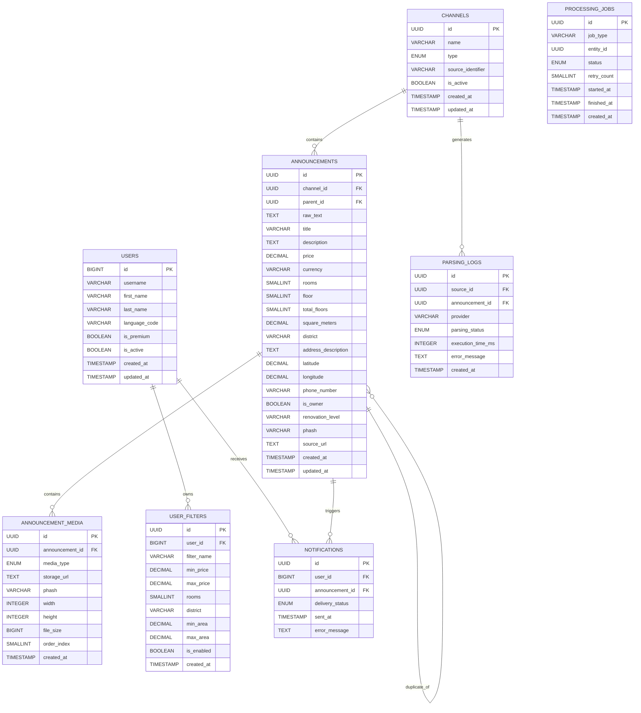

---

## Relationship Summary

| Parent Entity | Child Entity | Relationship |
|---------------|--------------|--------------|
| Channels | Announcements | One-to-Many |
| Announcements | Announcement Media | One-to-Many |
| Announcements | Announcements | Self-Reference (Duplicate Group) |
| Users | User Filters | One-to-Many |
| Users | Notifications | One-to-Many |
| Announcements | Notifications | One-to-Many |
| Channels | Parsing Logs | One-to-Many |

---

## Design Notes

Ushbu ERD quyidagi tamoyillarga asoslanadi.

- Third Normal Form (3NF)
- Referential Integrity
- Low Data Redundancy
- High Scalability
- Future Extensibility

Media fayllar `announcement_media` jadvalida alohida saqlanadi, bu esa bitta e'longa bir nechta rasm yoki video biriktirish imkonini beradi.

Duplicate e'lonlar `parent_id` orqali o'zaro bog'lanadi va alohida yozuv sifatida saqlanadi.

Foydalanuvchi qidiruv filtrlari `user_filters` jadvalida saqlanadi, bu esa kelajakda murakkab qidiruv va Notification mexanizmlarini kengaytirishni osonlashtiradi.

---

## Future Extensions

Kelajakdagi versiyalarda quyidagi Entity'lar qo'shilishi mumkin.

- favorites
- search_history
- recommendations
- analytics_events
- audit_logs
- api_keys
- worker_metrics

Yangi Entity'lar mavjud bog'lanishlarni buzmagan holda Database Schema'ga qo'shilishi kerak.

---

## Database Design Summary

Ushbu Database dizayni:

- ma'lumotlar yaxlitligini ta'minlaydi;
- Duplicate Detection mexanizmini qo'llab-quvvatlaydi;
- AI Parsing Pipeline bilan mos ishlaydi;
- yuqori tezlikdagi qidiruv uchun optimallashtirilgan;
- kelajakdagi kengaytirishlar uchun moslashuvchan arxitekturani taqdim etadi.

---

# 7. Telegram Listener Pipeline

## 7.1 Overview

Telegram Listener Pipeline tizimning eng muhim komponentlaridan biri hisoblanadi.

Uning vazifasi Telegram kanallarida e'lon qilingan yangi xabarlarni real vaqt rejimida kuzatish, ularni to'g'ri yig'ish va keyingi ishlov berish bosqichiga uzatishdan iborat.

Listener faqat ma'lumot yig'adi.

U quyidagi vazifalarni bajarmaydi.

- AI Parsing
- Duplicate Detection
- Notification
- Database Business Logic

Ushbu operatsiyalar keyingi Worker'lar tomonidan bajariladi.

Bu yondashuv komponentlar o'rtasidagi bog'liqlikni kamaytiradi va tizimni kengaytirishni osonlashtiradi.

---

# 7.2 Responsibilities

Telegram Listener quyidagi vazifalarni bajaradi.

- Telegram kanallarini monitoring qilish.
- Yangi xabarlarni qabul qilish.
- Media Group'larni yig'ish.
- Channel Adapter'ni ishga tushirish.
- Raw Event yaratish.
- Queue'ga Event yuborish.
- Parsing xatolarini log qilish.

Listener quyidagilarni bajarmaydi.

- AI chaqirish.
- Database Validation.
- Notification yuborish.
- Duplicate Detection.
- Search Index yaratish.

---

# 7.3 Telethon Integration

Telegram ma'lumotlarini olish uchun **Telethon** kutubxonasi ishlatiladi.

Telethon Telegram API bilan User Session orqali ishlaydi.

Bu Bot API'da mavjud bo'lmagan imkoniyatlardan foydalanish imkonini beradi.

Misollar.

- Private Channel
- Public Channel
- Media Group
- Edited Message
- Deleted Message
- Forward Information

Listener faqat oldindan ro'yxatdan o'tgan Source'larni kuzatadi.

---

# 7.4 Listening Strategy

Listener barcha faol Telegram Source'larni kuzatadi.

Ishlash ketma-ketligi.

```
Telegram Channel

↓

New Message

↓

Telethon Event

↓

Listener

↓

Buffer

↓

Adapter

↓

Queue
```

Har bir yangi Event mustaqil ravishda qayta ishlanadi.

---

# 7.5 Source Registration

Monitoring qilinadigan kanallar `channels` jadvalida saqlanadi.

Listener ishga tushganda.

1. Database'dan barcha `is_active = true` Source'larni yuklaydi.
2. Har bir Source uchun kuzatuvni boshlaydi.
3. Runtime davomida yangi Source qo'shilsa, konfiguratsiya yangilangandan keyin Listener uni ham kuzatishni boshlaydi.

---

# 7.6 Event Reception

Telethon yangi xabarni olganda Listener Event yaratadi.

Event quyidagi ma'lumotlarni o'z ichiga oladi.

- Source ID
- Telegram Message ID
- Message Date
- Raw Text
- Caption
- Media Information
- Sender Information (agar mavjud bo'lsa)

Raw Event hali Database'ga yozilmaydi.

---

# 7.7 Media Group Handling

Ko'plab Telegram kanallari e'lonni quyidagicha yuboradi.

```
Photo

Photo

Photo

Caption
```

yoki

```
Caption

Photo

Photo
```

Telegram bu elementlarni alohida Event sifatida yuboradi.

Shuning uchun Media Group to'liq yig'ilishi kerak.

---

## Buffer Strategy

Har bir Media Group vaqtinchalik Buffer'da saqlanadi.

```
Media Event

↓

Buffer

↓

Waiting

↓

Completed Group
```

Buffer ma'lum vaqt davomida yangi elementlarni kutadi.

Belgilangan vaqt ichida yangi element kelmasa, Media Group yakunlangan deb hisoblanadi.

---

## Group Identifier

Media Group Telegram tomonidan berilgan `grouped_id` orqali aniqlanadi.

Agar `grouped_id` mavjud bo'lmasa, oddiy xabar sifatida qayta ishlanadi.

---

# 7.8 Debounce Mechanism

Ba'zi kanallar barcha media fayllarni ketma-ket yuboradi.

Network kechikishlari sababli ular bir vaqtning o'zida kelmasligi mumkin.

Shuning uchun Debounce mexanizmi qo'llaniladi.

```
Message

↓

Wait

↓

Additional Media?

↓

Yes → Continue Waiting

↓

No → Process
```

Debounce vaqti konfiguratsiya orqali boshqariladi.

---

# 7.9 Channel Adapter

Har bir Telegram kanali o'ziga xos yozish uslubiga ega.

Masalan.

```
☎️

📍

💵

🏢
```

yoki

```
Narxi

Telefon

Manzil
```

yoki

```
2/4/9

70 m²

550$
```

Shuning uchun har bir Source uchun mos Adapter ishlatiladi.

```
Listener

↓

Adapter

↓

Normalized Raw Data
```

Adapter faqat formatni standartlashtiradi.

Business Logic bajarilmaydi.

---

# 7.10 Adapter Selection

Listener Source turiga qarab Adapter tanlaydi.

```
Channel A

↓

Adapter A

----------------

Channel B

↓

Adapter B

----------------

Channel C

↓

Default Adapter
```

Agar maxsus Adapter mavjud bo'lmasa,

Default Adapter ishlatiladi.

---

# 7.11 Validation

Adapter ishlagandan so'ng dastlabki tekshiruv amalga oshiriladi.

Tekshiriladigan elementlar.

- Empty Message
- Unsupported Media
- Broken Format
- Invalid Source

Validation muvaffaqiyatsiz bo'lsa.

Event Queue'ga yuborilmaydi.

---

# 7.12 Queue Publishing

Validation muvaffaqiyatli tugagandan so'ng Event Queue'ga yuboriladi.

```
Normalized Event

↓

Queue

↓

Worker
```

Queue ichiga faqat kerakli ma'lumotlar yuboriladi.

- Source ID
- Raw Text
- Media
- Telegram Metadata

---

# 7.13 Error Handling

Listener ishlashi davomida quyidagi xatolar yuz berishi mumkin.

- Telegram Connection Lost
- Flood Wait
- Invalid Session
- Media Download Error
- Adapter Error

Har bir xato Log qilinadi.

Listener iloji boricha ishlashni davom ettiradi.

---

# 7.14 Retry Strategy

Ba'zi xatolar vaqtinchalik bo'lishi mumkin.

Masalan.

- Network Error
- Timeout
- Telegram Temporary Error

Bunday holatda qayta urinish amalga oshiriladi.

Retry soni konfiguratsiya orqali belgilanadi.

Permanent xatolar qayta ishlanmaydi.

---

# 7.15 Monitoring

Listener quyidagi statistikalarni yig'adi.

- Received Messages
- Media Groups
- Queue Published
- Failed Events
- Adapter Errors
- Processing Time

Bu ma'lumotlar Monitoring tizimida ishlatilishi mumkin.

---

# 7.16 Sequence Diagram

```
Telegram Channel

↓

Telethon Event

↓

Listener

↓

Buffer

↓

Debounce

↓

Adapter

↓

Validation

↓

Queue

↓

Worker
```

---

# 7.17 Design Decisions

Telegram Listener quyidagi tamoyillarga amal qiladi.

- Event-Driven
- Asynchronous Processing
- Non-Blocking Architecture
- Adapter Pattern
- Fail Fast
- Queue First

Bu yondashuv Listener'ni juda yengil va tez ishlaydigan komponentga aylantiradi.

---

# 7.18 Future Improvements

Kelajakda quyidagi imkoniyatlar qo'shilishi mumkin.

- Multi-Account Listening
- Automatic Source Discovery
- Media Compression
- Smart Debounce
- Adaptive Rate Limiting
- Live Metrics Dashboard

---

# 7.19 Telegram Message Lifecycle

## Overview

Telegram Message Lifecycle tizimga kelib tushgan bitta Telegram xabarining qabul qilinishidan boshlab foydalanuvchiga yetkazilgungacha bo'lgan to'liq hayot siklini tavsiflaydi.

Har bir bosqich mustaqil komponent tomonidan bajariladi va ular Queue orqali o'zaro bog'lanadi.

Bu yondashuv tizimni modulli, kengaytiriladigan va nosozliklarga bardoshli (Fault Tolerant) qiladi.

---

## Complete Message Lifecycle

```text
┌──────────────────────────┐
│  Telegram Channel        │
└─────────────┬────────────┘
              │
              ▼
┌──────────────────────────┐
│ Telethon Listener        │
└─────────────┬────────────┘
              │
              ▼
┌──────────────────────────┐
│ Media Buffer             │
└─────────────┬────────────┘
              │
              ▼
┌──────────────────────────┐
│ Debounce                 │
└─────────────┬────────────┘
              │
              ▼
┌──────────────────────────┐
│ Channel Adapter          │
└─────────────┬────────────┘
              │
              ▼
┌──────────────────────────┐
│ Initial Validation       │
└─────────────┬────────────┘
              │
              ▼
┌──────────────────────────┐
│ Event Queue              │
└─────────────┬────────────┘
              │
              ▼
┌──────────────────────────┐
│ AI Parsing Worker        │
└─────────────┬────────────┘
              │
              ▼
┌──────────────────────────┐
│ Duplicate Detection      │
└─────────────┬────────────┘
              │
              ▼
┌──────────────────────────┐
│ PostgreSQL               │
└─────────────┬────────────┘
              │
              ▼
┌──────────────────────────┐
│ Notification Worker      │
└─────────────┬────────────┘
              │
              ▼
┌──────────────────────────┐
│ Telegram Bot             │
└──────────────────────────┘
```

---

## Lifecycle Stages

### Stage 1 — Message Reception

Telethon Telegram kanalida yangi xabarni aniqlaydi va Listener'ga uzatadi.

Agar xabar kuzatilayotgan (`is_active = true`) manbadan kelgan bo'lsa, u qayta ishlash jarayoniga yuboriladi.

---

### Stage 2 — Media Buffer

Agar xabar Media Group tarkibiga kirsa, barcha media elementlari vaqtinchalik Buffer'da yig'iladi.

Buffer maqsadi bitta e'longa tegishli barcha rasm, video va matnni birlashtirishdan iborat.

---

### Stage 3 — Debounce

Buffer ma'lum vaqt davomida yangi elementlar kelishini kutadi.

Belgilangan vaqt ichida yangi media kelmasa, e'lon yakunlangan deb hisoblanadi va keyingi bosqichga uzatiladi.

---

### Stage 4 — Channel Adapter

Source uchun mos Adapter tanlanadi.

Adapter:

- formatni standartlashtiradi;
- keraksiz belgilarni olib tashlaydi;
- keyingi bosqich uchun yagona Raw Data shaklini tayyorlaydi.

Bu bosqichda Business Logic bajarilmaydi.

---

### Stage 5 — Initial Validation

Minimal tekshiruvlar amalga oshiriladi.

Tekshiriladigan holatlar:

- bo'sh matn;
- noto'g'ri media;
- qo'llab-quvvatlanmaydigan Source;
- Adapter xatosi.

Validation muvaffaqiyatsiz tugasa, Event Queue'ga yuborilmaydi va xatolik log qilinadi.

---

### Stage 6 — Event Queue

Muvaffaqiyatli Event Queue'ga joylashtiriladi.

Queue Listener va Worker'larni bir-biridan mustaqil ishlashini ta'minlaydi.

Listener keyingi Telegram xabarlarini kutishda davom etadi va oldingi Event tugashini kutmaydi.

---

### Stage 7 — AI Parsing Worker

Worker Queue'dan Event'ni oladi.

AI modeli quyidagilarni aniqlaydi:

- narx;
- xonalar soni;
- maydon;
- qavat;
- manzil;
- telefon raqami;
- egasi yoki vositachi;
- ta'mirlash holati;
- boshqa strukturaviy atributlar.

Natija standart JSON formatiga o'tkaziladi.

---

### Stage 8 — Duplicate Detection

AI natijasi mavjud e'lonlar bilan taqqoslanadi.

Tekshirish mezonlari:

- telefon raqami;
- pHash;
- semantik o'xshashlik;
- parametrik moslik.

Agar dublikat topilsa, yangi yozuv `parent_id` orqali mavjud e'longa bog'lanadi.

---

### Stage 9 — Database Persistence

Tekshiruvlardan muvaffaqiyatli o'tgan e'lon PostgreSQL bazasiga yoziladi.

Shuningdek:

- media yozuvlari;
- parsing loglari;
- processing job holati;

ham yangilanadi.

---

### Stage 10 — Notification Delivery

Notification Worker yangi e'lonni foydalanuvchi filtrlariga mosligini tekshiradi.

Mos foydalanuvchilarga Telegram Bot orqali bildirishnoma yuboriladi.

Notification yuborilgandan so'ng uning holati `notifications` jadvalida qayd etiladi.

---

## Failure Handling

Har bir bosqich mustaqil ishlaydi.

Agar ma'lum bir bosqichda xatolik yuz bersa:

- Listener ishlashda davom etadi;
- boshqa Event'lar to'xtamaydi;
- xatolik log qilinadi;
- kerak bo'lsa Retry mexanizmi ishga tushiriladi.

Bu yondashuv tizimning umumiy barqarorligini ta'minlaydi.

---

## Design Principles

Telegram Message Lifecycle quyidagi tamoyillarga asoslanadi.

- Event-Driven Processing
- Asynchronous Execution
- Queue-Based Communication
- Loose Coupling
- High Availability
- Fault Tolerance
- Horizontal Scalability

---

## Summary

Telegram Message Lifecycle tizimdagi bitta Telegram xabarining qabul qilinishidan boshlab foydalanuvchiga yetkazilgungacha bo'lgan barcha bosqichlarni tavsiflaydi.

Har bir bosqich mustaqil komponent tomonidan bajariladi va Queue orqali bog'lanadi. Ushbu arxitektura tizimning yuqori unumdorlik, ishonchlilik va kelajakdagi kengaytirilishini ta'minlaydi.

---

# 7.20 Summary

Telegram Listener Pipeline Telegram kanallaridan ma'lumotlarni real vaqt rejimida yig'ish uchun javob beradi.

Pipeline quyidagi bosqichlardan iborat.

1. Event Reception
2. Media Group Assembly
3. Debounce
4. Channel Adapter
5. Validation
6. Queue Publishing

Shu bilan Listener Pipeline yakunlanadi.

Keyingi bo'limda Website Scraper Pipeline va uning ishlash tamoyillari batafsil ko'rib chiqiladi.

---

# 8. Website Scraper Pipeline

## 8.1 Overview

Website Scraper Pipeline ko'chmas mulk e'lonlarini turli veb-saytlardan avtomatik yig'ish uchun javob beradi.

Telegram Listener'dan farqli ravishda, Website Scraper **Pull-Based Architecture** tamoyiliga asoslanadi. Ya'ni tizim yangi ma'lumot kelishini kutmaydi, balki ma'lum vaqt oralig'ida manbalarni o'zi tekshiradi.

Pipeline quyidagi vazifalarni bajaradi.

- Faol Website Source'larni kuzatish.
- Yangi e'lonlarni aniqlash.
- HTML ma'lumotlarini olish.
- Ma'lumotlarni standartlashtirish.
- Queue'ga yuborish.
- Xatolarni log qilish.

AI Parsing, Duplicate Detection va Notification ushbu pipeline tarkibiga kirmaydi.

---

# 8.2 Responsibilities

Website Scraper quyidagi vazifalarni bajaradi.

- Website'larni periodik tekshirish.
- HTML yuklab olish.
- Dynamic Page'larni render qilish.
- E'lon havolalarini yig'ish.
- Yangi e'lonlarni aniqlash.
- Adapter orqali standart formatga o'tkazish.
- Queue'ga Event yuborish.

Quyidagi vazifalarni bajarmaydi.

- AI Parsing.
- Duplicate Detection.
- Database Business Logic.
- Notification yuborish.

---

# 8.3 Supported Source Types

Pipeline turli xil Website arxitekturalarini qo'llab-quvvatlaydi.

## Static Website

Oddiy HTML sahifalar.

Texnologiyalar.

- HTTPX
- BeautifulSoup4

---

## Dynamic Website

JavaScript orqali shakllanadigan sahifalar.

Texnologiya.

- Playwright

---

## Future Support

Kelajakda quyidagi manbalarni qo'llab-quvvatlash mumkin.

- REST API
- GraphQL API
- XML Feed
- RSS Feed

---

# 8.4 Scraping Strategy

Har bir Website ma'lum interval bilan tekshiriladi.

```
Scheduler

↓

Website

↓

HTML

↓

Adapter

↓

Queue
```

Har bir Source mustaqil ishlaydi.

Bitta Website'dagi xatolik boshqa Source'larning ishlashiga ta'sir qilmaydi.

---

# 8.5 Scheduler

Scraper Worker doimiy ravishda ishlaydi.

Har bir Source uchun tekshirish intervali konfiguratsiya qilinadi.

Misollar.

- 5 daqiqa
- 10 daqiqa
- 15 daqiqa
- 30 daqiqa

Tez-tez yangilanadigan Website'lar qisqaroq interval bilan tekshirilishi mumkin.

---

# 8.6 Source Registration

Website Source'lar `channels` jadvalida saqlanadi.

`type = website`

va

`is_active = true`

bo'lgan yozuvlar Scraper tomonidan avtomatik yuklanadi.

Har bir Source uchun mos Adapter biriktiriladi.

---

# 8.7 Download Stage

Scraper Website'dan HTML sahifani yuklab oladi.

Static Website uchun oddiy HTTP Request yetarli bo'ladi.

Dynamic Website uchun esa sahifa to'liq render qilingandan keyin HTML olinadi.

Timeout va Connection xatolari alohida qayd etiladi.

---

# 8.8 Content Extraction

Website HTML'dan e'lonlar ajratib olinadi.

Bu bosqichda quyidagilar olinishi mumkin.

- Announcement URL
- Title
- Description
- Images
- Price
- Publish Date

Har bir Website uchun CSS Selector yoki XPath qoidalari Adapter ichida saqlanadi.

---

# 8.9 URL Deduplication

Website bir xil e'lonni bir necha marta qayta ko'rsatishi mumkin.

Shuning uchun birinchi tekshiruv URL bo'yicha amalga oshiriladi.

```
Extract URL

↓

Database Lookup

↓

Exists?

↓

Yes → Skip

↓

No → Continue
```

Bu AI Pipeline'ga keraksiz yuk tushishining oldini oladi.

---

# 8.10 Website Adapter

Har bir Website turlicha HTML tuzilishga ega.

Masalan.

- HTML Class nomlari.
- DOM tuzilishi.
- Price formati.
- Media joylashuvi.

Har bir Website uchun alohida Adapter yoziladi.

```
Website

↓

Website Adapter

↓

Normalized Raw Data
```

Adapter faqat ma'lumotni standartlashtiradi.

Business Logic bajarmaydi.

---

# 8.11 Validation

Adapter'dan chiqqan ma'lumot dastlabki tekshiruvdan o'tadi.

Tekshiriladigan holatlar.

- URL mavjudligi.
- Bo'sh sahifa.
- Kerakli elementlar mavjudligi.
- Noto'g'ri HTML.

Validation muvaffaqiyatsiz tugasa.

Event Queue'ga yuborilmaydi.

---

# 8.12 Queue Publishing

Muvaffaqiyatli Validation'dan o'tgan e'lon Queue'ga yuboriladi.

Queue quyidagi ma'lumotlarni qabul qiladi.

- Source ID
- URL
- Raw HTML
- Extracted Text
- Media URL'lari

Keyingi bosqichda AI Worker ushbu ma'lumotlarni qayta ishlaydi.

---

# 8.13 Error Handling

Website Scraper quyidagi xatolarni boshqaradi.

- Timeout
- DNS Error
- SSL Error
- HTTP Error
- Parsing Error
- Playwright Error

Har bir xato alohida log qilinadi.

Bitta Website ishlamay qolsa ham boshqa Website'lar ishlashda davom etadi.

---

# 8.14 Retry Strategy

Ba'zi xatolar vaqtinchalik bo'lishi mumkin.

Masalan.

- Network Timeout
- HTTP 503
- Temporary DNS Failure

Bunday holatda Retry mexanizmi ishga tushiriladi.

Permanent xatolar qayta ishlanmaydi.

---

# 8.15 Monitoring

Har bir Website uchun quyidagi statistikalar yig'iladi.

- Last Crawl Time
- Crawl Duration
- New Announcements
- Skipped URLs
- Failed Requests
- Adapter Errors

Monitoring tizimi administratorga Website holatini kuzatish imkonini beradi.

---

# 8.16 Sequence Diagram

```text
Scheduler

↓

Website Request

↓

HTML Download

↓

Website Adapter

↓

Validation

↓

URL Deduplication

↓

Queue

↓

AI Worker
```

---

# 8.17 Design Decisions

Website Scraper quyidagi tamoyillarga asoslanadi.

- Pull-Based Architecture
- Scheduled Processing
- Adapter Pattern
- Queue First
- Asynchronous Execution
- Fault Isolation

Bu yondashuv yangi Website'larni qo'shishni va mavjudlarini qo'llab-quvvatlashni soddalashtiradi.

---

# 8.18 Telegram Pipeline bilan Integratsiya

Telegram Listener va Website Scraper turli usullar bilan ishlashiga qaramay, ular bir xil keyingi Pipeline'dan foydalanadi.

```text
Telegram Listener ─────────┐
                           │
                           ▼
                    Normalized Event
                           │
                           ▼
                        Event Queue
                           │
                           ▼
                     AI Parsing Worker
                           │
                           ▼
                   Duplicate Detection
                           │
                           ▼
                        PostgreSQL
                           │
                           ▼
                  Notification Worker
```

Bu yondashuv barcha ma'lumot manbalarini yagona standart formatga keltiradi va AI hamda Business Logic komponentlarini Source turidan mustaqil qiladi.

---

# 8.19 Future Improvements

Kelajakdagi rivojlantirish yo'nalishlari.

- Incremental Crawling
- Parallel Website Crawling
- Automatic Adapter Health Check
- Proxy Rotation
- JavaScript Resource Optimization
- Distributed Scraping
- CAPTCHA Detection
- Website Change Detection

---

# 8.20 Summary

Website Scraper Pipeline Website'lardan ma'lumot yig'ish uchun mo'ljallangan Pull-Based komponent hisoblanadi.

Pipeline quyidagi bosqichlardan iborat.

1. Scheduler
2. HTML Download
3. Content Extraction
4. Website Adapter
5. Validation
6. URL Deduplication
7. Queue Publishing

Telegram Listener Pipeline bilan birgalikda Website Scraper tizimning barcha tashqi ma'lumot manbalarini yagona Event Pipeline orqali AI Processing bosqichiga uzatadi.

Keyingi bo'limda AI Parsing Pipeline va ma'lumotlarni strukturaviy formatga o'tkazish jarayoni batafsil ko'rib chiqiladi.

---

# 9. AI Processing Pipeline

# Part 1 — AI Parsing & Structured Extraction

---

# 9.1 Overview

AI Processing Pipeline loyihaning asosiy biznes komponentlaridan biri hisoblanadi.

Telegram kanallari va Website'lardan kelgan tartibsiz (Unstructured) ma'lumotlar ushbu Pipeline orqali standart (Structured) ko'rinishga o'tkaziladi.

Pipeline quyidagi vazifalarni bajaradi.

- Matnni tahlil qilish
- Rasmlarni tahlil qilish
- JSON formatiga o'tkazish
- Ma'lumotlarni standartlashtirish
- Confidence baholash
- Validation uchun tayyorlash

AI Pipeline faqat ma'lumotlarni tahlil qiladi.

Quyidagi vazifalar ushbu Pipeline tarkibiga kirmaydi.

- Duplicate Detection
- Notification
- Database Persistence
- Search

---

# 9.2 AI Pipeline Architecture

AI Pipeline Event Queue orqali ishlaydi.

```
Queue

↓

AI Worker

↓

Provider Adapter

↓

LLM

↓

JSON Response

↓

Normalization

↓

Validation

↓

Next Worker
```

Har bir Event mustaqil ravishda qayta ishlanadi.

Bu Worker'larni gorizontal kengaytirish imkonini beradi.

---

# 9.3 Supported AI Providers

Tizim bitta AI modeliga bog'lanib qolmaydi.

Provider Abstraction orqali turli LLM'lardan foydalanish mumkin.

Dastlab quyidagi Provider'lar qo'llab-quvvatlanadi.

- Google Gemini
- OpenAI

Kelajakda quyidagilar ham qo'shilishi mumkin.

- Claude
- DeepSeek
- OpenRouter
- Azure OpenAI
- Local LLM

---

# 9.4 AI Provider Abstraction

Har bir AI Provider yagona interfeys orqali ishlaydi.

```
AI Worker

↓

AI Provider Interface

↓

Gemini Adapter

OpenAI Adapter

Future Providers
```

Business Logic qaysi Provider ishlayotganini bilmaydi.

Bu Provider almashtirishni juda osonlashtiradi.

---

# 9.5 Input Preparation

AI'ga yuborilishidan oldin barcha ma'lumotlar tayyorlanadi.

Input quyidagi qismlardan iborat bo'ladi.

- Raw Text
- Caption
- Media
- Source Metadata

---

## Raw Text

Telegram yoki Website'dan kelgan asl matn.

Hech qanday Business Logic qo'llanilmaydi.

---

## Media

Rasmlar AI Vision uchun yuboriladi.

Media URL yoki Base64 ko'rinishida uzatilishi mumkin.

---

## Metadata

Qo'shimcha ma'lumotlar.

Misollar.

- Source Type
- Language
- Source Name

Metadata AI'ga kontekst berish uchun ishlatiladi.

---

# 9.6 Prompt Engineering Strategy

AI javobining sifati Prompt sifatiga bevosita bog'liq.

Shuning uchun Prompt qat'iy standart asosida yoziladi.

Har bir Prompt ikki qismdan iborat.

- System Prompt
- User Prompt

---

## System Prompt

System Prompt AI rolini belgilaydi.

Masalan.

- Professional Information Extractor
- Real Estate Parser
- JSON Generator

AI faqat strukturaviy ma'lumot qaytarishi kerak.

---

## User Prompt

User Prompt Event ma'lumotlarini o'z ichiga oladi.

- Text
- Caption
- Images
- Metadata

---

## Output Rules

AI quyidagi qoidalarga amal qilishi kerak.

- Faqat JSON qaytarish.
- Izoh yozmaslik.
- Taxmin qilmaslik.
- Mavjud bo'lmagan maydonni `null` qilish.
- JSON sintaksisini buzmaslik.

---

# 9.7 JSON Extraction

AI javobi yagona JSON formatida qaytariladi.

Misol.

```json
{
  "title": "2 xonali kvartira",
  "price": 550,
  "currency": "USD",
  "rooms": 2,
  "floor": 4,
  "total_floors": 9,
  "square_meters": 68,
  "district": "Chilonzor",
  "phone_number": "+998901234567",
  "is_owner": true,
  "renovation_level": "Good"
}
```

---

## Required Fields

Minimal talab qilinadigan maydonlar.

- title
- price
- currency

---

## Optional Fields

Quyidagilar mavjud bo'lmasa `null` qaytariladi.

- rooms
- floor
- square_meters
- latitude
- longitude
- phone_number

---

## Missing Information

AI ma'lumot topa olmasa,

qiymatni o'ylab topmaydi.

Misol.

```json
{
    "rooms": null
}
```

---

# 9.8 Vision Processing

Agar Event tarkibida rasm mavjud bo'lsa,

AI Vision modeli ham ishlatiladi.

Vision quyidagilarni aniqlashi mumkin.

- Ta'mirlash holati
- Mebel mavjudligi
- Oshxona
- Hammom
- Balkon
- Binoning tashqi ko'rinishi

---

## Renovation Detection

Misollar.

- New
- Excellent
- Good
- Average
- Needs Renovation

---

## Furniture Detection

AI quyidagilarni aniqlashi mumkin.

- Fully Furnished
- Partially Furnished
- Empty

---

## Image Quality

Juda past sifatli yoki buzilgan rasmlar Vision Analysis'dan chiqarib tashlanishi mumkin.

---

# 9.9 AI Response Validation

AI javobi qabul qilinishidan oldin tekshiriladi.

Tekshiruvlar.

- JSON Parsing
- Required Fields
- Data Types
- Invalid Values
- Empty Response

Validation muvaffaqiyatsiz tugasa.

Retry yoki Fallback mexanizmi ishga tushiriladi.

---

# 9.10 Normalization Layer

AI javobi to'g'ridan-to'g'ri Database'ga yozilmaydi.

Avval barcha qiymatlar yagona formatga keltiriladi.

Bu bosqich **Rule-Based Normalization** deb ataladi.

Normalization AI natijasini standart biznes formatiga moslashtiradi.

---

## Price Normalization

Quyidagi barcha qiymatlar.

```
500$

500 USD

$500

500уе
```

quyidagiga o'tkaziladi.

```
price = 500

currency = USD
```

---

## Phone Number Normalization

Misollar.

```
90 123 45 67

+998901234567

998901234567
```

natijada.

```
+998901234567
```

---

## District Normalization

Turli yozilishlar.

```
Chilonzor

chilonzor

Чиланзар
```

bitta standart qiymatga o'tkaziladi.

```
Chilonzor
```

---

## Room Normalization

Misollar.

```
2 xona

2x

2-room

2 rooms
```

natijada.

```
rooms = 2
```

---

## Area Normalization

```
70 kv

70m²

70 sqm
```

↓

```
70
```

---

## Floor Normalization

```
4-etaj

4/9

4 qavat
```

↓

```
floor = 4

total_floors = 9
```

---

# 9.11 Parsing Result Object

Pipeline oxirida yagona Parsing Result hosil bo'ladi.

```
Raw Event

↓

AI Parsing

↓

Normalization

↓

Validation

↓

Structured Result
```

Structured Result keyingi Worker'lar uchun yagona format hisoblanadi.

---

## Result Components

Parsing Result quyidagi qismlardan iborat.

- Structured Fields
- Confidence Score
- AI Provider
- Parsing Metadata
- Validation Status

Bu obyekt Duplicate Detection va Database Worker tomonidan ishlatiladi.

---

# Part 1 Summary

Ushbu bo'limda quyidagilar tavsiflandi.

- AI Pipeline Architecture
- Provider Abstraction
- Input Preparation
- Prompt Engineering
- JSON Extraction
- Vision Processing
- AI Response Validation
- Rule-Based Normalization
- Structured Parsing Result

Natijada barcha tartibsiz ma'lumotlar yagona standart formatga o'tkaziladi va keyingi Processing Pipeline bosqichiga uzatiladi.

Part 2 bo'limida AI javobining ishonchliligini baholash, Retry va Fallback strategiyalari, xarajatlarni optimallashtirish hamda Production muhitidagi AI boshqaruvi ko'rib chiqiladi.

---

# 9. AI Processing Pipeline

# Part 2 — Confidence, Error Handling & Optimization

---

# 9.12 Confidence Score

AI modeli qaytargan har bir Parsing Result ishonchlilik darajasi (Confidence Score) bilan baholanadi.

Confidence Score AI natijasining qanchalik ishonchli ekanligini bildiradi.

Qiymat:

```
0.00 — 1.00
```

yoki

```
0 — 100%
```

ko'rinishida ifodalanishi mumkin.

---

## Confidence Sources

Confidence quyidagi omillarga asoslanadi.

- AI Model Confidence
- Required Field Completeness
- Vision Quality
- Text Quality
- Parsing Consistency

Misol.

| Confidence | Status |
|------------|---------|
| 95–100% | Excellent |
| 85–94% | High |
| 70–84% | Medium |
| <70% | Low |

---

## Low Confidence Handling

Past ishonchlilikka ega natijalar darhol rad etilmaydi.

Bunday Event'lar quyidagi usullardan biri orqali qayta ishlanishi mumkin.

- AI Retry
- Fallback Provider
- Manual Review (Future)
- Additional Validation Rules

---

# 9.13 Retry Strategy

Ba'zi AI xatolari vaqtinchalik bo'ladi.

Masalan.

- API Timeout
- Network Error
- Rate Limit
- Temporary Service Failure

Bunday holatlarda Retry mexanizmi ishga tushadi.

---

## Retry Policy

Retry soni konfiguratsiya orqali boshqariladi.

Misol.

```
Maximum Retry = 3
```

Har bir urinish orasida kutish vaqti oshib boradi (Exponential Backoff).

Misol.

```
Retry 1

↓

2 sec

↓

Retry 2

↓

4 sec

↓

Retry 3

↓

8 sec
```

---

## Non-Retry Errors

Quyidagi xatolar uchun Retry amalga oshirilmaydi.

- Invalid Prompt
- Invalid JSON Format
- Unsupported Model
- Authentication Error

---

# 9.14 Fallback Provider

Asosiy AI Provider ishlamay qolgan taqdirda, tizim avtomatik ravishda ikkinchi Provider'dan foydalanishi mumkin.

```
Primary Provider

↓

Failure

↓

Fallback Provider

↓

Structured Result
```

Masalan.

```
Gemini

↓

Unavailable

↓

OpenAI
```

yoki aksincha.

Provider almashtirilishi Business Logic'ga ta'sir qilmaydi.

---

# 9.15 Cost Optimization

AI xizmatlari xarajat talab qiladi.

Shuning uchun tizim imkon qadar ortiqcha AI chaqiriqlarini kamaytirishi kerak.

---

## URL Filtering

Website'dagi eski URL'lar AI'ga yuborilmaydi.

---

## Duplicate Prevention

Aniq dublikat Event'lar AI Pipeline'ga yuborilmaydi.

---

## Media Optimization

Keraksiz yoki juda katta rasmlar AI Vision'ga yuborilmasligi mumkin.

---

## Prompt Optimization

Prompt imkon qadar ixcham bo'lishi kerak.

Faqat kerakli ma'lumot AI'ga yuboriladi.

---

## Batch Processing (Future)

Kelajakda kichik Event'larni Batch ko'rinishida yuborish imkoniyati qo'shilishi mumkin.

---

# 9.16 Prompt Versioning

Prompt'lar ham loyiha kodi kabi versiyalanadi.

Har bir Prompt o'z identifikatoriga ega bo'ladi.

Misol.

```
prompt_v1

prompt_v2

prompt_v3
```

Bu eski natijalarni tahlil qilishni osonlashtiradi.

---

## Benefits

Prompt Versioning quyidagilarni ta'minlaydi.

- Reproducibility
- Regression Analysis
- Performance Comparison
- Safe Updates

---

# 9.17 Parsing Metrics

AI Pipeline ishlashi Monitoring tizimi orqali kuzatiladi.

Yig'iladigan statistikalar.

- Successful Parsing
- Failed Parsing
- Retry Count
- Average Response Time
- Average Token Usage
- Vision Usage
- Provider Distribution
- Average Confidence Score

Bu ma'lumotlar AI Pipeline sifatini baholash imkonini beradi.

---

# 9.18 Security Considerations

AI xizmatlari bilan ishlashda xavfsizlik muhim ahamiyatga ega.

---

## API Keys

API kalitlari faqat Environment Variables orqali saqlanadi.

Kod ichida API Key yozilmaydi.

---

## Prompt Safety

Prompt tarkibiga maxfiy tizim ma'lumotlari qo'shilmaydi.

AI faqat Parsing uchun zarur bo'lgan ma'lumotlarni oladi.

---

## Sensitive Information

Telefon raqami kabi ma'lumotlar faqat Business Logic uchun ishlatiladi.

AI javobi log qilinayotganda zarurat bo'lsa maxfiy maydonlar maskalanishi mumkin.

---

## Response Validation

AI javobi hech qachon ishonchli deb qabul qilinmaydi.

Har bir javob Validation bosqichidan o'tadi.

---

# 9.19 Future Improvements

Kelajakda quyidagi imkoniyatlar qo'shilishi mumkin.

- Automatic Prompt Optimization
- Multi-Model Ensemble
- AI Cache
- Local LLM Support
- Fine-Tuned Models
- AI Quality Dashboard
- Automatic Prompt A/B Testing

Bu imkoniyatlar mavjud arxitekturani o'zgartirmasdan qo'shilishi mumkin.

---

# 9.20 Complete AI Processing Flow

Quyidagi diagramma AI Pipeline'ning to'liq ishlash ketma-ketligini ko'rsatadi.

```text
Event Queue
      │
      ▼
AI Worker
      │
      ▼
Provider Selection
      │
      ▼
Prompt Generation
      │
      ▼
LLM Processing
      │
      ▼
JSON Response
      │
      ▼
Normalization
      │
      ▼
Validation
      │
      ▼
Confidence Evaluation
      │
      ▼
Success?
 ┌────┴────┐
 │         │
Yes        No
 │         │
 ▼         ▼
Next      Retry
Worker      │
            ▼
     Fallback Provider
            │
            ▼
      Validation
            │
            ▼
     Processing Failed
```

---

# 9.21 Design Decisions

AI Pipeline quyidagi tamoyillarga asoslanadi.

- Provider Independence
- Stateless Processing
- Structured Output
- Rule-Based Normalization
- Queue-Based Processing
- Fault Tolerance
- Horizontal Scalability

Bu tamoyillar AI komponentini tizimning boshqa qismlaridan mustaqil rivojlantirish imkonini beradi.

---

# 9.22 Production Considerations

Production muhitida AI Pipeline quyidagi talablarga javob berishi kerak.

- Retry va Timeout boshqaruvi.
- Monitoring va Alerting.
- API Usage kuzatuvi.
- Xarajatlarni nazorat qilish.
- Prompt Version Management.
- Provider almashtirish imkoniyati.
- To'liq Log va Audit imkoniyati.

---

# 9.23 Summary

AI Processing Pipeline tizimning markaziy komponenti bo'lib, tartibsiz matn va media ma'lumotlarini standart strukturaviy formatga aylantiradi.

Pipeline quyidagi bosqichlardan iborat.

1. Provider Selection
2. Prompt Generation
3. LLM Processing
4. JSON Extraction
5. Normalization
6. Validation
7. Confidence Evaluation
8. Retry yoki Fallback (zarur bo'lsa)
9. Structured Result

Ushbu arxitektura AI Provider'dan mustaqil ishlaydi, yuqori ishonchlilikni ta'minlaydi va kelajakda yangi AI modellarini minimal o'zgarishlar bilan qo'shish imkonini beradi.

Shu bilan **9. AI Processing Pipeline** bo'limi yakunlanadi.

---

# Appendix B — Standard AI JSON Schema

## B.1 Purpose

Ushbu Appendix AI Processing Pipeline tomonidan qaytarilishi kerak bo'lgan standart JSON formatini tavsiflaydi.

Mazkur Schema AI va Backend o'rtasidagi rasmiy **Data Contract** hisoblanadi.

AI Provider (Gemini, OpenAI yoki boshqa model) o'zgarishi mumkin, ammo JSON Schema o'zgarmasligi tavsiya etiladi.

Bu quyidagi afzalliklarni beradi.

- Stable API Contract
- Easier Validation
- Provider Independence
- Better Testing
- Simpler Maintenance

---

# B.2 General Rules

AI quyidagi qoidalarga amal qilishi kerak.

- Faqat bitta JSON Object qaytariladi.
- Markdown ishlatilmaydi.
- Izohlar yozilmaydi.
- Qo'shimcha matn yozilmaydi.
- JSON sintaksisi buzilmaydi.
- Mavjud bo'lmagan qiymatlar `null` sifatida qaytariladi.
- Taxmin qilinmaydi.

---

# B.3 Standard JSON Schema

```json
{
  "title": "string",
  "description": "string",

  "price": 550,
  "currency": "USD",

  "rooms": 2,
  "floor": 4,
  "total_floors": 9,

  "square_meters": 68,

  "district": "Chilonzor",
  "address_description": "Near Metro",

  "latitude": null,
  "longitude": null,

  "phone_number": "+998901234567",

  "is_owner": true,

  "renovation_level": "Good",

  "furniture_status": "Fully Furnished",

  "building_type": "Apartment",

  "balcony": true,

  "parking": false,

  "elevator": true,

  "pets_allowed": null,

  "children_allowed": null,

  "heating": null,

  "air_conditioner": true,

  "internet": true,

  "security": null,

  "utilities_included": null,

  "confidence": 0.96
}
```

---

# B.4 Field Description

| Field | Type | Required | Description |
|--------|------|----------|-------------|
| title | string | Yes | E'lon sarlavhasi |
| description | string | No | Tozalangan tavsif |
| price | number | Yes | Narx |
| currency | string | Yes | Valyuta |
| rooms | integer | No | Xonalar soni |
| floor | integer | No | Joylashgan qavat |
| total_floors | integer | No | Binodagi jami qavatlar |
| square_meters | number | No | Maydon |
| district | string | No | Tuman |
| address_description | string | No | Qo'shimcha manzil |
| latitude | number | No | Latitude |
| longitude | number | No | Longitude |
| phone_number | string | No | Telefon |
| is_owner | boolean | No | Egasi yoki vositachi |
| renovation_level | string | No | Ta'mirlash holati |
| furniture_status | string | No | Jihozlanganlik |
| building_type | string | No | Bino turi |
| balcony | boolean | No | Balkon mavjudligi |
| parking | boolean | No | Avtoturargoh |
| elevator | boolean | No | Lift |
| pets_allowed | boolean | No | Uy hayvonlariga ruxsat |
| children_allowed | boolean | No | Bolali oilalarga ruxsat |
| heating | string | No | Isitish tizimi |
| air_conditioner | boolean | No | Konditsioner |
| internet | boolean | No | Internet mavjudligi |
| security | string | No | Qo'riqlash tizimi |
| utilities_included | boolean | No | Kommunal to'lovlar kiritilganligi |
| confidence | number | Yes | AI ishonchlilik darajasi |

---

# B.5 Enumerated Values

Ba'zi maydonlar faqat oldindan belgilangan qiymatlarni qabul qiladi.

## Currency

```text
USD
UZS
```

---

## Renovation Level

```text
New

Excellent

Good

Average

Needs Renovation

Unknown
```

---

## Furniture Status

```text
Fully Furnished

Partially Furnished

Empty

Unknown
```

---

## Building Type

```text
Apartment

House

Townhouse

Studio

Dormitory

Unknown
```

---

# B.6 Required Fields

Quyidagi maydonlar AI tomonidan imkon qadar to'ldirilishi kerak.

```text
title

price

currency

confidence
```

Qolgan barcha maydonlar topilmasa `null` qaytariladi.

---

# B.7 Example Response

```json
{
  "title": "2 xonali kvartira",
  "description": "Yangi ta'mirlangan kvartira",

  "price": 650,
  "currency": "USD",

  "rooms": 2,
  "floor": 3,
  "total_floors": 9,

  "square_meters": 72,

  "district": "Yunusobod",

  "address_description": "Minor metro yaqinida",

  "latitude": null,
  "longitude": null,

  "phone_number": "+998901112233",

  "is_owner": true,

  "renovation_level": "Excellent",

  "furniture_status": "Fully Furnished",

  "building_type": "Apartment",

  "balcony": true,

  "parking": true,

  "elevator": true,

  "pets_allowed": null,

  "children_allowed": true,

  "heating": null,

  "air_conditioner": true,

  "internet": true,

  "security": "Intercom",

  "utilities_included": false,

  "confidence": 0.98
}
```

---

# B.8 Validation Rules

Backend AI javobini qabul qilishdan oldin quyidagilarni tekshiradi.

- JSON sintaksisi.
- Required Field mavjudligi.
- Data Type mosligi.
- Enum qiymatlari.
- Number diapazoni.
- Boolean qiymatlar.
- Confidence qiymati (`0.0–1.0`).

Validation muvaffaqiyatsiz tugasa, javob qayta ishlanmaydi.

---

# B.9 Versioning

JSON Schema versiyalanadi.

Misol.

```text
Schema v1.0

Schema v1.1

Schema v2.0
```

Har bir AI Prompt ma'lum Schema versiyasiga bog'lanadi.

Bu eski Prompt va yangi Backend o'rtasidagi moslikni saqlash imkonini beradi.

---

# B.10 Summary

Ushbu Schema AI Processing Pipeline va Backend o'rtasidagi rasmiy ma'lumot almashish formatini belgilaydi.

Barcha AI Provider'lar aynan shu Schema'ga mos JSON qaytarishi kerak.

Bu yondashuv Parsing Pipeline'ni barqaror, test qilish oson va kelajakda kengaytirishga qulay holga keltiradi.

---

# B.11 Processing Metadata

## Purpose

Business ma'lumotlaridan tashqari, AI Processing Pipeline har bir Parsing natijasi uchun texnik (Operational) metadata ham ishlab chiqarishi tavsiya etiladi.

Ushbu metadata Backend'ga AI Pipeline ishlashini kuzatish, monitoring qilish, debugging va kelajakdagi optimizatsiyalarni amalga oshirish imkonini beradi.

Muhim jihati shundaki, **metadata Business Data hisoblanmaydi**. U faqat tizimning ichki ishlashi uchun xizmat qiladi va odatda foydalanuvchilarga ko'rsatilmaydi.

---

## Standard Metadata Object

```json
{
  "metadata": {
    "provider": "gemini",
    "model": "gemini-3.1-flash",
    "prompt_version": "v1.3",
    "schema_version": "v1.0",
    "processed_at": "2026-07-24T12:00:00Z",
    "processing_time_ms": 1240,
    "input_tokens": 1180,
    "output_tokens": 246,
    "total_tokens": 1426,
    "vision_used": true,
    "retry_count": 0,
    "fallback_used": false
  }
}
```

---

## Metadata Field Description

| Field | Type | Required | Description |
|--------|------|----------|-------------|
| provider | string | Yes | AI Provider nomi (Gemini, OpenAI va boshqalar) |
| model | string | Yes | Ishlatilgan AI modeli |
| prompt_version | string | Yes | Prompt versiyasi |
| schema_version | string | Yes | AI JSON Schema versiyasi |
| processed_at | datetime | Yes | AI javobi olingan vaqt (UTC) |
| processing_time_ms | integer | Yes | AI tomonidan ishlov berish davomiyligi (millisekundlarda) |
| input_tokens | integer | No | Prompt uchun ishlatilgan tokenlar soni |
| output_tokens | integer | No | AI javobidagi tokenlar soni |
| total_tokens | integer | No | Umumiy tokenlar soni |
| vision_used | boolean | Yes | Vision modeli ishlatilganligini bildiradi |
| retry_count | integer | Yes | Ushbu Event uchun Retry urinishlari soni |
| fallback_used | boolean | Yes | Fallback Provider ishlatilganligini bildiradi |

---

## Usage

Metadata quyidagi vazifalarda ishlatilishi mumkin.

- AI Pipeline Monitoring
- Performance Analysis
- Cost Monitoring
- Prompt Performance Comparison
- Provider Comparison
- Debugging
- Incident Investigation
- Quality Assurance

Metadata Business Logic qarorlariga bevosita ta'sir qilmaydi va Database'ning biznes qismidan mustaqil ravishda saqlanishi tavsiya etiladi.

---

## Design Considerations

Metadata imkon qadar Provider'ga bog'liq bo'lmagan (Provider-Agnostic) formatda saqlanishi kerak.

Yangi AI Provider qo'shilganda yoki mavjud model yangilanganda metadata strukturasini o'zgartirish talab qilinmasligi tavsiya etiladi.

Agar ayrim maydonlar ma'lum Provider tomonidan taqdim etilmasa, ular `null` qiymati bilan qaytarilishi mumkin.

---

## Future Extensions

Kelajakdagi versiyalarda quyidagi maydonlar qo'shilishi mumkin.

- request_id
- correlation_id
- cache_hit
- cache_key
- rate_limit_remaining
- finish_reason
- safety_rating
- model_temperature
- model_region

Yangi maydonlar mavjud metadata formatiga mos ravishda Backward Compatible tarzda qo'shilishi tavsiya etiladi.

---

## Summary

Processing Metadata AI Pipeline faoliyatini kuzatish va boshqarish uchun mo'ljallangan standart texnik ma'lumotlar to'plamidir.

Business Data va Processing Metadata'ni alohida saqlash tavsiya etiladi. Bu yondashuv Monitoring, Audit, Performance Analysis va Debugging jarayonlarini soddalashtiradi hamda AI Pipeline'ning uzoq muddatli qo'llab-quvvatlanishini yengillashtiradi.

---

# 10. Deduplication Engine

# Part 1 — Detection Strategy & Matching Algorithms

---

# 10.1 Overview

Deduplication Engine tizimning eng muhim komponentlaridan biri hisoblanadi.

Turli Telegram kanallari va Website'lardan yig'ilgan e'lonlar ko'pincha bir xil kvartiraga tegishli bo'ladi. Bitta e'lon turli manbalarda, turli matnlar yoki turli rasmlar bilan bir necha marta joylashtirilishi mumkin.

Deduplication Engine'ning vazifasi bunday e'lonlarni avtomatik ravishda aniqlash va ularni bitta asosiy e'lon (Parent Announcement) ostida birlashtirishdir.

Bu foydalanuvchilarga bir xil kvartirani bir necha marta ko'rinishining oldini oladi hamda Database sifatini oshiradi.

---

# 10.2 Responsibilities

Deduplication Engine quyidagi vazifalarni bajaradi.

- Duplicate Candidate'larni topish.
- Exact Matching.
- Image Similarity Analysis.
- Attribute Matching.
- Similarity Scoring.
- Parent Announcement aniqlash.
- Duplicate Relationship yaratish.
- Search Engine uchun yagona e'lonni saqlash.

Quyidagi vazifalar ushbu komponentga tegishli emas.

- AI Parsing.
- Notification.
- Search.
- Data Collection.

---

# 10.3 Deduplication Pipeline

Har bir yangi Parsing Result quyidagi bosqichlardan o'tadi.

```text
Structured Result
        │
        ▼
Candidate Selection
        │
        ▼
Exact Matching
        │
        ▼
Image Matching
        │
        ▼
Attribute Matching
        │
        ▼
Similarity Score
        │
        ▼
Decision Engine
```

Har bir bosqich keyingi bosqich uchun kerakli ma'lumotni tayyorlaydi.

---

# 10.4 Candidate Selection

Har bir yangi e'lon Database'dagi barcha yozuvlar bilan solishtirilmaydi.

Avval ehtimoliy nomzodlar (Candidates) tanlab olinadi.

Bu Database yukini sezilarli darajada kamaytiradi.

---

## Time Window

Qidiruv faqat ma'lum vaqt oralig'idagi e'lonlarda amalga oshiriladi.

Misol.

```
Oxirgi 3 kun
```

yoki

```
Oxirgi 7 kun
```

Bu qiymat konfiguratsiya orqali boshqariladi.

---

## Search Space Reduction

Candidate Selection quyidagi parametrlar yordamida amalga oshirilishi mumkin.

- District.
- Rooms.
- Square Meters.
- Price Range.
- Phone Number mavjudligi.

Natijada tekshiriladigan e'lonlar soni keskin kamayadi.

---

# 10.5 Exact Matching

Exact Matching eng ishonchli deduplication usuli hisoblanadi.

Agar Exact Match topilsa, qo'shimcha tekshiruvlar talab qilinmaydi.

---

## Phone Number Match

Telefon raqami eng kuchli identifikatorlardan biridir.

Misol.

```
+998901234567
```

Agar telefon raqami bir xil bo'lsa,

e'lonlar katta ehtimol bilan bitta obyektga tegishlidir.

---

## Source URL Match

Website'lardan yig'ilgan e'lonlarda URL ham noyob identifikator bo'lishi mumkin.

Misol.

```
https://example.uz/listing/12345
```

Bir xil URL topilsa,

e'lon Duplicate deb belgilanadi.

---

# 10.6 Image Matching

Telefon raqami mavjud bo'lmagan holatlarda rasmlar asosiy signal bo'lib xizmat qiladi.

Image Matching uchun Perceptual Hash (pHash) ishlatiladi.

---

## Perceptual Hash

Har bir rasm uchun pHash qiymati hisoblanadi.

Misol.

```
A1B23C9D...
```

Oddiy Hash'dan farqli ravishda,

pHash rasm kichik o'zgargan bo'lsa ham o'xshashlikni aniqlay oladi.

---

## Hamming Distance

Ikki pHash orasidagi farq Hamming Distance yordamida hisoblanadi.

Misol.

```
Distance = 2
```

yoki

```
Distance = 5
```

Threshold konfiguratsiya orqali belgilanadi.

Masalan.

```
Distance < 8
```

bo'lsa,

rasmlar o'xshash deb hisoblanishi mumkin.

---

## Multiple Images

Agar e'londa bir nechta rasm mavjud bo'lsa,

har bir rasm alohida solishtiriladi.

Eng yaxshi mos kelgan natija Similarity Score hisoblashda ishlatiladi.

---

# 10.7 Attribute Matching

Image va Phone Match yetarli bo'lmagan holatlarda e'lon parametrlarining o'xshashligi baholanadi.

Bu bosqich AI tomonidan strukturaga keltirilgan ma'lumotlardan foydalanadi.

---

## Price Matching

Narxlar to'liq bir xil bo'lishi shart emas.

Masalan.

```
500 USD

↓

520 USD
```

kichik farq normal holat hisoblanishi mumkin.

---

## Room Matching

Xonalar soni bir xil bo'lishi kerak.

Misol.

```
2

↓

2
```

---

## Area Matching

Maydon kichik farq bilan solishtiriladi.

Masalan.

```
68

↓

70
```

Bu ikki qiymat o'xshash deb baholanishi mumkin.

---

## District Matching

Tuman nomlari Normalization bosqichidan o'tgan bo'lishi kerak.

Misol.

```
Chilonzor

↓

Chilonzor
```

---

## Floor Matching

Qavat ma'lumotlari mavjud bo'lsa,

ular ham qo'shimcha signal sifatida ishlatiladi.

---

# 10.8 Matching Flow

Quyidagi diagramma Matching bosqichlarini ko'rsatadi.

```text
New Announcement
        │
        ▼
Candidate Selection
        │
        ▼
Phone Match
        │
        ├──────────────► Match Found
        │
        ▼
Source URL Match
        │
        ├──────────────► Match Found
        │
        ▼
Image Matching
        │
        ▼
Attribute Matching
        │
        ▼
Similarity Score
```

Har bir bosqich mustaqil komponent sifatida implementatsiya qilinishi tavsiya etiladi.

Bu yangi Matching algoritmlarini qo'shishni osonlashtiradi.

---

# 10.9 Design Principles

Deduplication Engine quyidagi tamoyillarga asoslanadi.

- Multi-Signal Detection.
- Candidate First Strategy.
- Layered Matching.
- Provider Independent.
- Configurable Thresholds.
- Performance First.
- Extensible Architecture.

Har bir Matching algoritmi alohida modul sifatida ishlashi tavsiya etiladi.

Bu kelajakda yangi Matching metodlarini mavjud tizimni o'zgartirmasdan qo'shish imkonini beradi.

---

# 10.10 Summary

Deduplication Engine yangi e'lonlarni avval Candidate Selection orqali qisqartiradi, so'ng Exact Matching, Image Matching va Attribute Matching yordamida o'xshashlikni aniqlaydi.

Ushbu ko'p bosqichli yondashuv Database yukini kamaytiradi, noto'g'ri dublikatlarni kamaytiradi va Search Engine uchun yagona, sifatli e'lonlar bazasini shakllantiradi.

Part 2 bo'limida Similarity Score hisoblash, Duplicate Decision Engine, Parent Announcement strategiyasi, Performance Optimization va kelajakdagi rivojlanish yo'nalishlari batafsil ko'rib chiqiladi.

---

# 10. Deduplication Engine

# Part 2 — Decision Engine, Performance & Future Improvements

---

# 10.11 Similarity Score

Exact Matching barcha holatlarni qamrab olmaydi.

Masalan, telefon raqami o'zgargan, narxi biroz o'zgargan yoki yangi rasmlar qo'shilgan bo'lishi mumkin.

Bunday holatlarda Deduplication Engine bir nechta signalni birlashtirib umumiy **Similarity Score** hisoblaydi.

Similarity Score qancha yuqori bo'lsa, ikkita e'lon bir xil obyekt bo'lish ehtimoli shuncha yuqori bo'ladi.

---

## Weighted Scoring Strategy

Har bir Matching Signal o'z vazniga ega.

Misol.

| Signal | Weight |
|---------|--------:|
| Phone Number Match | 100 |
| Source URL Match | 100 |
| Same Image (pHash) | 70 |
| Same District | 10 |
| Same Rooms | 10 |
| Area Difference < 3m² | 10 |
| Price Difference < 5% | 10 |
| Same Floor | 5 |
| Similar Address Description | 15 |

Yakuniy Similarity Score barcha signal vaznlarining yig'indisi orqali hisoblanadi.

Bu tizim yangi signal turlarini qo'shishni osonlashtiradi.

---

## Score Classification

Hisoblangan Similarity Score quyidagicha talqin qilinadi.

| Score | Decision |
|--------|----------|
| ≥100 | Exact Duplicate |
| 80–99 | High Confidence Duplicate |
| 60–79 | Possible Duplicate |
| <60 | New Announcement |

Threshold qiymatlari konfiguratsiya orqali boshqarilishi tavsiya etiladi.

---

# 10.12 Decision Engine

Similarity Score hisoblangandan so'ng Decision Engine yakuniy qarorni qabul qiladi.

```
Similarity Score

↓

Decision Engine

↓

New

Duplicate

Possible Duplicate
```

Decision Engine Business Rule asosida ishlaydi.

---

## New Announcement

Agar Similarity Score belgilangan chegaradan past bo'lsa,

e'lon yangi (Unique Announcement) sifatida saqlanadi.

---

## Duplicate

Agar Score yuqori bo'lsa,

yangi e'lon mavjud Parent Announcement'ga biriktiriladi.

Yangi Parent yaratilmaydi.

---

## Possible Duplicate (Future)

Ba'zi holatlarda Similarity Score o'rtacha bo'lishi mumkin.

Kelajakda bunday e'lonlar Manual Review Queue'ga yuborilishi mumkin.

Hozirgi versiyada ular konfiguratsiyaga qarab:

- New Announcement sifatida saqlanishi yoki
- Duplicate sifatida belgilanishi mumkin.

---

# 10.13 Parent Announcement Strategy

Duplicate e'lonlar alohida obyekt sifatida foydalanuvchiga ko'rsatilmaydi.

Har bir Duplicate bitta Parent Announcement bilan bog'lanadi.

```
Parent Announcement

├── Telegram Channel A

├── Telegram Channel B

├── Telegram Channel C

└── Website
```

Bu foydalanuvchiga faqat bitta e'lonni ko'rsatadi.

---

## Parent Selection

Parent sifatida odatda quyidagi variantlardan biri tanlanadi.

- Birinchi topilgan e'lon.
- Eng to'liq ma'lumotga ega e'lon.
- Eng ishonchli manba.
- Eng yangi ma'lumotga ega e'lon (Future).

Parent tanlash strategiyasi konfiguratsiya orqali o'zgartirilishi mumkin.

---

# 10.14 Database Update Flow

Decision qabul qilingandan so'ng Database yangilanadi.

```
New Announcement

↓

Decision

↓

Unique ?

├── Yes → Insert Announcement

└── No → Link To Parent
```

Duplicate topilgan taqdirda mavjud Parent yozuvi yangilanmaydi, faqat bog'lanish (Relationship) yaratiladi.

Bu tarixni saqlab qolish imkonini beradi.

---

# 10.15 False Positive Prevention

Noto'g'ri Duplicate aniqlanishi tizim sifatiga salbiy ta'sir qiladi.

Shuning uchun Deduplication Engine ehtiyotkor yondashuvdan foydalanadi.

---

## Conservative Matching

Noaniq holatlarda tizim yangi e'lon yaratishni afzal ko'radi.

Bu noto'g'ri birlashtirish xavfini kamaytiradi.

---

## Multiple Signals

Hech qachon faqat bitta zaif signal asosida Duplicate qarori qabul qilinmaydi.

Masalan.

```
Same District
```

yolg'iz o'zi Duplicate hisoblash uchun yetarli emas.

Kamida bir nechta mustaqil signal mavjud bo'lishi tavsiya etiladi.

---

## Configurable Threshold

Similarity Threshold vaqt o'tishi bilan o'zgartirilishi mumkin.

Bu tizimni real ma'lumotlarga moslashtirish imkonini beradi.

---

# 10.16 Performance Optimization

Deduplication Engine katta hajmdagi ma'lumotlarda ham samarali ishlashi kerak.

---

## Candidate Reduction

Faqat ehtimoliy nomzodlar tekshiriladi.

Database'dagi barcha e'lonlar bilan solishtirish amalga oshirilmaydi.

---

## Database Indexes

Quyidagi maydonlar indekslanishi tavsiya etiladi.

- phone_number
- source_url
- district
- created_at
- parent_id

---

## Parallel Processing

Image Matching va Attribute Matching mustaqil bajarilishi mumkin.

Kelajakda Parallel Worker'lar yordamida ishlash unumdorligi oshirilishi mumkin.

---

## Cached Reference Data

Ba'zi tez-tez ishlatiladigan ma'lumotlar Cache'da saqlanishi mumkin.

Bu Database yukini kamaytiradi.

---

# 10.17 Monitoring & Metrics

Deduplication Engine faoliyati Monitoring tizimi orqali kuzatiladi.

Asosiy ko'rsatkichlar.

- Processed Announcements.
- New Announcements.
- Duplicate Announcements.
- Average Similarity Score.
- Exact Match Count.
- Image Match Count.
- Average Processing Time.
- Candidate Count.
- False Positive Rate (Future).

Bu statistikalar algoritm sifatini baholash imkonini beradi.

---

# 10.18 Future Improvements

Kelajakda quyidagi imkoniyatlar qo'shilishi mumkin.

- Machine Learning Based Matching.
- Semantic Description Matching.
- OCR Based Image Comparison.
- Building Recognition.
- Location Similarity.
- Manual Review Dashboard.
- Self-Tuning Threshold.
- Duplicate Analytics Dashboard.

Mavjud arxitektura ushbu imkoniyatlarni qo'shishga tayyor.

---

# 10.19 Complete Deduplication Flow

Quyidagi diagramma Deduplication Pipeline'ning to'liq ishlash ketma-ketligini ko'rsatadi.

```text
Structured Result
        │
        ▼
Candidate Selection
        │
        ▼
Exact Matching
        │
        ▼
Image Matching
        │
        ▼
Attribute Matching
        │
        ▼
Similarity Score
        │
        ▼
Decision Engine
        │
        ├──────────────┐
        ▼              ▼
New             Duplicate
 │                  │
 ▼                  ▼
Insert        Link To Parent
 │                  │
 └──────────┬───────┘
            ▼
      Database Updated
```

---

# 10.20 Design Decisions

Deduplication Engine quyidagi tamoyillarga asoslanadi.

- Multi-Signal Matching.
- Weighted Scoring.
- Conservative Decision Making.
- Parent-Child Relationship.
- Configurable Thresholds.
- Performance First.
- Extensible Matching Algorithms.

Bu tamoyillar yangi Matching algoritmlarini mavjud kodni o'zgartirmasdan qo'shish imkonini beradi.

---

# 10.21 Summary

Deduplication Engine AI tomonidan strukturaga keltirilgan e'lonlarni turli signal va algoritmlar yordamida tahlil qiladi hamda ular orasidagi dublikatlarni aniqlaydi.

Ko'p bosqichli Matching Pipeline, Weighted Similarity Score va Parent-Child modeli yordamida tizim foydalanuvchilarga takrorlanmaydigan, sifatli va ixcham e'lonlar bazasini taqdim etadi.

Ushbu arxitektura yuqori unumdorlikni ta'minlaydi, noto'g'ri Duplicate qarorlarini kamaytiradi va kelajakda Machine Learning yoki boshqa ilg'or Matching texnologiyalarini minimal o'zgarish bilan integratsiya qilish imkonini beradi.

---

# Appendix C — Deduplication Test Cases

## C.1 Purpose

Ushbu Appendix Deduplication Engine'ning turli vaziyatlarda qanday qaror qabul qilishi kerakligini tavsiflaydi.

Bu testlar quyidagi maqsadlarda ishlatilishi mumkin.

- Unit Testing
- Integration Testing
- Regression Testing
- QA Verification
- Acceptance Testing

Har bir test Business Rule'larning to'g'ri ishlashini tekshiradi.

---

# C.2 Test Structure

Har bir test quyidagi qismlardan iborat.

- Existing Announcement
- Incoming Announcement
- Matching Signals
- Expected Similarity Score
- Expected Decision

Similarity Score misollari konseptual bo'lib, amaliy implementatsiyada konfiguratsiyaga qarab o'zgarishi mumkin.

---

# C.3 Exact Matching Test Cases

---

## TC-001 — Same Phone Number

### Existing

```
Phone: +998901112233
```

### Incoming

```
Phone: +998901112233
```

### Expected

```
Similarity ≥100

Decision:

Duplicate
```

---

## TC-002 — Same Source URL

### Existing

```
https://example.com/listing/125
```

### Incoming

```
https://example.com/listing/125
```

### Expected

```
Duplicate
```

---

## TC-003 — Same Phone, Different Price

### Existing

```
500 USD
```

### Incoming

```
520 USD
```

Phone Number bir xil.

### Expected

```
Duplicate
```

---

# C.4 Image Matching Test Cases

---

## TC-004 — Same Images

pHash qiymatlari mos.

### Expected

```
Duplicate
```

---

## TC-005 — Cropped Images

Rasm biroz kesilgan.

Hamming Distance kichik.

### Expected

```
Duplicate
```

---

## TC-006 — Compressed Images

Telegram siqilgan rasm yuborgan.

### Expected

```
Duplicate
```

---

## TC-007 — Different Images

Rasmlar umuman boshqa.

### Expected

```
No Image Match
```

---

# C.5 Attribute Matching Test Cases

---

## TC-008 — Same District + Same Rooms + Similar Area

```
District

Rooms

Area
```

bir xil.

### Expected

```
High Similarity
```

---

## TC-009 — Same District Only

Faqat tuman mos.

### Expected

```
New Announcement
```

---

## TC-010 — Price Difference 3%

### Existing

```
500 USD
```

### Incoming

```
515 USD
```

### Expected

```
Still Similar
```

---

## TC-011 — Price Difference 40%

### Existing

```
500 USD
```

### Incoming

```
700 USD
```

### Expected

```
Weak Match
```

---

## TC-012 — Same Floor

```
Floor = 4
```

ikkalasida ham bir xil.

### Expected

```
Additional Score
```

---

# C.6 Combined Matching Test Cases

---

## TC-013 — Phone + Image

Telefon ham,

rasm ham mos.

### Expected

```
Exact Duplicate
```

---

## TC-014 — Image + Attributes

Telefon yo'q.

Ammo.

- pHash
- Rooms
- District
- Area

mos.

### Expected

```
Duplicate
```

---

## TC-015 — Phone Missing

Telefon mavjud emas.

Rasmlar va parametrlar mos.

### Expected

```
Duplicate
```

---

## TC-016 — Different Phone, Same Apartment

Broker boshqa telefon ishlatgan.

Ammo.

- Image
- Area
- District
- Floor

bir xil.

### Expected

```
Duplicate
```

---

# C.7 Parent Strategy Test Cases

---

## TC-017 — Existing Parent

Duplicate topildi.

### Expected

```
Link To Existing Parent
```

---

## TC-018 — No Parent

Duplicate topilmadi.

### Expected

```
Create New Parent
```

---

## TC-019 — Multiple Duplicates

Bir xil kvartira.

5 xil Telegram kanalida.

### Expected

```
One Parent

Five Sources
```

---

# C.8 False Positive Test Cases

---

## TC-020 — Same District, Different Apartment

Faqat tuman bir xil.

### Expected

```
New Announcement
```

---

## TC-021 — Same Rooms, Different Building

### Expected

```
New Announcement
```

---

## TC-022 — Similar Price Only

Faqat narx o'xshash.

### Expected

```
New Announcement
```

---

## TC-023 — Similar Area Only

Faqat maydon mos.

### Expected

```
New Announcement
```

---

# C.9 Performance Test Cases

---

## TC-024 — 100 Candidates

Candidate Selection.

```
100 candidates
```

### Expected

```
Processing Completed
```

---

## TC-025 — 10 000 Existing Announcements

Database katta.

### Expected

```
Candidate Selection ishlaydi.

Full Scan bajarilmaydi.
```

---

## TC-026 — Multiple Images

20 ta rasm mavjud.

### Expected

```
All Images Compared

Best Match Selected
```

---

# C.10 Failure Test Cases

---

## TC-027 — Missing Images

Rasm mavjud emas.

### Expected

```
Skip Image Matching
```

---

## TC-028 — Missing Phone Number

Telefon mavjud emas.

### Expected

```
Continue Matching
```

---

## TC-029 — Invalid pHash

Hash hisoblanmadi.

### Expected

```
Skip Image Signal

Continue Matching
```

---

## TC-030 — Corrupted Data

Incoming Event noto'g'ri formatda.

### Expected

```
Validation Failed

Do Not Run Deduplication
```

---

# C.11 Decision Matrix

| Phone | URL | Image | Attributes | Expected Decision |
|--------|-----|--------|------------|-------------------|
| ✅ | — | — | — | Duplicate |
| — | ✅ | — | — | Duplicate |
| — | — | ✅ | ✅ | Duplicate |
| — | — | ✅ | ❌ | Possible Duplicate |
| — | — | ❌ | ✅ | Possible Duplicate |
| ❌ | ❌ | ❌ | ❌ | New Announcement |

---

# C.12 Regression Test Suite

Har bir yangi algoritm yoki Business Rule o'zgarishidan so'ng quyidagi testlar qayta bajarilishi tavsiya etiladi.

- Exact Matching Tests
- Image Matching Tests
- Attribute Matching Tests
- Parent Strategy Tests
- Performance Tests
- Failure Tests

Bu Regression Test Suite yangi o'zgarishlarning mavjud funksionallikka salbiy ta'sir qilmaganligini tekshirish imkonini beradi.

---

# C.13 Acceptance Criteria

Deduplication Engine Production muhitiga tayyor deb hisoblanishi uchun quyidagi shartlar bajarilishi tavsiya etiladi.

- Barcha Test Cases muvaffaqiyatli o'tishi.
- Noto'g'ri Duplicate (False Positive) darajasi minimal bo'lishi.
- Candidate Selection Full Database Scan ishlatmasligi.
- Similarity Score konfiguratsiya orqali boshqarilishi.
- Parent Relationship to'g'ri yaratilishi.
- Processing Pipeline xatoliklarda to'xtab qolmasligi.

---

# C.14 Summary

Ushbu Appendix Deduplication Engine uchun standart test ssenariylarini belgilaydi.

Mazkur testlar algoritmning to'g'riligini, barqarorligini va unumdorligini tekshirish uchun yagona referens hujjat hisoblanadi.

Kelajakda yangi Matching algoritmlari yoki Business Rule'lar qo'shilganda ushbu test to'plami kengaytirilishi va Regression Testing jarayonining ajralmas qismi sifatida qo'llanilishi tavsiya etiladi.

---

# 11. Search Engine

## 11.1 Overview

Search Engine foydalanuvchilarga minglab e'lonlar orasidan kerakli kvartirani tez va aniq topish imkonini beruvchi asosiy komponentlardan biridir.

Search Engine AI Processing Pipeline tomonidan strukturaga keltirilgan ma'lumotlardan foydalanadi va turli filtrlar asosida qidiruv natijalarini qaytaradi.

Loyiha boshlang'ich bosqichida qidiruv to'liq PostgreSQL imkoniyatlari asosida ishlaydi.

Kelajakda ma'lumotlar hajmi sezilarli darajada oshganda OpenSearch yoki Elasticsearch integratsiyasi qo'shilishi mumkin.

---

# 11.2 Responsibilities

Search Engine quyidagi vazifalarni bajaradi.

- Structured ma'lumotlar bo'yicha qidiruv.
- Bir nechta filtrlarni birlashtirish.
- Natijalarni saralash.
- Pagination.
- Full Text Search.
- Geografik qidiruv (Future).
- Search Analytics (Future).

Search Engine quyidagi vazifalarni bajarmaydi.

- AI Parsing.
- Duplicate Detection.
- Notification.
- Data Collection.

---

# 11.3 Search Architecture

Search Engine API va Database o'rtasida joylashgan mustaqil servis hisoblanadi.

```
Telegram Bot

↓

Search API

↓

Search Service

↓

Repository Layer

↓

PostgreSQL

↓

Search Result
```

Business Logic Database strukturasidan mustaqil ishlaydi.

---

# 11.4 Search Flow

Foydalanuvchi qidiruv yuborganida quyidagi jarayon amalga oshiriladi.

```
User Query

↓

Validation

↓

Filter Builder

↓

Repository

↓

PostgreSQL

↓

Sorting

↓

Pagination

↓

Response
```

Har bir bosqich alohida javobgarlikka ega.

---

# 11.5 Supported Filters

Search Engine bir vaqtning o'zida bir nechta filtrni qo'llab-quvvatlaydi.

Asosiy filtrlar.

- Narx.
- Valyuta.
- Xonalar soni.
- Maydon.
- Qavat.
- Tuman.
- Egasi yoki vositachi.
- Ta'mirlash holati.

Kelajakda qo'shilishi mumkin.

- Lift.
- Balkon.
- Avtoturargoh.
- Jihozlanganlik.
- Uy hayvonlariga ruxsat.
- Konditsioner.
- Internet.
- Xavfsizlik.

---

# 11.6 Filter Combination

Filtrlar mustaqil ishlaydi.

Masalan.

```
District = Chilonzor

AND

Rooms = 2

AND

Price <= 700 USD

AND

Owner = true
```

Natijada faqat barcha shartlarga mos e'lonlar qaytariladi.

---

# 11.7 Price Search

Narx bo'yicha qidiruv diapazon asosida amalga oshiriladi.

Misollar.

```
Minimum Price

Maximum Price
```

yoki

```
300

↓

700 USD
```

Valyuta Normalization bosqichida standartlashtirilgan bo'lishi kerak.

---

# 11.8 Area Search

Maydon bo'yicha qidiruv.

Misollar.

```
50–80 m²
```

yoki

```
Area >= 70
```

---

# 11.9 Room Search

Xonalar soni bo'yicha qidiruv.

Misollar.

```
1

2

3

4+
```

Bu qiymatlar AI Normalization bosqichida standartlashtirilgan bo'ladi.

---

# 11.10 District Search

Tuman nomlari standart ko'rinishda saqlanadi.

Masalan.

```
Chilonzor

Yunusobod

Mirzo Ulug'bek
```

Search Engine faqat Normalized qiymatlar bilan ishlaydi.

---

# 11.11 Full Text Search

Title va Description bo'yicha matnli qidiruv PostgreSQL Full Text Search yordamida amalga oshiriladi.

Qidiruv quyidagi ustunlarda bajariladi.

- title
- description
- address_description

Natijalar relevans bo'yicha saralanadi.

---

# 11.12 Sorting

Natijalar turli mezonlar bo'yicha saralanishi mumkin.

Misollar.

- Newest First
- Oldest First
- Lowest Price
- Highest Price
- Largest Area

Agar foydalanuvchi Sorting tanlamasa,

standart tartiblash quyidagicha bo'ladi.

```
Newest First
```

---

# 11.13 Pagination

Katta natijalar sahifalarga bo'linadi.

```
Request

↓

LIMIT

OFFSET

↓

Response
```

Kelajakda Cursor Pagination qo'llab-quvvatlanishi mumkin.

---

# 11.14 Query Optimization

Search Engine Database'ga minimal yuk tushirishga harakat qiladi.

Asosiy usullar.

- Composite Index.
- Partial Index.
- Filter Pushdown.
- Selective Columns.
- Prepared Statements.

Keraksiz `SELECT *` ishlatilmaydi.

---

# 11.15 Search Result Object

Search Engine foydalanuvchiga faqat kerakli ma'lumotlarni qaytaradi.

Natija quyidagilarni o'z ichiga olishi mumkin.

- Announcement ID
- Title
- Price
- Rooms
- Area
- District
- Thumbnail
- Source
- Publish Time

Keraksiz texnik ma'lumotlar foydalanuvchiga yuborilmaydi.

---

# 11.16 Performance Considerations

Search Engine quyidagi Performance tamoyillariga amal qiladi.

- Indexed Search.
- Minimal JOIN.
- Pagination.
- Cached Reference Data (Future).
- Query Optimization.

Maqsad — qidiruv natijalarini imkon qadar tez qaytarish.

---

# 11.17 Future Improvements

Kelajakdagi rivojlanish yo'nalishlari.

- OpenSearch Integration.
- Elasticsearch Support.
- Radius Search.
- Map Search.
- Similar Announcement Search.
- AI Semantic Search.
- Saved Searches.
- Search Suggestions.
- Autocomplete.

Mavjud arxitektura ushbu imkoniyatlarni qo'shishga tayyor.

---

# 11.18 Sequence Diagram

```text
User

↓

Telegram Bot

↓

Search API

↓

Search Service

↓

Repository

↓

PostgreSQL

↓

Search Result

↓

Telegram Bot

↓

User
```

---

# 11.19 Design Decisions

Search Engine quyidagi tamoyillarga asoslanadi.

- PostgreSQL First.
- Repository Pattern.
- Filter Composition.
- Stateless Search.
- Index-Oriented Queries.
- Future Search Engine Support.

Bu yondashuv dastlabki bosqichda soddalikni saqlab qoladi va kelajakdagi kengayishni osonlashtiradi.

---

# 11.20 Summary

Search Engine foydalanuvchilarga AI tomonidan strukturaga keltirilgan e'lonlar orasidan tez va aniq qidiruvni taqdim etadi.

Asosiy imkoniyatlar.

1. Multi-Filter Search.
2. Full Text Search.
3. Sorting.
4. Pagination.
5. Performance Optimization.
6. Future Search Engine Integration.

Ushbu komponent AI Pipeline va Notification tizimidan mustaqil ishlaydi hamda kelajakda OpenSearch yoki Elasticsearch kabi qidiruv platformalariga minimal o'zgarish bilan ko'chirilishi mumkin.

---

# 11.21 Query Examples

## Overview

Ushbu bo'lim foydalanuvchi tomonidan yuborilgan qidiruv so'rovlarining Search Engine ichida qanday qayta ishlanishini ko'rsatadi.

Misollar konseptual xarakterga ega bo'lib, ular Search Service, Repository Layer va Database o'rtasidagi o'zaro ishlash tamoyillarini tushuntirish uchun keltirilgan.

Amaliy implementatsiyada SQLAlchemy Repository Pattern ishlatilishi tavsiya etiladi va SQL so'rovlar qo'lda yozilmasligi kerak.

---

# Example 1 — Price + Rooms + District

## User Request

> 2 xonali, Chilonzor tumani, 700 USD gacha.

---

## Search Filters

```text
district = "Chilonzor"

rooms = 2

price <= 700
```

---

## Repository Query (Conceptual)

```
AnnouncementRepository.search(
    district="Chilonzor",
    rooms=2,
    max_price=700
)
```

---

## Execution Flow

```
Telegram Bot

↓

Search API

↓

Search Service

↓

Repository

↓

PostgreSQL

↓

Announcements
```

---

# Example 2 — Area Range

## User Request

> 70 m² dan katta kvartiralar.

---

## Search Filters

```text
square_meters >= 70
```

---

## Repository Query

```
AnnouncementRepository.search(
    min_area=70
)
```

---

# Example 3 — Owner Only

## User Request

> Faqat egasidan berilgan e'lonlar.

---

## Search Filters

```text
is_owner = true
```

---

## Repository Query

```
AnnouncementRepository.search(
    owner_only=True
)
```

---

# Example 4 — Combined Search

## User Request

> Yunusobod, 3 xonali, 500–900 USD oralig'ida, lift mavjud.

---

## Search Filters

```text
district = "Yunusobod"

rooms = 3

price >= 500

price <= 900

elevator = true
```

---

## Repository Query

```
AnnouncementRepository.search(
    district="Yunusobod",
    rooms=3,
    min_price=500,
    max_price=900,
    elevator=True
)
```

---

# Example 5 — Full Text Search

## User Request

> Metro yaqinidagi kvartiralar.

---

## Search Filters

```text
query = "metro"
```

Repository Full Text Search mexanizmidan foydalanadi.

Qidiruv quyidagi ustunlarda amalga oshiriladi.

- title
- description
- address_description

---

# Example 6 — Sorting

## User Request

> Eng arzon e'lonlarni ko'rsat.

---

## Search Parameters

```text
sort = price

order = ascending
```

---

## Repository Query

```
AnnouncementRepository.search(
    sort="price",
    order="asc"
)
```

---

# Example 7 — Newest Announcements

## User Request

> Eng yangi e'lonlar.

---

## Search Parameters

```text
sort = created_at

order = descending
```

Bu tizimning standart tartiblash usuli hisoblanadi.

---

# Example 8 — Pagination

## User Request

> Ikkinchi sahifadagi natijalarni ko'rsat.

---

## Search Parameters

```text
page = 2

page_size = 20
```

---

## Repository Query

```
AnnouncementRepository.search(
    page=2,
    page_size=20
)
```

---

# Example 9 — No Matching Results

Agar birorta ham e'lon topilmasa, Search Engine bo'sh natija qaytaradi.

Misol.

```json
{
  "total": 0,
  "items": []
}
```

Bu holat xatolik sifatida emas, balki normal qidiruv natijasi sifatida qaraladi.

---

# Example 10 — Invalid Filters

Ba'zi noto'g'ri qidiruv parametrlariga misollar.

```text
Minimum Price > Maximum Price
```

yoki

```text
Rooms = -2
```

yoki

```text
Unknown District
```

Bunday holatlarda Search Service so'rovni Database'ga yuborishdan oldin Validation amalga oshiradi.

Noto'g'ri parametrlar foydalanuvchiga tushunarli xatolik xabari bilan qaytariladi.

---

# Filter Composition

Search Engine barcha filtrlarni dinamik ravishda birlashtiradi.

```
District

+

Price

+

Rooms

+

Area

+

Owner

+

Sorting

↓

Single Query
```

Faqat foydalanuvchi tanlagan filtrlar Query tarkibiga qo'shiladi.

Bu ortiqcha shartlar hosil bo'lishining oldini oladi.

---

# Repository Pattern Example

Search Service hech qachon Database bilan to'g'ridan-to'g'ri ishlamaydi.

Barcha qidiruvlar Repository Layer orqali amalga oshiriladi.

```
Search Service

↓

Announcement Repository

↓

SQLAlchemy

↓

PostgreSQL
```

Bu yondashuv kodni test qilishni, qo'llab-quvvatlashni va kelajakda Database texnologiyasini almashtirishni soddalashtiradi.

---

# Search Execution Lifecycle

Quyidagi diagramma bitta qidiruv so'rovining to'liq hayot siklini ko'rsatadi.

```text
User Request
        │
        ▼
Telegram Bot
        │
        ▼
Search API
        │
        ▼
Search Service
        │
        ▼
Input Validation
        │
        ▼
Filter Builder
        │
        ▼
Repository Layer
        │
        ▼
PostgreSQL
        │
        ▼
Result Mapping
        │
        ▼
Pagination
        │
        ▼
Telegram Bot Response
```

---

# Summary

Yuqoridagi misollar Search Engine foydalanuvchi so'rovlarini qanday qabul qilishi, ularni dinamik filtrlarga aylantirishi va Repository Layer orqali PostgreSQL'dan natijalarni qaytarishini ko'rsatadi.

Repository Pattern va Filter Composition yondashuvlari Search Engine'ni modulli, kengaytiriladigan va yuqori unumdor komponent sifatida rivojlantirish imkonini beradi.

---

# 12. Notification System

---

# 12.1 Overview

Notification System foydalanuvchilarga ularning qidiruv mezonlariga mos keladigan yangi e'lonlar haqida avtomatik ravishda xabar yuboruvchi komponent hisoblanadi.

Ushbu komponent AI Processing Pipeline va Deduplication Engine'dan keyin ishlaydi hamda faqat tasdiqlangan (Unique) e'lonlar uchun Notification yaratadi.

Asosiy maqsad foydalanuvchini kerakli e'lon paydo bo'lishi bilanoq imkon qadar tez xabardor qilishdir.

---

# 12.2 Responsibilities

Notification System quyidagi vazifalarni bajaradi.

- Filter Matching.
- Notification Queue yaratish.
- Telegram Bot orqali xabar yuborish.
- Delivery Status kuzatish.
- Retry mexanizmi.
- Notification History yuritish.

Quyidagi vazifalar ushbu komponentga tegishli emas.

- Data Collection.
- AI Parsing.
- Deduplication.
- Search.

---

# 12.3 Notification Architecture

Notification System Event-Driven Architecture asosida ishlaydi.

```text
Announcement Created
        │
        ▼
Notification Worker
        │
        ▼
Filter Matching
        │
        ▼
Notification Queue
        │
        ▼
Telegram Bot
        │
        ▼
User
```

Har bir yangi e'lon mustaqil Event sifatida qayta ishlanadi.

---

# 12.4 Notification Flow

Yangi e'lon Database'ga saqlangandan so'ng quyidagi ketma-ketlik bajariladi.

```text
New Announcement
        │
        ▼
Notification Worker
        │
        ▼
Load Active Users
        │
        ▼
Filter Matching
        │
        ▼
Eligible Users
        │
        ▼
Create Notification Tasks
        │
        ▼
Telegram Delivery
```

Notification yaratish Search Engine'dan mustaqil amalga oshiriladi.

---

# 12.5 Filter Matching

Har bir foydalanuvchi o'zining qidiruv mezonlarini saqlashi mumkin.

Misollar.

- Maksimal narx.
- Minimal narx.
- Xonalar soni.
- Tuman.
- Maydon.
- Egasi yoki vositachi.

Notification Worker yangi e'lonni barcha aktiv filtrlar bilan solishtiradi.

Faqat mos keladigan foydalanuvchilar Notification oladi.

---

# 12.6 Notification Rules

Notification quyidagi holatlarda yuboriladi.

- E'lon Duplicate emas.
- Foydalanuvchi filtrlari mos keladi.
- Foydalanuvchi Notification'ni yoqgan.
- Foydalanuvchi bloklanmagan.

Quyidagi holatlarda Notification yuborilmaydi.

- Duplicate Announcement.
- Aktiv filtr mavjud emas.
- Notification o'chirilgan.
- Delivery muvaffaqiyatsiz bo'lgan va Retry limiti tugagan.

---

# 12.7 Message Generation

Telegram xabari standart shablon asosida yaratiladi.

Xabarda quyidagi ma'lumotlar bo'lishi tavsiya etiladi.

- Sarlavha.
- Narx.
- Tuman.
- Xonalar soni.
- Maydon.
- Qavat.
- E'lon rasmi (agar mavjud bo'lsa).
- Asl manba havolasi.

Business Logic va Telegram Formatting alohida komponentlarda saqlanishi tavsiya etiladi.

---

# 12.8 Notification Queue

Notification yuborish sinxron amalga oshirilmaydi.

Har bir yuborish vazifasi Queue'ga joylanadi.

```text
Matched User

↓

Notification Queue

↓

Delivery Worker

↓

Telegram Bot API
```

Bu yondashuv katta yuklama ostida tizimning barqaror ishlashini ta'minlaydi.

---

# 12.9 Retry Strategy

Telegram API bilan ishlashda vaqtinchalik xatolar yuz berishi mumkin.

Misollar.

- Timeout.
- Temporary Network Error.
- Telegram Server Error.

Bunday holatlarda Notification qayta yuboriladi.

Misol.

```
Retry 1

↓

Retry 2

↓

Retry 3

↓

Failed
```

Retry soni konfiguratsiya orqali boshqariladi.

---

# 12.10 Delivery Status

Har bir Notification holati kuzatiladi.

Misollar.

```text
Pending

Queued

Sent

Delivered

Failed

Cancelled
```

Bu ma'lumot Monitoring va Debugging uchun ishlatiladi.

---

# 12.11 Performance Considerations

Notification System quyidagi tamoyillarga amal qiladi.

- Queue-Based Delivery.
- Stateless Workers.
- Parallel Processing.
- Batch User Loading.
- Configurable Retry.

Bu tizim minglab foydalanuvchilarga parallel ravishda Notification yuborish imkonini beradi.

---

# 12.12 Monitoring & Metrics

Notification System ishlashi Monitoring orqali kuzatiladi.

Asosiy ko'rsatkichlar.

- Notifications Created.
- Notifications Sent.
- Failed Deliveries.
- Retry Count.
- Average Delivery Time.
- Queue Size.
- Active Subscribers.

Bu statistikalar tizim sog'lig'ini kuzatishga yordam beradi.

---

# 12.13 Future Improvements

Kelajakdagi imkoniyatlar.

- Notification Priority.
- Quiet Hours.
- Digest Notifications.
- AI Based Recommendation.
- Multi-Language Messages.
- Multi-Channel Delivery (Email, Push).
- User Notification Analytics.

Mavjud arxitektura ushbu imkoniyatlarni qo'shishga tayyor.

---

# 12.14 Sequence Diagram

```text
New Announcement
        │
        ▼
Notification Worker
        │
        ▼
Filter Matching
        │
        ▼
Notification Queue
        │
        ▼
Delivery Worker
        │
        ▼
Telegram Bot API
        │
        ▼
User
```

---

# 12.15 Design Decisions

Notification System quyidagi tamoyillarga asoslanadi.

- Event-Driven Processing.
- Queue-Based Delivery.
- Filter-Based Matching.
- Stateless Workers.
- Retry Support.
- Horizontal Scalability.

Bu yondashuv Notification komponentini tizimning boshqa qismlaridan mustaqil ravishda rivojlantirish imkonini beradi.

---

# 12.16 Summary

Notification System foydalanuvchilarga ularning filtrlariga mos keluvchi yangi e'lonlarni avtomatik ravishda yetkazib beradi.

Tizim Queue-Based Delivery, Filter Matching va Retry mexanizmlari yordamida yuqori ishonchlilikni ta'minlaydi.

Kelajakda ushbu komponent qo'shimcha Delivery Channel'lar, AI Recommendation va Notification Analytics imkoniyatlari bilan kengaytirilishi mumkin.

---

# 12.17 Subscription & Saved Filters

## Overview

Notification System foydalanuvchilarga o'z qidiruv mezonlarini (Saved Filters) saqlash va ularga mos yangi e'lonlar paydo bo'lganda avtomatik xabarnoma olish imkoniyatini beradi.

Har bir Saved Filter mustaqil ob'ekt hisoblanadi va Notification Worker tomonidan alohida qayta ishlanadi.

Bu yondashuv bitta foydalanuvchiga bir vaqtning o'zida bir nechta turli qidiruv mezonlarini kuzatish imkonini beradi.

---

# Filter Lifecycle

Saved Filter quyidagi hayot sikliga ega.

```text
Create

↓

Update

↓

Enable / Disable

↓

Matching

↓

Notification

↓

Delete
```

Har bir bosqich foydalanuvchi tomonidan Telegram Bot orqali boshqariladi.

---

# Filter Components

Har bir Saved Filter quyidagi parametrlarni o'z ichiga olishi mumkin.

- Filter Name
- Minimum Price
- Maximum Price
- Currency
- District
- Rooms
- Minimum Area
- Maximum Area
- Floor
- Owner Only
- Renovation Level
- Furniture Status
- Is Active

Kelajakda yangi qidiruv parametrlarini mavjud filter strukturasini o'zgartirmasdan qo'shish mumkin.

---

# Multiple Saved Filters

Bitta foydalanuvchi bir nechta Saved Filter yaratishi mumkin.

Misol.

```
Filter 1

2 Rooms

Chilonzor

≤700 USD
```

```
Filter 2

3 Rooms

Yunusobod

≤1000 USD
```

```
Filter 3

Studio

Mirzo Ulug'bek

≤500 USD
```

Har bir Filter Notification Worker tomonidan mustaqil tekshiriladi.

---

# Filter Status

Har bir Saved Filter quyidagi holatlardan birida bo'ladi.

```text
Active

Disabled

Deleted
```

Faqat **Active** holatdagi filterlar Notification Matching jarayonida ishtirok etadi.

---

# Filter Matching Process

Yangi e'lon kelganda Notification Worker quyidagi ketma-ketlikni bajaradi.

```text
New Announcement
        │
        ▼
Load Active Filters
        │
        ▼
Evaluate Filter Rules
        │
        ▼
Matched Filters
        │
        ▼
Notification Queue
```

Har bir filter mustaqil ravishda baholanadi.

---

# Duplicate Notification Prevention

Bitta e'lon bir foydalanuvchining bir nechta Saved Filter'iga mos kelishi mumkin.

Masalan.

```
Filter A

↓

Matched
```

```
Filter B

↓

Matched
```

Bunday holatda foydalanuvchiga **faqat bitta Notification** yuborilishi tavsiya etiladi.

Notification ichida mos kelgan filter nomlari ko'rsatilishi yoki ichki loglarda saqlanishi mumkin.

Bu foydalanuvchiga bir xil e'lon bo'yicha ketma-ket bir nechta xabar yuborilishining oldini oladi.

---

# Filter Management

Telegram Bot orqali quyidagi amallar qo'llab-quvvatlanishi tavsiya etiladi.

- Create Filter
- View Filters
- Update Filter
- Enable Filter
- Disable Filter
- Delete Filter

Har bir amal Business Logic orqali Validation'dan o'tishi kerak.

---

# Validation Rules

Saved Filter yaratilishidan yoki yangilanishidan oldin quyidagi tekshiruvlar bajariladi.

- Minimum Price ≤ Maximum Price
- Minimum Area ≤ Maximum Area
- District mavjud bo'lishi
- Rooms qiymati musbat bo'lishi
- Currency qo'llab-quvvatlanadigan qiymatlardan biri bo'lishi

Noto'g'ri parametrlar Database'ga yozilmaydi.

---

# User Limits

Tizim konfiguratsiyasi foydalanuvchi uchun Saved Filter sonini cheklashi mumkin.

Misol.

| User Type | Maximum Saved Filters |
|-----------|----------------------:|
| Standard | 5 |
| Premium | 20 |

Bu limitlar konfiguratsiya orqali o'zgartirilishi mumkin va Business Logic darajasida nazorat qilinadi.

---

# Future Improvements

Kelajakdagi imkoniyatlar.

- Shared Filters
- Filter Templates
- Smart Filter Suggestions
- AI Generated Filters
- Favorite Districts
- Notification Schedule
- Temporary Filters
- Expiring Filters

Mavjud arxitektura ushbu imkoniyatlarni qo'shishga tayyor.

---

# Summary

Saved Filters Notification System'ning asosiy tarkibiy qismlaridan biri bo'lib, foydalanuvchilarga o'z qidiruv mezonlarini uzoq muddat saqlash va ularga mos yangi e'lonlar haqida avtomatik xabarnoma olish imkonini beradi.

Har bir filter mustaqil ravishda boshqariladi, Validation'dan o'tadi va Notification Worker tomonidan baholanadi. Bitta foydalanuvchi uchun Duplicate Notification yuborilishining oldi olinadi hamda foydalanuvchi turiga qarab filterlar sonini cheklash imkoniyati mavjud.

---

# 13. Telegram Bot Architecture

# Part 1 — Bot Architecture & User Interaction

---

# 13.1 Overview

Telegram Bot foydalanuvchilar uchun tizimning asosiy interfeysi (Primary User Interface) hisoblanadi.

Foydalanuvchilar platformaning deyarli barcha imkoniyatlaridan Telegram Bot orqali foydalanadilar.

Bot quyidagi komponentlar bilan o'zaro ishlaydi.

- Search Engine
- Notification System
- User Management
- Saved Filters
- AI Processed Announcements

Telegram Bot Business Logic'ni o'z ichiga olmaydi.

Barcha biznes qoidalari Service Layer orqali bajariladi.

---

# 13.2 Responsibilities

Telegram Bot quyidagi vazifalarni bajaradi.

- User Authentication (Telegram Identity).
- Command Processing.
- Callback Query Processing.
- Conversation Management.
- Search Interface.
- Saved Filter Management.
- Notification Settings.
- User Profile Management.

Quyidagi vazifalar Telegram Bot'ga tegishli emas.

- AI Parsing.
- Search Logic.
- Deduplication.
- Database Operations.
- Notification Decision.

---

# 13.3 High-Level Architecture

Telegram Bot boshqa komponentlardan mustaqil ishlaydi.

```text
Telegram User
        │
        ▼
Telegram Bot
        │
        ▼
Bot Handlers
        │
        ▼
Service Layer
        │
        ▼
Repositories
        │
        ▼
PostgreSQL
```

Bot faqat foydalanuvchi va Service Layer o'rtasidagi vositachi hisoblanadi.

---

# 13.4 Update Flow

Har bir Telegram Update quyidagi bosqichlardan o'tadi.

```text
Telegram Update
        │
        ▼
Dispatcher
        │
        ▼
Middleware
        │
        ▼
Router
        │
        ▼
Handler
        │
        ▼
Service
        │
        ▼
Response
```

Bu oqim Aiogram 3.x Router Architecture'ga mos keladi.

---

# 13.5 Handler Structure

Kodning modulliligini saqlash uchun Handler'lar funksional bo'limlarga ajratiladi.

Tavsiya etilgan tuzilma.

```text
bot/

handlers/

├── start.py
├── profile.py
├── search.py
├── filters.py
├── notifications.py
├── settings.py
└── help.py
```

Har bir Handler faqat bitta funksional modul uchun javob beradi.

---

# 13.6 FSM (Conversation State Management)

Ba'zi jarayonlar bir nechta bosqichdan iborat bo'ladi.

Masalan.

```
Create Filter

↓

District

↓

Rooms

↓

Price

↓

Confirmation
```

Bunday jarayonlar Finite State Machine (FSM) yordamida boshqariladi.

Har bir State mustaqil bo'lishi va aniq vazifaga ega bo'lishi tavsiya etiladi.

---

# 13.7 Command Processing

Bot quyidagi asosiy Command'larni qo'llab-quvvatlaydi.

- /start
- /menu
- /search
- /filters
- /notifications
- /settings
- /help

Har bir Command tegishli Handler orqali qayta ishlanadi.

Business Logic Command Handler ichida yozilmaydi.

---

# 13.8 Callback Query Processing

Inline Keyboard tugmalari Callback Query orqali ishlaydi.

Misol.

```
Search

↓

Select District

↓

Select Rooms

↓

Show Results
```

Har bir Callback Data oldindan belgilangan formatga ega bo'lishi tavsiya etiladi.

Masalan.

```
search:district

filter:create

notification:disable
```

Bu Callback Router'ni soddalashtiradi.

---

# 13.9 Keyboard Strategy

Bot ikki turdagi Keyboard'dan foydalanadi.

### Reply Keyboard

Asosiy menyular uchun.

Misollar.

- Search
- Filters
- Notifications
- Settings

---

### Inline Keyboard

Interaktiv amallar uchun.

Misollar.

- Next Page
- Previous Page
- Delete Filter
- Edit Filter
- Enable Notification

Inline Keyboard foydalanuvchi tajribasini yaxshilaydi va ortiqcha xabarlar sonini kamaytiradi.

---

# 13.10 Error Handling

Telegram Bot foydalanuvchiga texnik xatolarni ko'rsatmasligi kerak.

Har qanday Exception markazlashtirilgan Error Handler orqali ushlanadi.

Misollar.

- Validation Error.
- Database Error.
- Telegram API Error.
- Internal Server Error.

Foydalanuvchiga faqat tushunarli va foydali xabar qaytariladi.

Masalan.

```
So'rovingizni bajarishda vaqtinchalik muammo yuz berdi.

Iltimos, keyinroq qayta urinib ko'ring.
```

Texnik tafsilotlar Log System orqali saqlanadi.

---

# 13.11 Design Principles

Telegram Bot quyidagi tamoyillarga asoslanadi.

- Thin Controller.
- Service-Oriented Architecture.
- Modular Handlers.
- Stateless Processing.
- FSM for Multi-Step Operations.
- Consistent User Experience.
- Reusable Keyboards.
- Centralized Error Handling.

Bu tamoyillar Bot kodining soddaligini, test qilinishini va kengaytirilishini ta'minlaydi.

---

# 13.12 Summary

Telegram Bot platformaning asosiy foydalanuvchi interfeysi bo'lib, Search Engine, Notification System va boshqa komponentlar bilan Service Layer orqali ishlaydi.

Modulli Handler tuzilmasi, FSM yordamida Conversation Management, standartlashtirilgan Callback Query'lar va markazlashtirilgan Error Handling botni barqaror, kengaytiriladigan va qo'llab-quvvatlash oson bo'lgan arxitektura asosida rivojlantirish imkonini beradi.

Part 2 bo'limida foydalanuvchi ssenariylari, Search va Notification bilan integratsiya, Pagination, Rate Limiting, Monitoring hamda kelajakdagi rivojlanish imkoniyatlari batafsil ko'rib chiqiladi.

---

# 13. Telegram Bot Architecture

# Part 2 — Features, UX & Scalability

---

# 13.13 User Journey

Telegram Bot foydalanuvchini platforma bilan tanishtirishdan boshlab kundalik foydalanishgacha bo'lgan barcha jarayonlarni boshqaradi.

Tavsiya etilgan umumiy oqim.

```text
/start
    │
    ▼
Main Menu
    │
    ├────────► Search
    │
    ├────────► Saved Filters
    │
    ├────────► Notifications
    │
    ├────────► Settings
    │
    └────────► Help
```

Har bir bo'lim foydalanuvchi uchun mustaqil va tushunarli bo'lishi tavsiya etiladi.

---

# 13.14 Search Interaction

Search Engine bilan ishlash Telegram Bot orqali amalga oshiriladi.

Foydalanuvchi qidiruvni quyidagi usullarda boshlashi mumkin.

- Manual Search.
- Saved Filter.
- Quick Search (Future).

Qidiruv jarayoni.

```text
Search

↓

Choose Filters

↓

Search Request

↓

Search API

↓

Search Result

↓

Pagination
```

Bot Search Logic'ni bajarmaydi.

Faqat Search Service'ga so'rov yuboradi.

---

# 13.15 Saved Filter Management

Telegram Bot foydalanuvchiga Saved Filter'larni boshqarish imkoniyatini beradi.

Qo'llab-quvvatlanadigan amallar.

- Create Filter.
- View Filters.
- Update Filter.
- Enable Filter.
- Disable Filter.
- Delete Filter.

Har bir amal alohida Conversation Flow orqali bajarilishi tavsiya etiladi.

---

# 13.16 Notification Settings

Foydalanuvchi Notification parametrlarini mustaqil boshqarishi mumkin.

Misollar.

- Notification ON/OFF.
- Saved Filter Activation.
- Notification Frequency (Future).
- Quiet Hours (Future).

Barcha sozlamalar User Profile bilan bog'lanadi.

---

# 13.17 Pagination Strategy

Search natijalari bir vaqtning o'zida to'liq yuborilmaydi.

Natijalar sahifalarga bo'linadi.

```text
Search Result

↓

Page 1

↓

Next

↓

Page 2

↓

Previous
```

Pagination Inline Keyboard orqali amalga oshiriladi.

Har bir sahifada cheklangan miqdordagi e'lon ko'rsatiladi.

Bu Telegram API cheklovlariga mos ishlashni ta'minlaydi.

---

# 13.18 Message Strategy

Bot foydalanuvchi bilan ortiqcha xabar almashmasligi tavsiya etiladi.

Asosiy tamoyillar.

- Eski menyularni Edit qilish.
- Keraksiz xabarlarni yubormaslik.
- Bir xil ma'lumotni takrorlamaslik.
- Inline Keyboard'dan maksimal foydalanish.

Bu foydalanuvchi tajribasini yaxshilaydi.

---

# 13.19 Rate Limiting

Telegram API va Bot Server'ni ortiqcha yuklanishdan himoya qilish uchun Rate Limiting qo'llaniladi.

Misollar.

- Bir foydalanuvchi uchun ketma-ket Search cheklovi.
- Callback Query Flood Protection.
- Notification Sending Limit.

Bu cheklovlar konfiguratsiya orqali boshqarilishi tavsiya etiladi.

---

# 13.20 Logging & Monitoring

Telegram Bot faoliyati Monitoring tizimi orqali kuzatiladi.

Asosiy ko'rsatkichlar.

- Daily Active Users.
- Commands Per Minute.
- Callback Queries.
- Search Requests.
- Filter Creations.
- Notification Clicks (Future).
- Error Count.
- Average Response Time.

Monitoring tizim ishlashini tahlil qilish va nosozliklarni aniqlash uchun ishlatiladi.

---

# 13.21 Security Considerations

Telegram Bot foydalanuvchi ma'lumotlarini himoya qilishi kerak.

Asosiy tamoyillar.

- Telegram User ID orqali identifikatsiya.
- Callback Data Validation.
- FSM State Validation.
- Input Sanitization.
- Permission Checks.

Bot foydalanuvchi tomonidan yuborilgan barcha parametrlarni Validation'dan o'tkazishi tavsiya etiladi.

---

# 13.22 Scalability

Bot arxitekturasi gorizontal kengayishga tayyor bo'lishi kerak.

Bunga quyidagilar yordam beradi.

- Stateless Handlers.
- Shared Database.
- Queue-Based Notifications.
- Independent Workers.

Kelajakda bir nechta Bot Instance bir vaqtning o'zida ishlashi mumkin.

---

# 13.23 Future Improvements

Kelajakda quyidagi imkoniyatlar qo'shilishi mumkin.

- Multi-Language Interface.
- AI Assistant.
- Voice Search.
- Image Search.
- Favorite Announcements.
- Personal Recommendations.
- Recently Viewed.
- Premium Features.
- Interactive Map Search.
- Web Application Integration.

Mavjud arxitektura ushbu imkoniyatlarni qo'llab-quvvatlash uchun yetarlicha moslashuvchan.

---

# 13.24 Sequence Diagram

Quyidagi diagramma foydalanuvchi tomonidan qidiruv amalga oshirilgandagi umumiy oqimni ko'rsatadi.

```text
User
    │
    ▼
Telegram Bot
    │
    ▼
Search Handler
    │
    ▼
Search Service
    │
    ▼
Repository
    │
    ▼
PostgreSQL
    │
    ▼
Search Results
    │
    ▼
Pagination
    │
    ▼
Telegram User
```

---

# 13.25 Design Decisions

Telegram Bot quyidagi arxitektura tamoyillariga asoslanadi.

- Thin Controller Pattern.
- Modular Handler Structure.
- Service-Oriented Design.
- Event-Driven Communication.
- FSM-Based Conversations.
- Stateless Processing.
- Reusable UI Components.
- Consistent Navigation.
- Scalable Deployment.

Bu qarorlar Bot komponentini boshqa tizim qismlaridan mustaqil rivojlantirish va test qilish imkonini beradi.

---

# 13.26 Summary

Telegram Bot foydalanuvchilar uchun platformaning yagona kirish nuqtasi bo'lib, Search Engine, Notification System va boshqa servislar bilan Service Layer orqali o'zaro ishlaydi.

Qidiruv, Saved Filter boshqaruvi, Notification sozlamalari, Pagination, Monitoring va Security tamoyillari foydalanuvchilarga qulay va barqaror tajriba taqdim etadi.

Stateless arxitektura, modulli Handler'lar va standartlashtirilgan UX yondashuvi tizimning kelajakda yangi imkoniyatlar bilan oson kengaytirilishini ta'minlaydi.

---

# Appendix D — Telegram Bot UX Flows

## D.1 Purpose

Ushbu Appendix Telegram Bot foydalanuvchi interfeysining (UX) asosiy oqimlarini tavsiflaydi.

Maqsad foydalanuvchi qanday yo'l orqali kerakli funksiyaga yetib borishini standartlashtirishdir.

Bu hujjat UI dizayni emas, balki foydalanuvchi harakatlari va tizim javoblarini tavsiflaydi.

Asosiy foydalanish sohalari.

- UX Design
- Backend Development
- QA Testing
- Acceptance Testing
- Future Improvements

---

# D.2 General Navigation

Botning tavsiya etilgan navigatsiya tuzilmasi.

```text
/start
    │
    ▼
Main Menu
    │
    ├────────► Search
    │
    ├────────► Saved Filters
    │
    ├────────► Notifications
    │
    ├────────► Favorites
    │
    ├────────► Settings
    │
    └────────► Help
```

Har qanday sahifadan foydalanuvchi asosiy menyuga qayta olishi kerak.

---

# D.3 First-Time User Flow

Yangi foydalanuvchi uchun tavsiya etilgan oqim.

```text
/start
    │
    ▼
Welcome Message
    │
    ▼
Accept Terms (Future)
    │
    ▼
Create User
    │
    ▼
Main Menu
```

Agar foydalanuvchi oldindan mavjud bo'lsa,

to'g'ridan-to'g'ri Main Menu ochiladi.

---

# D.4 Search Flow

Manual qidiruv jarayoni.

```text
Search
    │
    ▼
Choose District
    │
    ▼
Choose Rooms
    │
    ▼
Choose Price
    │
    ▼
Search Confirmation
    │
    ▼
Search Results
```

Har bir bosqich FSM orqali boshqariladi.

---

# D.5 Search Result Flow

Qidiruv natijalari bilan ishlash.

```text
Search Results
      │
      ├────────► Next Page
      │
      ├────────► Previous Page
      │
      ├────────► Open Source
      │
      ├────────► Save Favorite
      │
      └────────► Back
```

Har bir natija alohida ko'rilishi mumkin.

---

# D.6 Saved Filter Creation

Yangi Saved Filter yaratish.

```text
Create Filter
      │
      ▼
District
      │
      ▼
Rooms
      │
      ▼
Price Range
      │
      ▼
Area
      │
      ▼
Confirmation
      │
      ▼
Saved
```

Har bir bosqichda foydalanuvchi orqaga qaytishi mumkin.

---

# D.7 Saved Filter Management

Mavjud filterlarni boshqarish.

```text
Saved Filters
      │
      ├────────► View
      │
      ├────────► Edit
      │
      ├────────► Enable
      │
      ├────────► Disable
      │
      └────────► Delete
```

Har bir filter mustaqil boshqariladi.

---

# D.8 Notification Flow

Notification bilan ishlash.

```text
New Announcement
        │
        ▼
Notification Received
        │
        ▼
Open Announcement
        │
        ├────────► Source
        │
        ├────────► Save Favorite
        │
        └────────► Back
```

Notification ichida foydalanuvchi uchun minimal, ammo foydali ma'lumot ko'rsatiladi.

---

# D.9 Favorites Flow

Kelajakdagi imkoniyat.

```text
Announcement
      │
      ▼
Add Favorite
      │
      ▼
Favorites List
      │
      ▼
Open Favorite
```

Favorites Notification System'dan mustaqil ishlaydi.

---

# D.10 Settings Flow

Sozlamalarni boshqarish.

```text
Settings
     │
     ├────────► Notifications
     │
     ├────────► Language
     │
     ├────────► Profile
     │
     └────────► About
```

Har bir sozlama alohida Handler orqali boshqariladi.

---

# D.11 Error Flow

Noto'g'ri holatlarda tavsiya etilgan UX.

```text
User Action
      │
      ▼
Validation Error
      │
      ▼
Friendly Message
      │
      ▼
Retry
```

Texnik Exception foydalanuvchiga ko'rsatilmaydi.

---

# D.12 Empty State Flow

Natija topilmagan holat.

```text
Search

↓

No Results

↓

Suggestions

↓

Back To Search
```

Foydalanuvchiga qayta qidiruvni boshlash imkoniyati beriladi.

---

# D.13 Pagination Flow

Ko'p natijalar bilan ishlash.

```text
Page 1

↓

Next

↓

Page 2

↓

Next

↓

Page 3

↓

Previous
```

Har bir sahifa Telegram API limitlariga mos bo'lishi kerak.

---

# D.14 Conversation Cancellation

FSM jarayonida foydalanuvchi istalgan vaqtda chiqishi mumkin.

```text
Conversation

↓

Cancel

↓

State Cleared

↓

Main Menu
```

Bu noto'g'ri State qolib ketishining oldini oladi.

---

# D.15 General UX Principles

Telegram Bot quyidagi UX tamoyillariga amal qilishi tavsiya etiladi.

- Minimal bosqichlar.
- Bir xil navigatsiya uslubi.
- Tushunarli tugmalar.
- Keraksiz xabar yubormaslik.
- Inline Keyboard'dan maksimal foydalanish.
- Eski menyularni imkon qadar `editMessage` orqali yangilash.
- Har bir jarayondan asosiy menyuga qaytish imkoniyati.
- Har bir uzoq davom etadigan operatsiya uchun foydalanuvchiga holat (status) ko'rsatish.

---

# D.16 Future UX Improvements

Kelajakdagi imkoniyatlar.

- AI Assistant.
- Voice Commands.
- Image Search.
- Map Search.
- Quick Filters.
- Recently Viewed.
- Smart Recommendations.
- Multi-language UX.
- Telegram Mini App Integration.

---

# D.17 Acceptance Criteria

Telegram Bot UX quyidagi talablarni qanoatlantirishi tavsiya etiladi.

- Har bir asosiy funksiyaga 3–5 bosqich ichida yetib borish mumkin.
- Har qanday FSM jarayoni bekor qilinishi mumkin.
- Orqaga qaytish (Back) funksiyasi mavjud.
- Asosiy menyuga qaytish imkoniyati doimo mavjud.
- Bir xil e'lon bo'yicha takroriy Notification yuborilmaydi.
- Xatoliklar foydalanuvchiga tushunarli tarzda ko'rsatiladi.
- Navigatsiya barcha bo'limlarda bir xil uslubda ishlaydi.

---

# D.18 Summary

Ushbu Appendix Telegram Bot foydalanuvchi tajribasining asosiy oqimlarini standartlashtiradi.

Tavsiflangan UX Flow'lar Search, Saved Filters, Notifications, Settings va boshqa funksiyalar o'rtasidagi izchil navigatsiyani ta'minlaydi.

Mazkur hujjat backend implementatsiyasi, QA sinovlari va kelajakdagi interfeys o'zgarishlari uchun yagona referens sifatida xizmat qiladi.

---

# Appendix E — Part 1 — Core Processing Flows

---

# E.1 Purpose

Ushbu Appendix tizimning asosiy ichki jarayonlari qanday ketma-ketlikda ishlashini Sequence Diagram yordamida tavsiflaydi.

Bu diagrammalar quyidagi maqsadlarda ishlatiladi.

- System Design
- Backend Development
- Integration Testing
- Architecture Review
- Onboarding

Diagrammalarda asosiy komponentlar o'rtasidagi o'zaro aloqa ko'rsatiladi.

---

# E.2 Telegram Listener → AI → Deduplication → Database

Telegram kanalidan yangi e'lon kelganda bajariladigan asosiy jarayon.

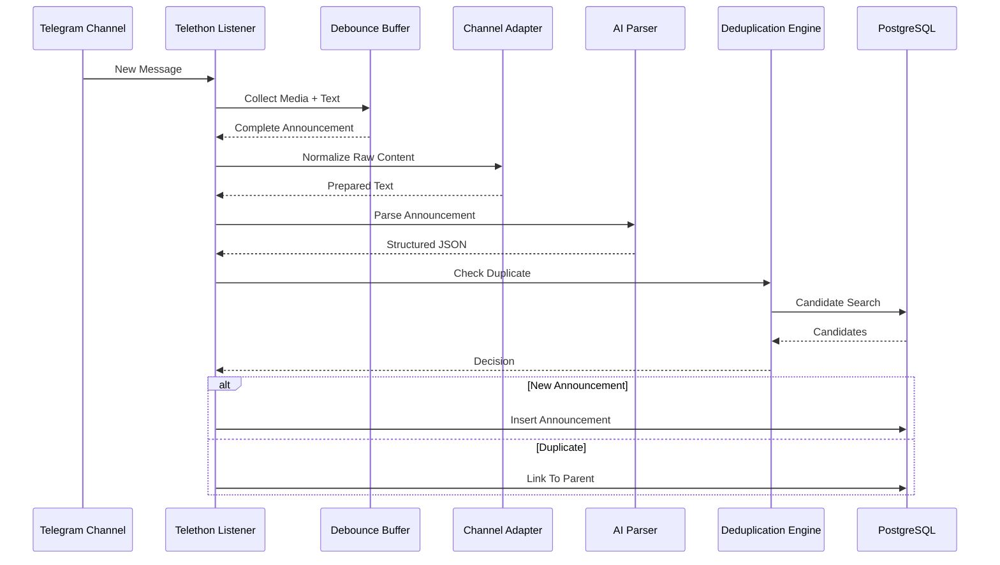

### Expected Result

- Structured Announcement yaratiladi.
- Duplicate aniqlanadi.
- Database yangilanadi.

---

# E.3 Website Scraper → AI → Deduplication → Database

Website'dan ma'lumot yig'ish jarayoni.

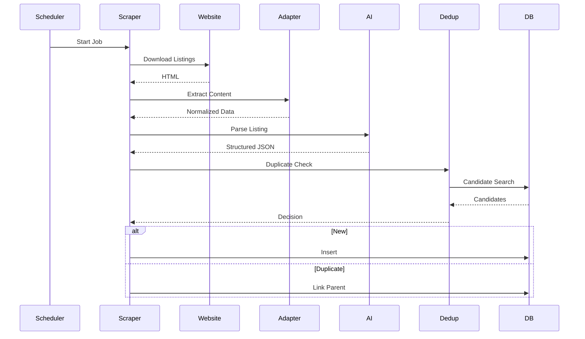

### Expected Result

- Website ma'lumotlari standart formatga o'tkaziladi.
- Duplicate tekshiriladi.
- Database yangilanadi.

---

# E.4 AI Retry Flow

AI xizmatida vaqtinchalik xatolik yuz bersa bajariladigan jarayon.

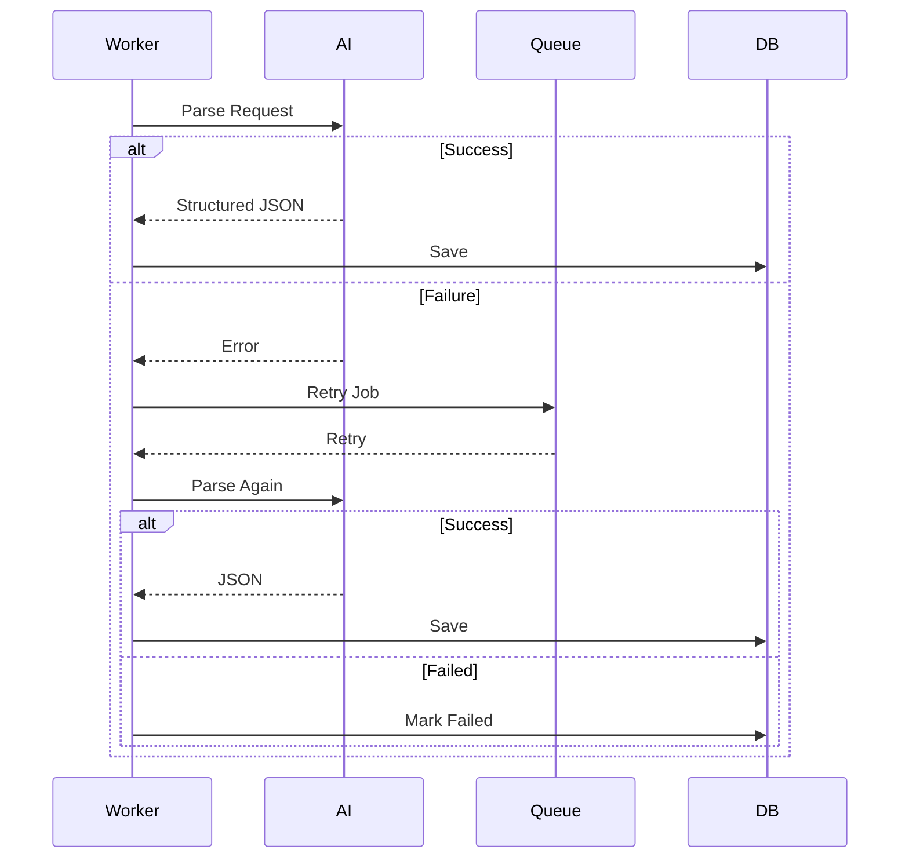

### Expected Result

- Temporary Error avtomatik tiklanadi.
- Retry limiti tugasa Failure qayd qilinadi.

---

# E.5 Complete Announcement Lifecycle

Yangi e'lonning tizimdagi to'liq hayot sikli.

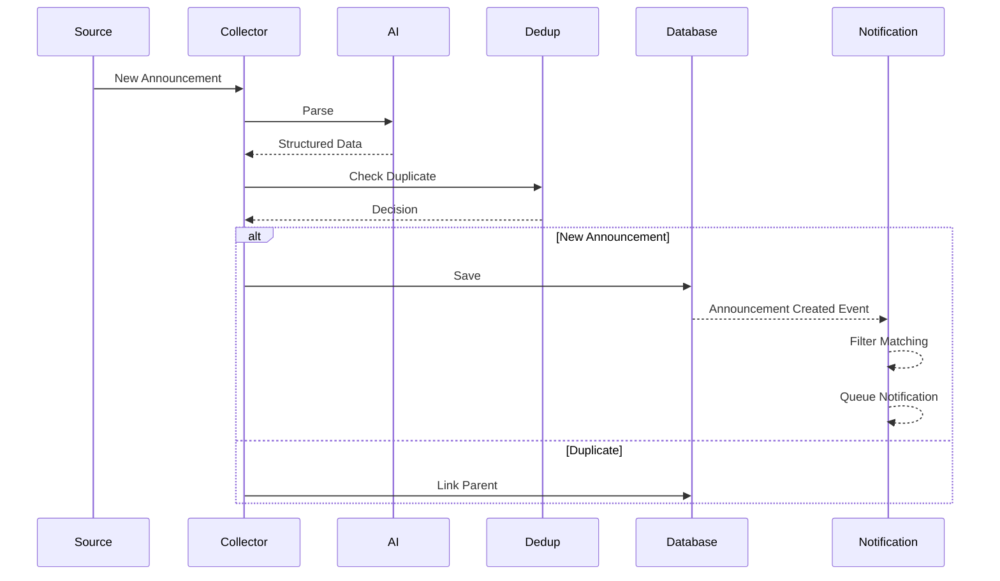

### Expected Result

- Har bir e'lon yagona Pipeline orqali o'tadi.
- Duplicate bo'lmagan e'lonlargina Notification System'ga uzatiladi.

---

# E.6 Component Responsibilities

| Component | Responsibility |
|------------|----------------|
| Telegram Listener | Telegram kanallaridan real-time xabarlarni qabul qilish |
| Website Scraper | Website'lardan e'lonlarni yig'ish |
| Channel Adapter | Raw ma'lumotni standartlashtirish |
| AI Parser | Structured JSON yaratish |
| Deduplication Engine | Dublikatlarni aniqlash |
| PostgreSQL | Ma'lumotlarni saqlash |
| Notification System | Mos foydalanuvchilarga xabar yuborish |

---

# E.7 Design Notes

Ushbu diagrammalar quyidagi arxitektura tamoyillarini aks ettiradi.

- Event-Driven Processing.
- Loose Coupling.
- AI as Independent Service.
- Repository-Based Persistence.
- Layered Processing.
- Retry-Based Fault Tolerance.
- Parent-Child Duplicate Model.

Har bir komponent mustaqil ishlaydi va faqat o'ziga tegishli mas'uliyatni bajaradi.

---

# E.8 Summary

Core Processing Flow diagrammalari Telegram Listener va Website Scraper orqali kelgan ma'lumotlarning AI Processing, Deduplication va Database'ga saqlanish jarayonini ko'rsatadi.

Ushbu diagrammalar tizimning ichki ishlash ketma-ketligini aniq ifodalaydi hamda ishlab chiqish, integratsiya va test jarayonlari uchun asosiy referens vazifasini bajaradi.

# Appendix E — Part 2 — User Interaction Flows

---

# E.9 Purpose

Ushbu bo'lim foydalanuvchi bilan bog'liq asosiy jarayonlarning ketma-ketligini (Sequence Flow) tavsiflaydi.

Diagrammalar Telegram Bot, Search Engine va Notification System o'rtasidagi o'zaro aloqalarni ko'rsatadi.

Asosiy maqsad:

- User Experience'ni standartlashtirish.
- Service Communication'ni ko'rsatish.
- Backend implementatsiyasini soddalashtirish.
- Integration Testing uchun referens yaratish.

---

# E.10 User Search Flow

Foydalanuvchi yangi qidiruv amalga oshirganda bajariladigan jarayon.

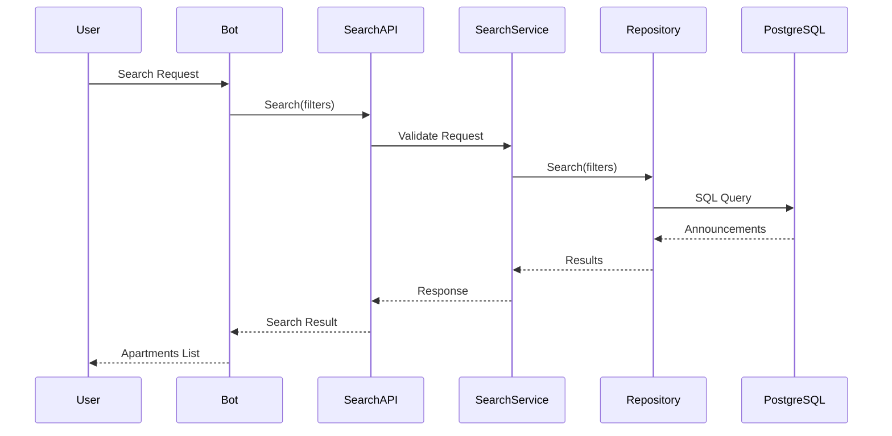

### Expected Result

- Search Request Validation bajariladi.
- Search faqat Service Layer orqali amalga oshiriladi.
- Natijalar Telegram Bot orqali foydalanuvchiga qaytariladi.

---

# E.11 Saved Filter Matching Flow

Yangi e'lon kelganda Saved Filter'larni tekshirish jarayoni.

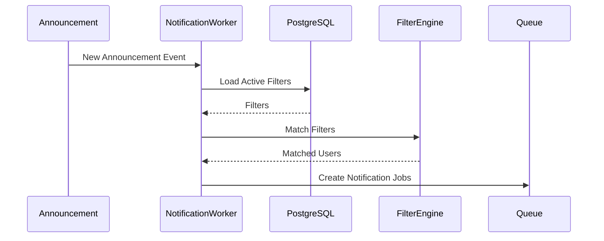

### Expected Result

- Faqat Active Filter'lar yuklanadi.
- Mos foydalanuvchilar aniqlanadi.
- Notification Queue yaratiladi.

---

# E.12 Notification Delivery Flow

Notification foydalanuvchiga yuborilishi.

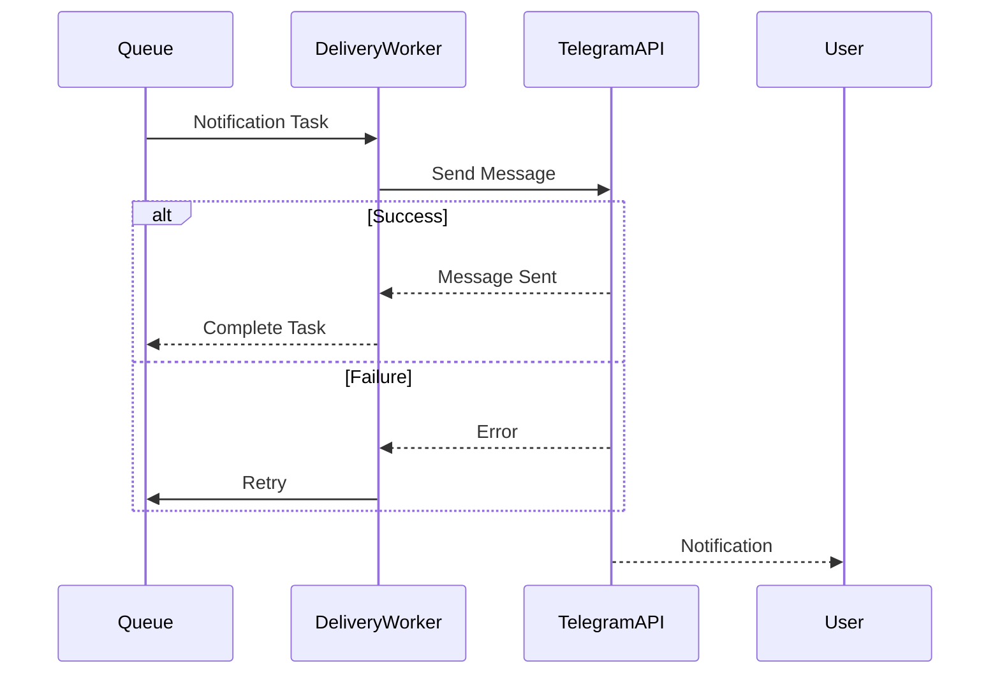

### Expected Result

- Notification Queue orqali yuboriladi.
- Temporary Error holatlarida Retry ishlaydi.

---

# E.13 Telegram Bot Search Conversation

FSM yordamida Search yaratish.

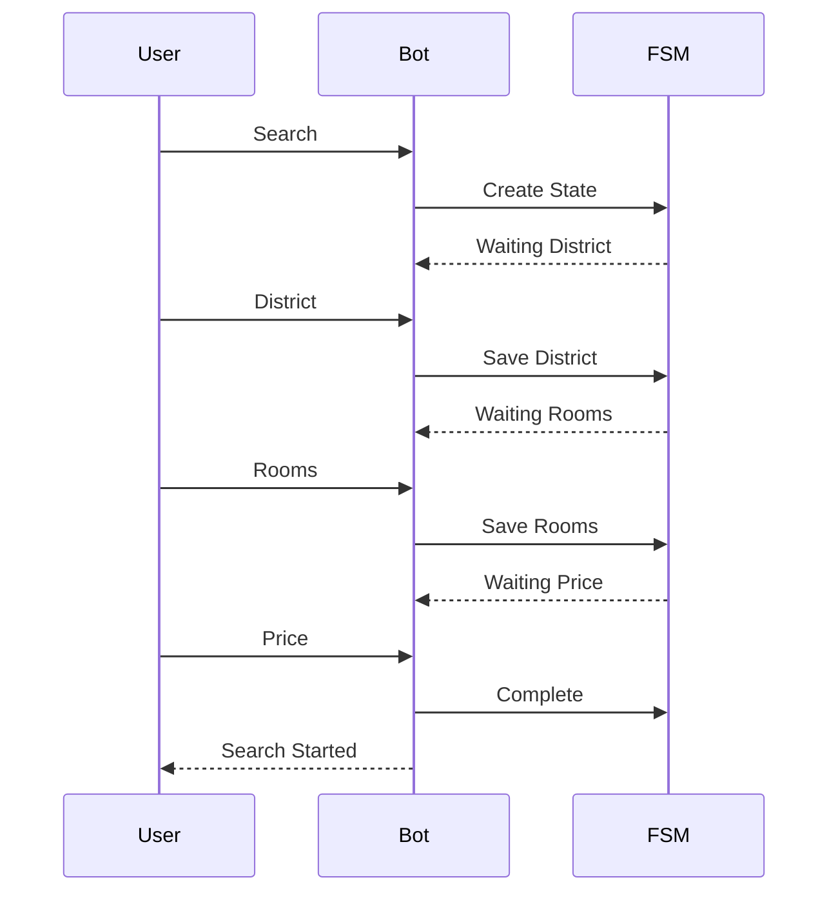

### Expected Result

- Conversation FSM orqali boshqariladi.
- Har bir bosqich Validation'dan o'tadi.

---

# E.14 Filter Management Flow

Saved Filter yaratish yoki tahrirlash.

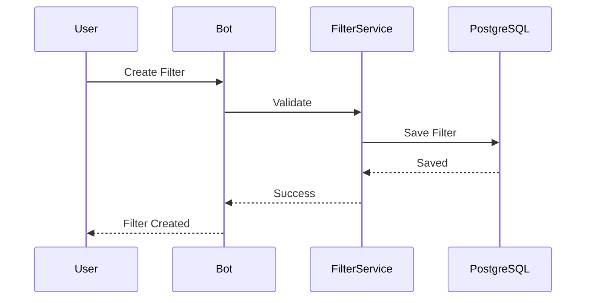

### Expected Result

- Filter Validation bajariladi.
- Database'ga faqat valid filter yoziladi.

---

# E.15 Complete User Journey

Foydalanuvchining platformadagi umumiy ishlash jarayoni.

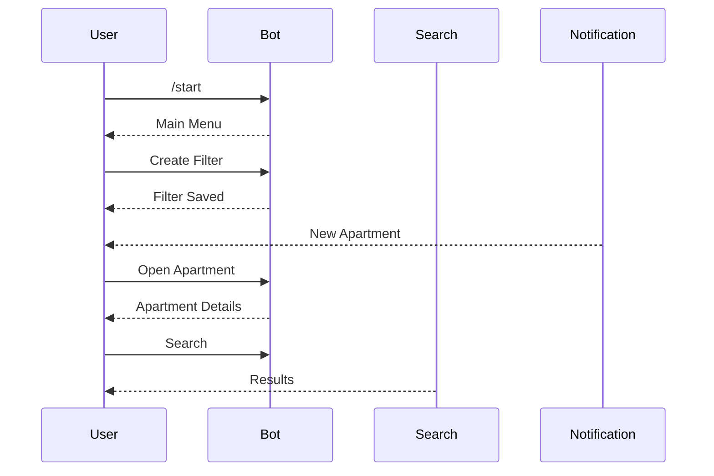

### Expected Result

- Foydalanuvchi platformaning barcha asosiy imkoniyatlaridan Telegram Bot orqali foydalanadi.
- Notification va Search bir xil interfeys orqali boshqariladi.

---

# E.16 Interaction Principles

Barcha User Flow quyidagi tamoyillarga asoslanadi.

- Service-Oriented Communication.
- Stateless Request Processing.
- Queue-Based Notifications.
- FSM-Based Conversations.
- Validation Before Processing.
- Thin Telegram Handlers.

Bu tamoyillar Bot va Backend o'rtasidagi bog'liqlikni kamaytiradi.

---

# E.17 Summary

User Interaction Flow diagrammalari Telegram Bot orqali amalga oshiriladigan asosiy foydalanuvchi ssenariylarini tavsiflaydi.

Qidiruv, Saved Filter boshqaruvi, Notification Delivery va Conversation Flow'lar Service Layer orqali bajariladi hamda barcha jarayonlar Event-Driven va Stateless Architecture tamoyillariga mos ravishda ishlaydi.

Ushbu diagrammalar Telegram Bot implementatsiyasi, integratsiya sinovlari va foydalanuvchi tajribasini standartlashtirish uchun asosiy texnik referens hisoblanadi.

---

# 14. REST API Specification

# Part 1 — API Fundamentals & Authentication

---

# 14.1 Overview

REST API tizimning barcha tashqi va ichki komponentlari o'rtasidagi standart aloqa interfeysi hisoblanadi.

API quyidagi komponentlar tomonidan ishlatilishi mumkin.

- Telegram Bot
- Future Web Application
- Future Mobile Application
- Admin Panel
- Internal Workers
- Monitoring Services
- Third-Party Integrations (Future)

API FastAPI framework asosida ishlab chiqiladi va REST tamoyillariga amal qiladi.

Barcha endpoint'lar OpenAPI Specification orqali avtomatik hujjatlashtiriladi.

---

# 14.2 API Design Principles

REST API quyidagi tamoyillarga asoslanadi.

## Stateless Communication

Har bir HTTP Request mustaqil hisoblanadi.

Server avvalgi Request holatini saqlamaydi.

---

## Resource-Oriented Design

Har bir endpoint ma'lum bir Resource'ni ifodalaydi.

Misollar.

```
/users

/announcements

/filters

/notifications
```

---

## Predictable URLs

Endpoint nomlari sodda va tushunarli bo'lishi tavsiya etiladi.

Misollar.

```
GET /announcements

GET /announcements/{id}

POST /filters

PATCH /filters/{id}

DELETE /filters/{id}
```

---

## Consistent Responses

Barcha endpoint'lar bir xil Response formatidan foydalanadi.

Bu Client implementatsiyasini soddalashtiradi.

---

## Validation First

Har bir Request Business Logic'dan oldin Validation'dan o'tadi.

---

## Idempotent Operations

GET, PUT va DELETE endpoint'lari imkon qadar Idempotent bo'lishi tavsiya etiladi.

---

# 14.3 Base URL

API Version Prefix ishlatadi.

Development muhiti.

```
http://localhost:8000/api/v1
```

Production muhiti.

```
https://api.example.com/api/v1
```

Barcha endpoint'lar ushbu prefiks ostida joylashadi.

Misollar.

```
GET /api/v1/search

POST /api/v1/filters

GET /api/v1/profile
```

---

# 14.4 Versioning Strategy

API Backward Compatibility'ni saqlash uchun URL Versioning'dan foydalanadi.

Misol.

```
/api/v1

/api/v2
```

Har bir Major Version mustaqil ishlaydi.

Minor o'zgarishlar mavjud Version ichida amalga oshiriladi.

Eskirgan endpoint'lar Deprecation Policy asosida bosqichma-bosqich olib tashlanadi.

---

# 14.5 Authentication

API bir nechta autentifikatsiya usullarini qo'llab-quvvatlaydi.

---

## Telegram Authentication

Asosiy foydalanuvchi autentifikatsiyasi Telegram Identity orqali amalga oshiriladi.

Telegram Bot foydalanuvchining Telegram ID'sini tizim identifikatori sifatida ishlatadi.

Bot va Backend o'rtasidagi so'rovlar ichki ishonchli kanal orqali yuboriladi.

---

## JWT Authentication (Future)

Kelajakdagi Web Application va Mobile Client uchun JWT Authentication qo'llab-quvvatlanishi rejalashtirilgan.

JWT quyidagi imkoniyatlarni beradi.

- Login Session
- Refresh Token
- Expiration
- Role-Based Authorization

Mazkur imkoniyat joriy versiyada majburiy emas.

---

## Internal API Authentication

Internal Service'lar o'rtasidagi aloqa alohida autentifikatsiya mexanizmidan foydalanishi tavsiya etiladi.

Misollar.

- Internal API Key
- Service Token
- Mutual Authentication (Future)

Bu mexanizm tashqi foydalanuvchilarga ochiq bo'lmaydi.

---

# 14.6 Request Format

Barcha Request'lar JSON formatida yuboriladi.

Misol.

```http
POST /api/v1/filters
Content-Type: application/json
```

```json
{
  "district": "Chilonzor",
  "rooms": 2,
  "max_price": 700
}
```

GET Request parametrlarida Query Parameters ishlatiladi.

Misol.

```http
GET /api/v1/search?district=Chilonzor&rooms=2&page=1
```

---

# 14.7 Response Format

API barcha endpoint'lar uchun yagona Response formatidan foydalanadi.

Muvaffaqiyatli javob.

```json
{
  "success": true,
  "data": {},
  "message": null
}
```

Xatolik holati.

```json
{
  "success": false,
  "data": null,
  "message": "Validation failed"
}
```

Bu format barcha endpoint'larda bir xil bo'lishi tavsiya etiladi.

---

# 14.8 Standard Error Responses

API standart HTTP xatolik kodlaridan foydalanadi.

Misollar.

| Status | Description |
|---------|-------------|
| 400 | Bad Request |
| 401 | Unauthorized |
| 403 | Forbidden |
| 404 | Resource Not Found |
| 409 | Conflict |
| 422 | Validation Error |
| 429 | Too Many Requests |
| 500 | Internal Server Error |

Error Response foydalanuvchi uchun tushunarli bo'lishi kerak.

---

# 14.9 HTTP Status Codes

REST API quyidagi javob kodlaridan foydalanadi.

| Method | Success Code |
|----------|-------------|
| GET | 200 OK |
| POST | 201 Created |
| PUT | 200 OK |
| PATCH | 200 OK |
| DELETE | 204 No Content |

Xatolik kodlari HTTP standartlariga mos bo'lishi tavsiya etiladi.

---

# 14.10 Pagination Format

Katta natijalar Pagination orqali qaytariladi.

Misol.

```json
{
  "success": true,
  "data": [
    {}
  ],
  "pagination": {
    "page": 1,
    "page_size": 20,
    "total_items": 356,
    "total_pages": 18
  }
}
```

Pagination quyidagi Query Parameters orqali boshqariladi.

```
page

page_size

sort

order
```

Kelajakda Cursor Pagination qo'llab-quvvatlanishi mumkin.

---

# 14.11 Summary

REST API platformaning barcha tashqi va ichki komponentlari uchun yagona aloqa interfeysini taqdim etadi.

API Resource-Oriented Design, Stateless Communication va Consistent Response Format tamoyillariga asoslanadi.

Telegram Authentication joriy versiyada asosiy autentifikatsiya mexanizmi bo'lsa-da, kelajakda JWT va boshqa autentifikatsiya usullarini qo'shish imkoniyati saqlanib qoladi.

Yagona Request/Response formati, standart HTTP Status Code'lar va Pagination qoidalari barcha Client'lar uchun izchil va barqaror integratsiyani ta'minlaydi.

---

# 14. REST API Specification

# Part 2 — User & Search Endpoints

---

# 14.12 User API

## Overview

User API foydalanuvchi profilini boshqarish uchun mo'ljallangan.

Joriy versiyada foydalanuvchilar Telegram Bot orqali autentifikatsiya qilinadi, shuning uchun alohida Login yoki Registration endpoint'lari mavjud emas.

User API quyidagi vazifalarni bajaradi.

- Profil ma'lumotlarini olish.
- Profil sozlamalarini yangilash.
- Notification parametrlarini boshqarish.
- Til sozlamalarini boshqarish (Future).

---

## Get Profile

Foydalanuvchining profil ma'lumotlarini qaytaradi.

### Endpoint

```http
GET /api/v1/profile
```

### Authentication

Telegram Authentication

### Success Response

```json
{
  "success": true,
  "data": {
    "telegram_id": 123456789,
    "username": "john_doe",
    "is_premium": false,
    "created_at": "2026-01-15T10:20:00Z"
  }
}
```

### Response Fields

| Field | Description |
|--------|-------------|
| telegram_id | Telegram User ID |
| username | Telegram Username |
| is_premium | Premium holati |
| created_at | Ro'yxatdan o'tgan sana |

---

## Update Profile

Profil sozlamalarini yangilaydi.

### Endpoint

```http
PATCH /api/v1/profile
```

### Request Example

```json
{
  "language": "uz",
  "notifications": true
}
```

### Success Response

```json
{
  "success": true,
  "message": "Profile updated successfully."
}
```

Faqat ruxsat etilgan maydonlarni yangilash tavsiya etiladi.

---

## Validation Rules

Profilni yangilashda quyidagi tekshiruvlar bajariladi.

- Language qo'llab-quvvatlanadigan qiymat bo'lishi kerak.
- Notification qiymati Boolean bo'lishi kerak.
- Telegram ID o'zgartirilmaydi.
- Premium holati foydalanuvchi tomonidan o'zgartirilmaydi.

---

# 14.13 Search API

## Overview

Search API platformaning asosiy endpoint'laridan biri hisoblanadi.

U foydalanuvchilarga e'lonlarni turli mezonlar asosida qidirish imkonini beradi.

Search API faqat Duplicate bo'lmagan va aktiv e'lonlarni qaytarishi tavsiya etiladi.

---

## Search Apartments

### Endpoint

```http
GET /api/v1/search
```

### Query Parameters

| Parameter | Description |
|-----------|-------------|
| district | Tuman |
| rooms | Xonalar soni |
| min_price | Minimal narx |
| max_price | Maksimal narx |
| min_area | Minimal maydon |
| max_area | Maksimal maydon |
| owner_only | Faqat egasi |
| page | Sahifa |
| page_size | Natijalar soni |

### Example

```http
GET /api/v1/search?district=Chilonzor&rooms=2&max_price=700&page=1
```

### Success Response

```json
{
  "success": true,
  "data": [
    {
      "id": "b92b7d...",
      "title": "2 xonali kvartira",
      "district": "Chilonzor",
      "price": 650,
      "rooms": 2
    }
  ],
  "pagination": {
    "page": 1,
    "page_size": 20,
    "total_items": 315,
    "total_pages": 16
  }
}
```

---

## Search by ID

Muayyan e'lonni olish.

### Endpoint

```http
GET /api/v1/announcements/{id}
```

### Success Response

```json
{
  "success": true,
  "data": {
    "id": "...",
    "title": "...",
    "price": 650,
    "district": "Chilonzor",
    "rooms": 2,
    "square_meters": 58,
    "source_url": "..."
  }
}
```

Agar e'lon mavjud bo'lmasa.

```
404 Not Found
```

qaytariladi.

---

## Pagination

Search API Offset Pagination'dan foydalanadi.

Parametrlar.

```
page

page_size
```

Tavsiya etilgan standart qiymatlar.

| Parameter | Default |
|------------|---------|
| page | 1 |
| page_size | 20 |

Server maksimal `page_size` limitini o'rnatishi tavsiya etiladi.

---

## Sorting

Search natijalari turli mezonlar bo'yicha tartiblanishi mumkin.

Misollar.

```
price

created_at

rooms

square_meters
```

So'rov.

```http
GET /api/v1/search?sort=price&order=asc
```

Qo'llab-quvvatlanadigan tartiblash.

- Ascending
- Descending

---

## Filtering

Search API bir vaqtning o'zida bir nechta filtrni qo'llab-quvvatlaydi.

Misollar.

- District.
- Rooms.
- Price Range.
- Area.
- Floor.
- Owner Only.
- Renovation Level (Future).
- Furnished (Future).

Barcha parametrlar ixtiyoriy hisoblanadi.

Filtrlar kombinatsiyalab ishlatilishi mumkin.

---

## Search Validation

Search Request quyidagi tekshiruvlardan o'tadi.

- min_price ≤ max_price
- min_area ≤ max_area
- page ≥ 1
- page_size belgilangan limitdan oshmasligi
- sort faqat ruxsat etilgan qiymatlardan biri bo'lishi
- order faqat asc yoki desc bo'lishi

Validation xatolari `422 Validation Error` bilan qaytariladi.

---

# 14.14 Favorites API (Future)

## Overview

Kelajakda foydalanuvchilar e'lonlarni Favorite sifatida saqlashlari mumkin.

Rejalashtirilgan endpoint'lar.

### Add Favorite

```http
POST /api/v1/favorites
```

---

### List Favorites

```http
GET /api/v1/favorites
```

---

### Remove Favorite

```http
DELETE /api/v1/favorites/{announcement_id}
```

Favorites Notification System'dan mustaqil ishlaydi.

Kelajakda Recommendation System bilan integratsiya qilinishi mumkin.

---

# 14.15 Summary

User API foydalanuvchi profilini boshqarish uchun mo'ljallangan bo'lib, Telegram Authentication asosida ishlaydi.

Search API platformaning asosiy endpoint'i hisoblanadi va foydalanuvchilarga turli filtrlar, tartiblash va pagination yordamida e'lonlarni qidirish imkonini beradi.

Kelajakda Favorites API qo'shilishi orqali foydalanuvchilar qiziqarli e'lonlarni saqlash va keyinchalik ularga tezkor murojaat qilish imkoniyatiga ega bo'ladilar.

Barcha endpoint'lar yagona Request/Response formatiga amal qiladi hamda REST tamoyillariga mos ravishda ishlab chiqiladi.

---

# 14. REST API Specification

# Part 3 — Filters & Notifications API

---

# 14.16 Saved Filters API

## Overview

Saved Filters API foydalanuvchilarga qidiruv mezonlarini saqlash va Notification System bilan integratsiya qilish imkonini beradi.

Har bir Saved Filter mustaqil resurs hisoblanadi va foydalanuvchiga tegishli bo'ladi.

Supported Operations.

- Create Filter
- Update Filter
- Delete Filter
- Enable Filter
- Disable Filter
- List Filters

Barcha endpoint'lar Telegram Authentication talab qiladi.

---

## Create Filter

Yangi Saved Filter yaratadi.

### Endpoint

```http
POST /api/v1/filters
```

### Request Example

```json
{
  "name": "2 Rooms - Chilonzor",
  "district": "Chilonzor",
  "rooms": 2,
  "max_price": 700,
  "min_area": 50,
  "owner_only": true
}
```

### Success Response

```json
{
  "success": true,
  "data": {
    "id": "filter_uuid",
    "status": "active"
  }
}
```

Validation muvaffaqiyatli o'tgandan keyingina Filter Database'ga yoziladi.

---

## Update Filter

Mavjud Saved Filter'ni yangilaydi.

### Endpoint

```http
PATCH /api/v1/filters/{id}
```

Faqat Filter egasi o'z filterini yangilashi mumkin.

Validation Create Filter bilan bir xil qoidalarga amal qiladi.

---

## Delete Filter

Saved Filter'ni o'chiradi.

### Endpoint

```http
DELETE /api/v1/filters/{id}
```

### Success Response

```
204 No Content
```

Delete operatsiyasi idempotent bo'lishi tavsiya etiladi.

---

## Enable Filter

Filter'ni aktiv holatga o'tkazadi.

### Endpoint

```http
PATCH /api/v1/filters/{id}/enable
```

### Success Response

```json
{
  "success": true,
  "message": "Filter enabled."
}
```

Aktiv filterlar Notification Matching jarayonida qatnashadi.

---

## Disable Filter

Filter'ni vaqtincha o'chiradi.

### Endpoint

```http
PATCH /api/v1/filters/{id}/disable
```

### Success Response

```json
{
  "success": true,
  "message": "Filter disabled."
}
```

Disable qilingan filterlar Database'da saqlanadi, ammo Notification Worker tomonidan hisobga olinmaydi.

---

## List Filters

Foydalanuvchining barcha Saved Filter'larini qaytaradi.

### Endpoint

```http
GET /api/v1/filters
```

### Success Response

```json
{
  "success": true,
  "data": [
    {
      "id": "...",
      "name": "Chilonzor",
      "enabled": true
    }
  ]
}
```

Natijalar yaratilgan sana bo'yicha tartiblanishi tavsiya etiladi.

---

## Validation Rules

Saved Filter quyidagi tekshiruvlardan o'tadi.

- Filter Name bo'sh bo'lmasligi.
- min_price ≤ max_price.
- min_area ≤ max_area.
- Rooms musbat qiymat bo'lishi.
- District qo'llab-quvvatlanadigan qiymatlardan biri bo'lishi.
- Foydalanuvchi Filter limitidan oshmasligi.

Validation xatolari `422 Validation Error` bilan qaytariladi.

---

# 14.17 Notification API

## Overview

Notification API foydalanuvchiga yuborilgan Notification'larni boshqarish uchun ishlatiladi.

Supported Operations.

- Get Notifications
- Mark as Read
- Update Notification Settings

---

## Get Notifications

Foydalanuvchining Notification tarixini qaytaradi.

### Endpoint

```http
GET /api/v1/notifications
```

### Query Parameters

| Parameter | Description |
|-----------|-------------|
| page | Sahifa |
| page_size | Natijalar soni |
| unread_only | Faqat o'qilmagan Notification'lar |

### Success Response

```json
{
  "success": true,
  "data": [
    {
      "id": "...",
      "title": "2 xonali kvartira",
      "created_at": "2026-01-10T10:20:00Z",
      "is_read": false
    }
  ]
}
```

---

## Mark as Read

Notification'ni o'qilgan deb belgilaydi.

### Endpoint

```http
PATCH /api/v1/notifications/{id}/read
```

### Success Response

```json
{
  "success": true,
  "message": "Notification marked as read."
}
```

Operatsiya bir necha marta bajarilganda ham bir xil natijani qaytarishi tavsiya etiladi.

---

## Notification Settings

Notification parametrlarini yangilaydi.

### Endpoint

```http
PATCH /api/v1/notifications/settings
```

### Request Example

```json
{
  "enabled": true
}
```

### Success Response

```json
{
  "success": true,
  "message": "Notification settings updated."
}
```

Kelajakda quyidagi parametrlar qo'shilishi mumkin.

- Quiet Hours.
- Delivery Frequency.
- Category Preferences.

---

# 14.18 Webhook Endpoints (Internal)

## Overview

Webhook Endpoint'lar faqat ichki servislar tomonidan ishlatiladi.

Ular tashqi foydalanuvchilar uchun ochiq bo'lmaydi.

---

## Internal Events

Misollar.

```http
POST /internal/events/new-announcement
```

```http
POST /internal/events/deduplication-completed
```

```http
POST /internal/events/notification-created
```

Har bir Webhook Internal Authentication orqali himoyalanishi tavsiya etiladi.

---

## Security Requirements

Internal Webhook'lar uchun tavsiya etilgan himoya mexanizmlari.

- Internal API Key.
- HMAC Signature.
- Reverse Proxy Restrictions.
- IP Allowlist (Future).
- Mutual TLS (Future).

---

# 14.19 Health Check API

## Overview

Health Check API Monitoring va Orchestration tizimlari uchun mo'ljallangan.

---

## Basic Health Check

### Endpoint

```http
GET /health
```

### Success Response

```json
{
  "status": "healthy"
}
```

---

## Detailed Health Check

Kelajakdagi imkoniyat.

```http
GET /health/details
```

Misol.

```json
{
  "database": "healthy",
  "telegram_bot": "healthy",
  "notification_worker": "healthy",
  "ai_service": "healthy"
}
```

Bu endpoint Monitoring tizimlari bilan integratsiya qilishni osonlashtiradi.

---

# 14.20 Summary

Saved Filters API foydalanuvchilarga qidiruv mezonlarini yaratish va boshqarish imkonini beradi hamda Notification System bilan bevosita integratsiyalashgan.

Notification API yuborilgan xabarnomalarni ko'rish, ularni o'qilgan deb belgilash va Notification sozlamalarini boshqarish uchun xizmat qiladi.

Internal Webhook Endpoint'lar servislar o'rtasidagi Event-Driven Communication'ni ta'minlaydi, Health Check API esa tizimning ishlash holatini Monitoring va Deployment vositalari uchun standart usulda taqdim etadi.

Barcha endpoint'lar REST tamoyillariga mos ravishda ishlab chiqiladi va yagona Request/Response formatiga amal qiladi.

---

# 14. REST API Specification

# Part 4 — Internal APIs, Standards & Best Practices

---

# 14.21 Internal Service APIs

## Overview

Platforma bir nechta mustaqil komponentlardan tashkil topgan bo'lsa-da, ular yagona Business Logic asosida ishlaydi.

Ichki servislar o'rtasidagi aloqa (Service-to-Service Communication) tashqi REST API'dan ajratilgan bo'lishi tavsiya etiladi.

Internal API quyidagi komponentlar tomonidan ishlatiladi.

- Telegram Listener
- Website Scraper
- AI Processing Worker
- Deduplication Engine
- Notification Worker
- Scheduler
- Monitoring Services

Bu endpoint'lar tashqi foydalanuvchilar uchun ochiq bo'lmaydi.

---

## Internal Communication Principles

Ichki servislar quyidagi tamoyillarga amal qilishi tavsiya etiladi.

- Service Isolation.
- Stateless Requests.
- Standard JSON Messages.
- Versioned APIs.
- Consistent Error Responses.
- Timeout Protection.
- Retry Support.

Bu tamoyillar komponentlarni mustaqil rivojlantirish imkonini beradi.

---

## Internal Event Examples

Misollar.

```http
POST /internal/events/new-announcement
```

```http
POST /internal/events/ai-completed
```

```http
POST /internal/events/deduplication-finished
```

```http
POST /internal/events/notification-created
```

Har bir Internal API faqat ishonchli servislar tomonidan chaqirilishi kerak.

---

# 14.22 Idempotency

## Overview

Ba'zi HTTP operatsiyalar bir necha marta yuborilishi mumkin.

API bir xil Request bir necha marta bajarilganda tizim holati o'zgarmasligini ta'minlashi tavsiya etiladi.

---

## Idempotent Operations

Quyidagi endpoint'lar Idempotent hisoblanadi.

- GET
- PUT
- DELETE

PATCH endpoint'lari ham imkon qadar Idempotent bo'lishi tavsiya etiladi.

Misol.

```
PATCH Notification Read

↓

Already Read

↓

Return Success
```

---

## Duplicate Request Protection

Kelajakda quyidagi imkoniyat qo'shilishi mumkin.

```
Idempotency-Key
```

Misol.

```http
POST /api/v1/filters

Idempotency-Key:
4d6a5e98...
```

Bu mexanizm Network Retry natijasida yuzaga keladigan Duplicate Request'larning oldini oladi.

---

# 14.23 Validation Rules

## Overview

Har bir Request Business Logic ishlashidan oldin Validation'dan o'tishi kerak.

Validation quyidagi qatlamlarda bajariladi.

- Request Schema.
- Data Type Validation.
- Business Validation.
- Database Constraints.

---

## Request Validation

Misollar.

- Required Fields.
- Optional Fields.
- Maximum Length.
- Minimum Length.
- Enum Values.
- UUID Format.
- Numeric Range.

---

## Business Validation

Misollar.

- min_price ≤ max_price.
- min_area ≤ max_area.
- Existing User.
- Existing Filter.
- Ownership Verification.

---

## Validation Response

Validation xatolari quyidagi formatda qaytarilishi tavsiya etiladi.

```json
{
  "success": false,
  "message": "Validation failed",
  "errors": [
    {
      "field": "max_price",
      "message": "Must be greater than min_price"
    }
  ]
}
```

Bu format Client uchun xatolarni aniqlashni soddalashtiradi.

---

# 14.24 API Security

## Overview

REST API foydalanuvchi ma'lumotlari va tizim resurslarini himoya qilishi kerak.

---

## Authentication

Qo'llab-quvvatlanadigan autentifikatsiya mexanizmlari.

- Telegram Authentication.
- Internal Service Authentication.
- JWT (Future).

---

## Authorization

Har bir foydalanuvchi faqat o'z resurslariga murojaat qilishi mumkin.

Misollar.

- Own Filters.
- Own Notifications.
- Own Profile.

Resource Ownership majburiy tekshirilishi tavsiya etiladi.

---

## Input Security

Barcha kiruvchi ma'lumotlar tekshiriladi.

Asosiy tamoyillar.

- Input Validation.
- Parameter Sanitization.
- SQL Injection Protection.
- JSON Validation.

---

## Transport Security

Production muhitida quyidagilar tavsiya etiladi.

- HTTPS.
- TLS 1.2 yoki undan yuqori.
- Secure Headers.
- Reverse Proxy.

---

## Sensitive Data

Quyidagi ma'lumotlar loglarga yozilmasligi tavsiya etiladi.

- API Keys.
- Authentication Tokens.
- User Secrets.
- Internal Credentials.

---

# 14.25 Rate Limiting

## Overview

Rate Limiting API'ni noto'g'ri foydalanish va ortiqcha yuklanishdan himoya qiladi.

---

## Recommended Limits

Misollar.

| Endpoint Type | Recommended Limit |
|---------------|------------------:|
| Search API | 60 requests/minute |
| Profile API | 30 requests/minute |
| Filter API | 20 requests/minute |
| Notification API | 30 requests/minute |

Bu qiymatlar konfiguratsiya orqali o'zgartirilishi mumkin.

---

## Limit Response

Cheklov oshirilganda.

```
429 Too Many Requests
```

qaytariladi.

---

## Future Improvements

Kelajakda quyidagilar qo'shilishi mumkin.

- Adaptive Rate Limiting.
- IP-Based Limits.
- Premium User Limits.
- Distributed Rate Limiting.

---

# 14.26 API Documentation (OpenAPI)

## Overview

REST API avtomatik hujjatlashtirilishi tavsiya etiladi.

FastAPI OpenAPI Specification'ni avtomatik generatsiya qiladi.

---

## Documentation Endpoints

Misollar.

```text
/docs
```

Swagger UI.

```text
/redoc
```

ReDoc.

---

## Documentation Requirements

Har bir endpoint quyidagilarni o'z ichiga olishi tavsiya etiladi.

- Description.
- Request Schema.
- Response Schema.
- Error Responses.
- Authentication Requirements.
- Example Requests.
- Example Responses.

Bu hujjatlar Client Developer'lar uchun asosiy referens hisoblanadi.

---

# 14.27 Future Improvements

REST API kelajakda quyidagi imkoniyatlar bilan kengaytirilishi mumkin.

- JWT Authentication.
- OAuth2 Support.
- API Version 2.
- Cursor Pagination.
- GraphQL Gateway.
- Public Developer API.
- API Analytics.
- WebSocket API.
- API Usage Dashboard.
- Distributed Tracing.

Mavjud arxitektura ushbu imkoniyatlarni qo'llab-quvvatlash uchun yetarlicha moslashuvchan.

---

# 14.28 Summary

Internal API'lar tizim komponentlari o'rtasidagi xavfsiz va standartlashtirilgan aloqani ta'minlaydi.

Idempotency, Validation, API Security va Rate Limiting tamoyillari REST API'ning ishonchliligi va barqarorligini oshiradi.

FastAPI tomonidan taqdim etiladigan OpenAPI hujjatlari integratsiyani soddalashtiradi, kelajakdagi kengaytirish imkoniyatlari esa platformaning yangi mijozlar va servislar bilan moslashuvchan ishlashini ta'minlaydi.

---

# Appendix G — Error Codes Reference

---

# G.1 Purpose

Ushbu Appendix platformada ishlatiladigan barcha standart xatolik kodlari (Error Codes) va ularning ma'nolarini tavsiflaydi.

Asosiy maqsad:

- REST API uchun yagona Error Standard yaratish.
- Telegram Bot javoblarini standartlashtirish.
- AI Worker va Background Worker'lar uchun umumiy xatolik formatini belgilash.
- Monitoring va Debugging jarayonlarini soddalashtirish.

Barcha komponentlar imkon qadar bir xil Error Response formatidan foydalanishi tavsiya etiladi.

---

# G.2 Error Response Format

REST API quyidagi standart javob formatidan foydalanishi tavsiya etiladi.

```json
{
  "success": false,
  "error": {
    "code": "FILTER_NOT_FOUND",
    "message": "Saved filter was not found."
  }
}
```

Kelajakda quyidagi metadata qo'shilishi mumkin.

```json
{
  "success": false,
  "error": {
    "code": "FILTER_NOT_FOUND",
    "message": "Saved filter was not found."
  },
  "meta": {
    "request_id": "f7b1...",
    "timestamp": "2026-01-10T12:20:00Z"
  }
}
```

---

# G.3 HTTP Status Code Mapping

| HTTP Status | Meaning |
|-------------|---------|
| 200 | Successful Request |
| 201 | Resource Created |
| 204 | Resource Deleted |
| 400 | Bad Request |
| 401 | Unauthorized |
| 403 | Forbidden |
| 404 | Resource Not Found |
| 409 | Conflict |
| 422 | Validation Error |
| 429 | Too Many Requests |
| 500 | Internal Server Error |
| 503 | Service Unavailable |

HTTP Status Code'lar REST standartlariga mos kelishi tavsiya etiladi.

---

# G.4 General Error Codes

| Error Code | Description |
|-------------|-------------|
| UNKNOWN_ERROR | Unknown system error |
| INTERNAL_ERROR | Internal server failure |
| INVALID_REQUEST | Invalid request format |
| VALIDATION_ERROR | Request validation failed |
| RESOURCE_NOT_FOUND | Requested resource not found |
| ACCESS_DENIED | Access denied |
| RATE_LIMIT_EXCEEDED | Too many requests |
| SERVICE_UNAVAILABLE | Service temporarily unavailable |

---

# G.5 User & Authentication Errors

| Error Code | Description |
|-------------|-------------|
| USER_NOT_FOUND | User does not exist |
| USER_ALREADY_EXISTS | User already exists |
| INVALID_TELEGRAM_USER | Invalid Telegram identity |
| AUTHENTICATION_REQUIRED | Authentication required |
| INVALID_TOKEN | Invalid authentication token |
| TOKEN_EXPIRED | Authentication token expired |
| PERMISSION_DENIED | User has insufficient permissions |

---

# G.6 Search & Filter Errors

| Error Code | Description |
|-------------|-------------|
| FILTER_NOT_FOUND | Saved filter not found |
| FILTER_LIMIT_EXCEEDED | Maximum number of filters reached |
| INVALID_FILTER | Invalid filter parameters |
| INVALID_SORT_FIELD | Unsupported sorting field |
| INVALID_PAGINATION | Invalid pagination parameters |
| SEARCH_RESULT_EMPTY | No announcements found |

---

# G.7 Announcement & Deduplication Errors

| Error Code | Description |
|-------------|-------------|
| ANNOUNCEMENT_NOT_FOUND | Announcement not found |
| DUPLICATE_DETECTED | Duplicate announcement detected |
| INVALID_SOURCE | Unsupported announcement source |
| INVALID_MEDIA | Invalid media content |
| INVALID_PHONE_NUMBER | Invalid phone number format |

---

# G.8 AI Processing Errors

| Error Code | Description |
|-------------|-------------|
| AI_REQUEST_FAILED | AI request failed |
| AI_TIMEOUT | AI request timeout |
| AI_RATE_LIMIT | AI rate limit exceeded |
| AI_INVALID_RESPONSE | Invalid AI response |
| AI_PARSING_FAILED | Failed to parse structured data |
| AI_LOW_CONFIDENCE | Confidence score below threshold |
| AI_UNSUPPORTED_CONTENT | Unsupported content format |

Retry Policy ushbu xatoliklarning ayrimlari uchun qo'llaniladi.

---

# G.9 Telegram Errors

| Error Code | Description |
|-------------|-------------|
| TELEGRAM_API_ERROR | Telegram API returned an error |
| MESSAGE_NOT_DELIVERED | Failed to deliver message |
| USER_BLOCKED_BOT | User blocked the bot |
| CHAT_NOT_FOUND | Chat not found |
| CALLBACK_EXPIRED | Callback query expired |
| MESSAGE_TOO_LONG | Telegram message exceeds limit |

Notification Worker ushbu xatoliklarni Monitoring tizimiga yuborishi tavsiya etiladi.

---

# G.10 Database Errors

| Error Code | Description |
|-------------|-------------|
| DATABASE_CONNECTION_FAILED | Database connection failed |
| DATABASE_TIMEOUT | Database timeout |
| UNIQUE_CONSTRAINT_FAILED | Unique constraint violation |
| FOREIGN_KEY_VIOLATION | Foreign key constraint failed |
| TRANSACTION_FAILED | Transaction rollback occurred |

---

# G.11 Internal Service Errors

| Error Code | Description |
|-------------|-------------|
| INTERNAL_API_ERROR | Internal API request failed |
| SERVICE_TIMEOUT | Internal service timeout |
| QUEUE_UNAVAILABLE | Queue service unavailable |
| EVENT_PROCESSING_FAILED | Failed to process event |
| INVALID_INTERNAL_REQUEST | Invalid internal request |

---

# G.12 Retryable Errors

Quyidagi xatoliklarda avtomatik Retry qo'llanilishi tavsiya etiladi.

| Error Code | Retry |
|-------------|:-----:|
| AI_TIMEOUT | ✅ |
| AI_REQUEST_FAILED | ✅ |
| TELEGRAM_API_ERROR | ✅ |
| DATABASE_TIMEOUT | ✅ |
| SERVICE_TIMEOUT | ✅ |
| QUEUE_UNAVAILABLE | ✅ |

Quyidagi xatoliklarda Retry tavsiya etilmaydi.

| Error Code | Retry |
|-------------|:-----:|
| VALIDATION_ERROR | ❌ |
| USER_NOT_FOUND | ❌ |
| FILTER_NOT_FOUND | ❌ |
| INVALID_FILTER | ❌ |
| INVALID_TOKEN | ❌ |

---

# G.13 Logging Requirements

Har bir xatolik quyidagi minimal ma'lumotlarni log qilishi tavsiya etiladi.

- Timestamp
- Error Code
- HTTP Status (agar mavjud bo'lsa)
- Service Name
- Request ID
- User ID (agar mavjud bo'lsa)
- Stack Trace (faqat Internal Logs uchun)

Maxfiy ma'lumotlar (API Key, Token, Password va boshqalar) loglarga yozilmasligi kerak.

---

# G.14 Monitoring Integration

Monitoring tizimi quyidagi ko'rsatkichlarni yig'ishi tavsiya etiladi.

- Errors Per Minute
- Top Error Codes
- AI Failure Rate
- Telegram Delivery Errors
- Validation Errors
- Database Errors
- Internal API Errors
- Retry Count

Bu ma'lumotlar tizim sog'lig'ini kuzatish va nosozliklarni tez aniqlashga yordam beradi.

---

# G.15 Best Practices

Platformaning barcha komponentlari quyidagi tamoyillarga amal qilishi tavsiya etiladi.

- Har bir Error Code yagona va o'zgarmas bo'lishi.
- Error Message foydalanuvchi uchun tushunarli bo'lishi.
- Ichki texnik tafsilotlar API javobida ko'rsatilmasligi.
- Retry faqat vaqtinchalik (transient) xatoliklar uchun ishlatilishi.
- Error Code'lar Monitoring va Alerting tizimlari bilan integratsiyalashgan bo'lishi.

---

# G.16 Summary

Ushbu Appendix platforma bo'ylab yagona Error Handling standartini belgilaydi.

REST API, Telegram Bot, AI Processing Pipeline, Deduplication Engine va boshqa komponentlar bir xil Error Code tizimidan foydalangan holda izchil ishlaydi.

Standartlashtirilgan Error Response, Retry siyosati va Monitoring integratsiyasi tizimning barqarorligi, kuzatiluvchanligi (Observability) va qo'llab-quvvatlanishini sezilarli darajada yaxshilaydi.

---

# 15. Worker & Queue System

---

# 15.1 Overview

Worker & Queue System platformaning Background Processing qatlamini tashkil etadi.

Platformadagi ko'plab operatsiyalar foydalanuvchi so'roviga bevosita javob qaytarishni talab qilmaydi. Bunday vazifalarni asosiy API jarayonidan ajratish tizimning javob berish tezligini oshiradi va komponentlar orasidagi bog'liqlikni kamaytiradi.

Worker Architecture quyidagi vazifalarni bajaradi.

- AI Processing
- Image Download
- Deduplication
- Notification Delivery
- Website Crawling
- Scheduled Tasks
- Maintenance Jobs

Ushbu komponentlar Event-Driven Architecture tamoyiliga asoslanadi.

---

# 15.2 Design Goals

Worker tizimi quyidagi maqsadlar asosida ishlab chiqiladi.

- Asynchronous Processing
- Fault Isolation
- Horizontal Scalability
- Retry Support
- Independent Deployment
- High Throughput
- Reliability
- Observability

Har bir Worker mustaqil ishlashi va boshqa Worker'larning holatiga bog'liq bo'lmasligi tavsiya etiladi.

---

# 15.3 Architecture Overview

Platforma Queue-Based Processing modelidan foydalanadi.

```text
Event

↓

Queue

↓

Worker

↓

Business Logic

↓

Database / API
```

Har bir Event Queue orqali tegishli Worker'ga uzatiladi.

Bu yondashuv API Response Time'ni qisqartiradi va tizimning umumiy o'tkazuvchanligini oshiradi.

---

# 15.4 Worker Types

Platformada quyidagi asosiy Worker'lar mavjud.

| Worker | Responsibility |
|---------|----------------|
| Telegram Listener | Telegram Event Processing |
| Website Scraper | Website Crawling |
| AI Worker | AI Parsing & Extraction |
| Deduplication Worker | Duplicate Detection |
| Notification Worker | Message Delivery |
| Scheduler Worker | Scheduled Jobs |
| Maintenance Worker | Cleanup & Maintenance |

Har bir Worker alohida jarayon (process) yoki konteyner sifatida ishga tushirilishi tavsiya etiladi.

---

# 15.5 Queue Principles

Queue tizimi Event'larni vaqtinchalik saqlaydi va Worker'lar tomonidan qayta ishlanishini ta'minlaydi.

Asosiy tamoyillar.

- First In First Out (FIFO).
- Durable Messages.
- Retry Support.
- Delayed Processing.
- Dead Letter Queue Support (Future).

Queue foydalanuvchi so'rovlaridan mustaqil ishlaydi.

---

# 15.6 Event Types

Platformada quyidagi asosiy Event'lar hosil bo'ladi.

| Event | Generated By |
|--------|--------------|
| New Telegram Message | Telegram Listener |
| New Website Announcement | Website Scraper |
| AI Parsing Completed | AI Worker |
| Deduplication Completed | Deduplication Worker |
| Notification Created | Notification Service |
| Scheduled Cleanup | Scheduler |

Har bir Event yagona identifikator (Event ID) bilan qayd etilishi tavsiya etiladi.

---

# 15.7 Worker Lifecycle

Har bir Worker quyidagi hayotiy sikl bo'yicha ishlaydi.

```text
Start

↓

Connect Queue

↓

Receive Task

↓

Validate

↓

Execute

↓

Success / Retry / Fail

↓

Wait Next Task
```

Worker doimiy ishlashga mo'ljallangan bo'lib, Queue'dan yangi vazifalarni kutadi.

---

# 15.8 Retry Strategy

Ba'zi vazifalar vaqtinchalik xatoliklar sababli muvaffaqiyatsiz tugashi mumkin.

Bunday holatlarda Retry mexanizmi qo'llaniladi.

Retry tavsiya etiladigan holatlar.

- Temporary Network Failure
- AI Timeout
- Telegram API Timeout
- Database Timeout
- Internal Service Timeout

Retry tavsiya etilmaydigan holatlar.

- Validation Error
- Invalid Input
- Unsupported Content
- Resource Not Found

Retry siyosati eksponensial kechikish (Exponential Backoff) asosida amalga oshirilishi tavsiya etiladi.

---

# 15.9 Failure Handling

Worker bajarilishi davomida xatolik yuz bersa, tizim quyidagi tartibda harakat qiladi.

1. Error log qilinadi.
2. Retry mumkinligi tekshiriladi.
3. Retry bajariladi.
4. Retry limiti tugasa, vazifa Failed deb belgilanadi.
5. Monitoring tizimiga xabar yuboriladi.

Kelajakda Dead Letter Queue (DLQ) qo'shilishi tavsiya etiladi.

---

# 15.10 Monitoring & Metrics

Har bir Worker Monitoring tizimiga asosiy ko'rsatkichlarni yuborishi tavsiya etiladi.

Monitoring qilinadigan metrikalar.

- Active Workers
- Tasks Per Minute
- Average Processing Time
- Retry Count
- Failed Tasks
- Queue Length
- Queue Wait Time
- Success Rate

Bu ko'rsatkichlar tizimning yuklanishini va samaradorligini baholash imkonini beradi.

---

# 15.11 Deployment Strategy

Har bir Worker alohida Docker Container sifatida ishga tushirilishi tavsiya etiladi.

Misol.

```text
listener

↓

queue

↓

ai-worker

↓

dedup-worker

↓

notification-worker
```

Bu yondashuv kerakli Worker'ni mustaqil ravishda qayta ishga tushirish yoki gorizontal kengaytirishni osonlashtiradi.

---

# 15.12 Scalability

Worker Architecture gorizontal kengaytirishni qo'llab-quvvatlaydi.

Yuklama ortganda bir xil Worker'dan bir nechta nusxa ishga tushirilishi mumkin.

Misol.

```text
Queue

↓

Notification Worker 1

Notification Worker 2

Notification Worker 3
```

Queue vazifalarni Worker'lar o'rtasida taqsimlaydi.

Bu yondashuv minglab Event'larni parallel qayta ishlash imkonini beradi.

---

# 15.13 Best Practices

Worker tizimini ishlab chiqishda quyidagi tamoyillarga amal qilish tavsiya etiladi.

- Workers mustaqil bo'lishi.
- Stateless Processing.
- Small and Focused Responsibilities.
- Retry faqat vaqtinchalik xatoliklar uchun.
- Idempotent Task Processing.
- Structured Logging.
- Comprehensive Monitoring.
- Graceful Shutdown Support.

---

# 15.14 Summary

Worker & Queue System platformaning barcha Background Processing vazifalarini boshqaruvchi asosiy infratuzilma hisoblanadi.

Queue-Based Architecture yordamida AI Processing, Deduplication, Notification Delivery va boshqa uzoq davom etuvchi operatsiyalar API'dan mustaqil bajariladi.

Mustaqil Worker'lar, Retry Strategy, Monitoring va Horizontal Scalability tamoyillari tizimning ishonchliligi, kengayuvchanligi va yuqori yuklama ostida barqaror ishlashini ta'minlaydi.

---

# 16. Security

# Part 1 — Security Architecture & Access Control

---

# 16.1 Overview

Platforma ko'chmas mulk e'lonlarini yig'ish, qayta ishlash va foydalanuvchilarga yetkazish jarayonida bir nechta tashqi servislar hamda ichki komponentlar bilan o'zaro aloqa qiladi. Shu sababli xavfsizlik (Security) tizim arxitekturasining ajralmas qismi hisoblanadi.

Security Architecture quyidagi maqsadlarga xizmat qiladi.

- Foydalanuvchi ma'lumotlarini himoyalash.
- Ichki servislar o'rtasidagi ishonchli aloqani ta'minlash.
- Ruxsatsiz kirishni oldini olish.
- Maxfiy konfiguratsiyalarni himoyalash.
- Tizimning yaxlitligi (Integrity) va mavjudligini (Availability) saqlash.

Mazkur bo'lim OWASP Security Principles hamda Defense in Depth yondashuviga asoslanadi.

---

# 16.2 Security Principles

Platforma quyidagi asosiy xavfsizlik tamoyillariga amal qilishi tavsiya etiladi.

## Least Privilege

Har bir foydalanuvchi yoki servis faqat o'z vazifasi uchun zarur bo'lgan minimal ruxsatlarga ega bo'lishi kerak.

---

## Defense in Depth

Xavfsizlik faqat bitta qatlam bilan cheklanmaydi.

Himoya quyidagi qatlamlarda amalga oshiriladi.

- Network
- Reverse Proxy
- API
- Authentication
- Authorization
- Database
- Infrastructure

---

## Secure by Default

Tizimning standart konfiguratsiyasi maksimal darajada xavfsiz bo'lishi tavsiya etiladi.

Masalan.

- HTTPS yoqilgan.
- Debug rejimi Production'da o'chirilgan.
- Secrets Environment Variables orqali boshqariladi.

---

## Principle of Trust Boundaries

Har qanday tashqi ma'lumot ishonchsiz (Untrusted Input) sifatida qabul qilinadi.

Quyidagi manbalardan kelgan ma'lumotlar tekshiruvdan o'tadi.

- Telegram Channels
- Website Scrapers
- REST API Requests
- Internal Events

---

## Auditability

Muhim xavfsizlik hodisalari loglanishi va Monitoring tizimiga uzatilishi tavsiya etiladi.

---

# 16.3 Threat Model

Platforma quyidagi asosiy xavf manbalarini hisobga oladi.

| Threat | Mitigation |
|---------|------------|
| Unauthorized API Access | Authentication |
| Credential Leakage | Secrets Management |
| SQL Injection | ORM + Validation |
| Malformed Requests | Request Validation |
| API Abuse | Rate Limiting |
| Service Failure | Retry & Monitoring |
| Data Tampering | Database Constraints |
| Session Leakage | Secure Storage |
| Denial of Service | Rate Limiting & Reverse Proxy |

Threat Model kelajakdagi xavfsizlik auditlari uchun asos bo'lib xizmat qiladi.

---

# 16.4 Authentication

## Overview

Authentication foydalanuvchi yoki servisning haqiqiyligini tasdiqlash uchun ishlatiladi.

Platformada bir nechta autentifikatsiya mexanizmlari qo'llaniladi.

---

## Telegram Authentication

Joriy versiyada foydalanuvchilar Telegram Bot orqali autentifikatsiya qilinadi.

Telegram User ID platformadagi asosiy identifikator hisoblanadi.

Telegram Bot foydalanuvchini autentifikatsiya qilgandan so'ng, Backend servislar ushbu identifikator orqali foydalanuvchini aniqlaydi.

Parol saqlanmaydi va foydalanuvchidan qo'shimcha Login talab qilinmaydi.

---

## Internal Services Authentication

Ichki komponentlar o'rtasidagi aloqa alohida autentifikatsiya mexanizmi orqali himoyalanishi tavsiya etiladi.

Tavsiya etilgan usullar.

- Internal API Key.
- Service Token.
- Mutual Authentication (Future).

Ichki endpoint'lar Internet orqali ochiq bo'lmasligi kerak.

---

## Future JWT Authentication

Kelajakda Web Dashboard yoki Mobile Application qo'shilganda JWT Authentication ishlatilishi rejalashtirilgan.

JWT quyidagi imkoniyatlarni taqdim etadi.

- Access Token
- Refresh Token
- Token Expiration
- Stateless Authentication

Mazkur mexanizm joriy MVP uchun majburiy emas.

---

# 16.5 Authorization

Authentication foydalanuvchini aniqlaydi, Authorization esa uning nima qilish huquqiga ega ekanligini belgilaydi.

Platformada Resource Ownership tamoyili qo'llaniladi.

Foydalanuvchi quyidagi resurslarni faqat o'zi boshqarishi mumkin.

- Own Profile
- Own Saved Filters
- Own Notifications
- Own Favorites (Future)

Har bir Protected Endpoint foydalanuvchining resursga egaligini tekshirishi tavsiya etiladi.

Authorization tekshiruvi Business Logic bajarilishidan oldin amalga oshirilishi kerak.

---

# 16.6 RBAC (Future)

Kelajakdagi Admin Panel uchun Role-Based Access Control (RBAC) qo'llab-quvvatlanishi rejalashtirilgan.

Tavsiya etilgan rollar.

| Role | Permissions |
|------|-------------|
| User | Search, Filters, Notifications |
| Moderator | Source Monitoring, Manual Review |
| Administrator | Full System Access |

RBAC modeli tizim kengaygan sari yangi rollarni qo'shishni osonlashtiradi.

---

# 16.7 Secrets Management

Platformadagi barcha maxfiy ma'lumotlar koddan tashqarida saqlanishi kerak.

Misollar.

- Database Password
- Telegram API ID
- Telegram API Hash
- Gemini API Key
- OpenAI API Key
- Internal Service Tokens

Secrets `.env` fayli yoki Production Secret Management tizimi orqali boshqariladi.

Maxfiy ma'lumotlarni Git Repository'ga joylashtirish qat'iyan tavsiya etilmaydi.

## Telethon Session Security

Telethon tomonidan yaratiladigan `.session` fayllari maxfiy hisoblanadi.

Quyidagi qoidalarga amal qilish tavsiya etiladi.

- Session fayllari Git repository'ga commit qilinmaydi.
- Docker Volume ichida saqlanadi.
- Faqat Telegram Listener ulardan foydalanadi.
- Fayl ruxsatlari (Permissions) minimal darajada belgilanadi.
- Session komprometatsiya qilinsa, qayta autentifikatsiya amalga oshiriladi.

---

# 16.8 Transport Security

Barcha tashqi aloqa himoyalangan transport protokoli orqali amalga oshirilishi tavsiya etiladi.

Production muhitida.

- HTTPS majburiy.
- TLS 1.2 yoki undan yuqori.
- HTTP → HTTPS Redirect.
- Secure Reverse Proxy.

Ichki servislar yopiq tarmoq (Private Network) orqali ishlashi tavsiya etiladi.

---

# 16.9 Security Headers

REST API va Web Dashboard (Future) quyidagi HTTP Security Header'lardan foydalanishi tavsiya etiladi.

| Header | Purpose |
|---------|---------|
| Strict-Transport-Security | HTTPS Enforcement |
| X-Content-Type-Options | MIME Type Protection |
| X-Frame-Options | Clickjacking Protection |
| Referrer-Policy | Referrer Control |
| Permissions-Policy | Browser Feature Restrictions |
| Content-Security-Policy (Future) | XSS Risk Reduction |

Mazkur Header'lar Reverse Proxy yoki Application darajasida sozlanishi mumkin.

---

# 16.10 Summary

Security Architecture platformaning barcha komponentlari uchun yagona xavfsizlik tamoyillarini belgilaydi.

Authentication, Authorization, Secrets Management va himoyalangan transport qatlamlari foydalanuvchi ma'lumotlari hamda ichki servislarni ruxsatsiz kirishdan himoya qiladi.

Defense in Depth, Least Privilege va Secure by Default tamoyillariga amal qilish orqali platforma yuqori darajadagi xavfsizlik, kengayuvchanlik va barqarorlikni ta'minlaydi.

---

# 16. Security

# Part 2 — Data Protection, Monitoring & Incident Response

---

# 16.11 Input Validation

## Overview

Platformaga kiruvchi barcha ma'lumotlar ishonchsiz (Untrusted Input) deb qabul qilinadi.

Validation foydalanuvchi tomonidan yuborilgan ma'lumotlar, Telegram kanallaridan olingan postlar, Website Scraper natijalari va AI tomonidan qaytarilgan JSON javoblariga nisbatan qo'llaniladi.

Validation quyidagi qatlamlarda amalga oshiriladi.

- API Request Validation
- Business Validation
- AI Response Validation
- Database Constraints

---

## Request Validation

REST API orqali yuborilgan barcha so'rovlar Pydantic Schema yordamida tekshiriladi.

Tekshiriladigan elementlar.

- Required Fields
- Data Types
- Maximum Length
- Minimum Length
- Enum Values
- UUID Format
- Numeric Range
- Date Format

Validation muvaffaqiyatsiz bo'lsa, Request Business Logic qatlamiga uzatilmaydi.

---

## AI Output Validation

AI modeli tomonidan qaytarilgan Structured JSON ham alohida tekshiriladi.

Quyidagi holatlar Validation'dan o'tadi.

- JSON Structure
- Required Fields
- Price Format
- Phone Number Format
- Coordinates Format (Future)
- Confidence Score

AI javobi noto'g'ri bo'lsa, Parsing Worker ushbu natijani rad etadi yoki qayta ishlashga yuboradi.

---

# 16.12 SQL Injection & XSS Protection

## SQL Injection Protection

Platforma SQLAlchemy ORM'dan foydalanganligi sababli barcha SQL so'rovlar parametrlashtirilgan (Parameterized Queries) ko'rinishida bajarilishi tavsiya etiladi.

Raw SQL faqat zarurat tug'ilganda ishlatilishi va parametrlar orqali uzatilishi kerak.

Foydalanuvchi tomonidan yuborilgan ma'lumotlar hech qachon SQL satriga bevosita qo'shilmasligi kerak.

---

## Cross-Site Scripting (XSS)

Joriy versiyada asosiy interfeys Telegram Bot bo'lsa-da, kelajakdagi Web Dashboard uchun XSS himoyasi hisobga olinadi.

Tavsiya etilgan choralar.

- Output Encoding
- HTML Escaping
- Content Security Policy (Future)
- Input Sanitization

Telegram orqali kelgan matnlar HTML sifatida render qilinmaydi.

---

## File Validation

Kelajakda foydalanuvchi tomonidan fayl yuklash imkoniyati qo'shilsa, quyidagi tekshiruvlar tavsiya etiladi.

- MIME Type Validation
- File Size Limit
- Extension Validation
- Malware Scanning (Future)

---

# 16.13 Rate Limiting & Abuse Prevention

## Overview

Rate Limiting platformani noto'g'ri foydalanish va avtomatlashtirilgan hujumlardan himoya qiladi.

---

## API Rate Limiting

Har bir foydalanuvchi uchun so'rovlar soni cheklanadi.

Misol.

| Endpoint | Recommended Limit |
|-----------|------------------:|
| Search | 60 requests/minute |
| Filters | 20 requests/minute |
| Notifications | 30 requests/minute |
| Profile | 30 requests/minute |

Limit oshirilganda.

```
429 Too Many Requests
```

javobi qaytariladi.

---

## Abuse Prevention

Quyidagi holatlar Monitoring tizimi tomonidan kuzatilishi tavsiya etiladi.

- Excessive Requests
- Repeated Validation Errors
- Suspicious Search Patterns
- Invalid Authentication Attempts
- Automated Bot Activity

Shubhali faollik aniqlanganda vaqtinchalik cheklovlar qo'llanilishi mumkin.

---

## Future Improvements

Kelajakda quyidagi mexanizmlar qo'shilishi mumkin.

- IP Reputation
- Adaptive Rate Limiting
- CAPTCHA (Web Dashboard)
- Device Fingerprinting

---

# 16.14 Logging & Audit Trail

## Overview

Platformaning barcha muhim hodisalari markazlashtirilgan log tizimida qayd etilishi tavsiya etiladi.

---

## Logged Events

Quyidagi hodisalar loglanadi.

- Authentication
- Authorization Failure
- AI Processing Errors
- Queue Errors
- Internal API Errors
- Database Errors
- Notification Delivery Errors
- System Exceptions

---

## Audit Trail

Audit Trail tizimdagi muhim operatsiyalar tarixini saqlaydi.

Misollar.

- Saved Filter Created
- Saved Filter Updated
- Saved Filter Deleted
- Notification Sent
- Manual Moderation (Future)
- Admin Actions (Future)

Audit yozuvlari imkon qadar o'zgartirilmaydigan (Immutable) bo'lishi tavsiya etiladi.

---

## Sensitive Information

Quyidagi ma'lumotlar loglarga yozilmasligi kerak.

- Passwords
- API Keys
- Tokens
- Session Files
- Internal Credentials

---

# 16.15 Monitoring & Security Alerts

## Monitoring

Monitoring tizimi platformaning xavfsizlik holatini real vaqt rejimida kuzatadi.

Monitoring qilinadigan asosiy metrikalar.

- Failed Authentication Count
- API Error Rate
- AI Failure Rate
- Queue Failures
- Database Connection Errors
- Telegram API Errors
- Worker Crashes

---

## Security Alerts

Muayyan chegaradan oshgan hodisalar Alert yaratadi.

Misollar.

- Database Unavailable
- Telegram API Failure
- AI Service Down
- Queue Overflow
- Excessive Failed Requests
- High Error Rate

Alert'lar administratorlarga avtomatik yuborilishi tavsiya etiladi.

---

# 16.16 Backup & Disaster Recovery

## Database Backup

Database muntazam ravishda zaxiralanishi tavsiya etiladi.

Tavsiya etilgan strategiya.

- Daily Incremental Backup
- Weekly Full Backup
- Monthly Archive

---

## Configuration Backup

Quyidagi konfiguratsiyalar alohida saqlanishi tavsiya etiladi.

- Docker Compose Files
- Environment Configuration
- Alembic Migrations
- Application Configuration

---

## Disaster Recovery

Favqulodda holatda tiklash jarayoni quyidagi bosqichlardan iborat.

1. Restore Database.
2. Restore Configuration.
3. Deploy Containers.
4. Verify Services.
5. Resume Processing.

Recovery Procedure muntazam sinovdan o'tkazilishi tavsiya etiladi.

---

# 16.17 Vulnerability Management

Platforma muntazam ravishda xavfsizlik tekshiruvlaridan o'tkazilishi tavsiya etiladi.

Tekshiruv yo'nalishlari.

- Dependency Updates
- Container Image Scanning
- Static Code Analysis
- Secret Scanning
- Security Audit

Aniqlangan zaifliklar ustuvorlik darajasiga ko'ra bartaraf etiladi.

---

# 16.18 Future Security Improvements

Platforma rivojlanishi davomida quyidagi imkoniyatlarni qo'shish rejalashtirilgan.

- JWT Authentication
- OAuth2 Support
- Multi-Factor Authentication
- Secret Management Service
- Web Application Firewall
- Security Information and Event Management (SIEM)
- Intrusion Detection System
- Distributed Audit Logs
- Automated Security Scanning

Mazkur imkoniyatlar platformaning xavfsizlik darajasini yanada oshiradi.

---

# 16.19 Summary

Data Protection va Incident Response platformaning xavfsizlik strategiyasini yakunlovchi asosiy komponentlar hisoblanadi.

Input Validation, SQL Injection va XSS himoyasi noto'g'ri yoki zararli ma'lumotlarning tizimga kirishini oldini oladi.

Logging, Audit Trail va Monitoring vositalari xavfsizlik hodisalarini kuzatish va tahlil qilish imkonini beradi, Backup hamda Disaster Recovery strategiyalari esa favqulodda holatlarda xizmatni tez tiklashni ta'minlaydi.

Muntazam Vulnerability Management va kelajakdagi xavfsizlik yaxshilanishlari platformaning uzoq muddatli barqarorligi va himoyalanganligini qo'llab-quvvatlaydi.

---

# 17. Monitoring & Logging

# Part 1 — Monitoring Architecture & Metrics

---

# 17.1 Overview

Monitoring platformaning ishlash holatini real vaqt rejimida kuzatish, nosozliklarni erta aniqlash va tizimning umumiy barqarorligini ta'minlash uchun mo'ljallangan.

Monitoring Architecture barcha asosiy komponentlarni qamrab oladi.

- FastAPI
- Telegram Bot
- Telegram Listener
- Website Scraper
- AI Worker
- Deduplication Worker
- Notification Worker
- PostgreSQL
- Queue System

Monitoring tizimi nafaqat nosozliklarni aniqlash, balki platformaning ishlash samaradorligini tahlil qilish imkonini ham beradi.

---

# 17.2 Monitoring Goals

Monitoring tizimi quyidagi maqsadlarga xizmat qiladi.

## Availability

Barcha servislarning ishlash holatini kuzatish.

---

## Reliability

Worker va Queue tizimining barqaror ishlashini nazorat qilish.

---

## Performance

API va Background Worker'larning ishlash tezligini o'lchash.

---

## Capacity Planning

Resurslardan foydalanishni kuzatish orqali kelajakdagi kengaytirishni rejalashtirish.

---

## Incident Detection

Nosozliklarni imkon qadar erta aniqlash va administratorni xabardor qilish.

---

## Trend Analysis

Uzoq muddatli statistik ma'lumotlarni yig'ish va tahlil qilish.

---

# 17.3 Monitoring Architecture

Monitoring markazlashtirilgan (Centralized Monitoring) tamoyiliga asoslanadi.

Har bir komponent o'z metrikalarini Monitoring tizimiga yuboradi.

```text
FastAPI
        │
Telegram Bot
        │
Telegram Listener
        │
Website Scraper
        │
AI Worker
        │
Deduplication Worker
        │
Notification Worker
        │
PostgreSQL
        │
Queue System
        │
        ▼
 Monitoring Platform
        │
        ▼
 Dashboard + Alerts
```

Har bir servis mustaqil ravishda Monitoring tizimiga ma'lumot uzatishi tavsiya etiladi.

---

## Correlation ID

Platformada har bir asosiy Event uchun yagona **Correlation ID** (yoki **Request ID**) yaratilishi tavsiya etiladi.

Misol.

```text
Telegram Message

↓

Listener

↓

AI Worker

↓

Deduplication

↓

Notification
```

Har bir bosqich bir xil Correlation ID bilan loglanadi.

Bu Incident Investigation va Distributed Debugging jarayonlarini sezilarli darajada soddalashtiradi.

---

# 17.4 Health Checks

## Overview

Health Check Endpoint'lari servislarning ishlash holatini avtomatik tekshirish uchun ishlatiladi.

Monitoring tizimi ushbu endpoint'larni davriy ravishda tekshiradi.

---

## Basic Health Check

Misol.

```http
GET /health
```

Response.

```json
{
  "status": "healthy"
}
```

---

## Detailed Health Check

Kelajakda quyidagi endpoint qo'shilishi mumkin.

```http
GET /health/details
```

Misol.

```json
{
  "api": "healthy",
  "database": "healthy",
  "telegram_listener": "healthy",
  "ai_worker": "healthy",
  "notification_worker": "healthy"
}
```

---

## Health Check Principles

Health Check quyidagilarni tekshirishi tavsiya etiladi.

- Database Connection
- Queue Connection
- AI Service Availability
- Telegram API Availability
- Internal Services

---

# 17.5 System Metrics

Platformaning barcha komponentlari standart metrikalarni yig'ishi tavsiya etiladi.

---

## API Metrics

API ishlash samaradorligini baholash uchun.

Kuzatiladigan metrikalar.

- Requests Per Second
- Average Response Time
- HTTP Status Distribution
- Error Rate
- Active Connections

---

## Worker Metrics

Har bir Worker uchun.

- Active Workers
- Tasks Processed
- Average Task Duration
- Retry Count
- Failed Tasks
- Queue Waiting Time

---

## Queue Metrics

Queue tizimi uchun.

- Queue Length
- Processing Rate
- Pending Tasks
- Delayed Tasks
- Oldest Pending Task

---

## Database Metrics

PostgreSQL uchun.

- Active Connections
- Query Duration
- Slow Queries
- Transaction Rate
- Connection Pool Usage
- Storage Utilization

---

## AI Metrics

AI Processing sifati va ishlash tezligi uchun.

- Requests Per Minute
- Average Processing Time
- Success Rate
- Parsing Failure Rate
- Confidence Score Distribution
- Token Usage (Future)

---

## Infrastructure Metrics

Server darajasidagi metrikalar.

- CPU Usage
- Memory Usage
- Disk Usage
- Network Traffic
- Container Restart Count

---

# 17.6 Dashboards

Monitoring Dashboard administratorlarga tizimning umumiy holatini vizual ko'rinishda taqdim etadi.

Tavsiya etilgan Dashboard bo'limlari.

## System Overview

- Active Services
- Service Status
- Uptime
- Error Rate

---

## API Dashboard

- Requests
- Response Time
- Error Distribution

---

## Queue Dashboard

- Queue Size
- Processing Speed
- Failed Jobs

---

## AI Dashboard

- AI Requests
- Average Latency
- Success Rate
- Parsing Accuracy

---

## Infrastructure Dashboard

- CPU
- RAM
- Storage
- Network

Dashboard real vaqt rejimida yangilanishi tavsiya etiladi.

---

# 17.7 Summary

Monitoring Architecture platformaning barcha asosiy komponentlarini markazlashtirilgan tarzda kuzatish imkonini beradi.

Health Check Endpoint'lari servislarning ishlash holatini avtomatik tekshiradi, System Metrics esa API, Worker, Queue, Database va AI Processing samaradorligini baholash uchun zarur bo'lgan ko'rsatkichlarni yig'adi.

Correlation ID yordamida bir xil Event'ning butun hayotiy siklini kuzatish mumkin, Dashboard'lar esa administratorlarga tizim holatini vizual va qulay ko'rinishda taqdim etadi.

---

# 17. Monitoring & Logging

# Part 2 — Logging, Alerting & Observability

---

# 17.8 Logging Strategy

## Overview

Logging platformada sodir bo'ladigan barcha muhim hodisalarni qayd etish, tahlil qilish va nosozliklarni aniqlash uchun ishlatiladi.

Platformaning barcha komponentlari yagona Logging Strategy'ga amal qilishi tavsiya etiladi.

Quyidagi komponentlar log yozadi.

- FastAPI
- Telegram Bot
- Telegram Listener
- Website Scraper
- AI Worker
- Deduplication Worker
- Notification Worker
- Scheduler Worker

Har bir log yozuvi imkon qadar bir xil formatga ega bo'lishi kerak.

---

## Logging Objectives

Logging quyidagi maqsadlarga xizmat qiladi.

- Debugging
- Monitoring
- Security Audit
- Performance Analysis
- Incident Investigation
- Compliance (Future)

---

## What Should Be Logged

Quyidagi hodisalar loglanishi tavsiya etiladi.

- Incoming Requests
- API Responses
- Worker Execution
- Queue Processing
- AI Requests
- AI Responses
- Retry Operations
- Database Errors
- External API Errors
- System Exceptions

---

## What Should NOT Be Logged

Maxfiy ma'lumotlar loglarga yozilmasligi kerak.

Masalan.

- Password
- API Key
- Access Token
- Refresh Token
- Session Files
- Internal Secrets
- Personal Sensitive Data

---

# 17.9 Structured Logging

## Overview

Platformada Structured Logging qo'llanilishi tavsiya etiladi.

Log yozuvlari oddiy matn ko'rinishida emas, balki JSON formatida saqlanishi tavsiya etiladi.

Misol.

```json
{
  "timestamp": "2026-07-24T10:30:25Z",
  "level": "INFO",
  "service": "ai-worker",
  "correlation_id": "f4a2b781",
  "event": "AI Parsing Completed",
  "duration_ms": 842
}
```

Bu Monitoring va Log Aggregation vositalari bilan integratsiyani soddalashtiradi.

---

## Required Fields

Har bir log yozuvi imkon qadar quyidagi maydonlarni o'z ichiga olishi tavsiya etiladi.

- Timestamp
- Log Level
- Service Name
- Correlation ID
- Request ID (agar mavjud bo'lsa)
- User ID (agar mavjud bo'lsa)
- Event Name
- Execution Time
- Error Code (agar mavjud bo'lsa)

---

## Correlation ID

Platformadagi barcha servislar bir xil **Correlation ID** dan foydalanishi tavsiya etiladi.

Bu quyidagi zanjirni bitta identifikator orqali kuzatish imkonini beradi.

```text
Telegram Listener
        │
        ▼
AI Worker
        │
        ▼
Deduplication Worker
        │
        ▼
Notification Worker
```

---

# 17.10 Log Levels

Platforma standart Log Level'laridan foydalanadi.

| Level | Description |
|--------|-------------|
| DEBUG | Development uchun batafsil ma'lumot |
| INFO | Oddiy tizim hodisalari |
| WARNING | Potensial muammo |
| ERROR | Xatolik yuz berdi |
| CRITICAL | Muhim tizim nosozligi |

Production muhitida odatda `INFO`, `WARNING`, `ERROR` va `CRITICAL` darajalari yozilishi tavsiya etiladi.

---

# 17.11 Log Rotation & Retention

## Log Rotation

Log fayllari cheksiz kattalashib ketmasligi uchun avtomatik Rotation qo'llanilishi tavsiya etiladi.

Rotation quyidagi omillarga asoslanishi mumkin.

- File Size
- Daily Rotation
- Weekly Rotation

---

## Retention Policy

Loglarni saqlash muddati tizim ehtiyojlariga qarab belgilanadi.

Tavsiya etilgan siyosat.

| Log Type | Retention |
|----------|-----------|
| Application Logs | 30 days |
| Error Logs | 90 days |
| Audit Logs | 180 days |
| Security Logs | 365 days |

Muddat tugagach loglar avtomatik arxivlanishi yoki o'chirilishi tavsiya etiladi.

---

# 17.12 Alerting

## Overview

Alerting Monitoring tizimi aniqlagan muhim hodisalar haqida administratorlarni avtomatik xabardor qiladi.

Alertlar imkon qadar tezkor bo'lishi kerak.

---

## Alert Conditions

Quyidagi holatlar Alert yaratishi tavsiya etiladi.

- API Down
- Database Down
- Queue Overflow
- AI Service Failure
- Telegram API Failure
- High Error Rate
- Worker Crash
- Excessive Retry Count
- Disk Space Low

---

## Notification Channels

Alertlar quyidagi kanallar orqali yuborilishi mumkin.

- Telegram
- Email (Future)
- Slack (Future)
- PagerDuty (Future)

---

## Alert Severity

| Severity | Description |
|----------|-------------|
| Low | Informational event |
| Medium | Requires attention |
| High | Service degradation |
| Critical | Immediate intervention required |

---

# 17.13 Distributed Tracing (Future)

Platforma kelajakda Distributed Tracing mexanizmini qo'llab-quvvatlashi rejalashtirilgan.

Distributed Tracing yordamida bitta so'rovning barcha servislar bo'ylab harakati kuzatiladi.

Misol.

```text
Telegram Listener

↓

AI Worker

↓

Deduplication

↓

Notification

↓

Completed
```

Har bir bosqich Trace ID orqali bog'lanadi.

Bu murakkab nosozliklarni aniqlashni sezilarli darajada soddalashtiradi.

---

# 17.14 Incident Investigation

## Overview

Incident Investigation Monitoring va Logging ma'lumotlari asosida nosozlik sababini aniqlash jarayonidir.

---

## Investigation Steps

Tavsiya etilgan tartib.

1. Alert qabul qilinadi.
2. Correlation ID aniqlanadi.
3. Barcha tegishli loglar yig'iladi.
4. Worker Activity tekshiriladi.
5. Queue holati tekshiriladi.
6. Database holati tekshiriladi.
7. Root Cause aniqlanadi.
8. Incident yopiladi.

---

## Post-Incident Review

Har bir muhim nosozlikdan so'ng quyidagilar tavsiya etiladi.

- Root Cause Analysis (RCA)
- Corrective Actions
- Preventive Actions
- Documentation Update

Bu kelajakda shu turdagi muammolarni kamaytirishga yordam beradi.

---

# 17.15 Best Practices

Monitoring va Logging tizimi quyidagi tamoyillarga amal qilishi tavsiya etiladi.

- Structured Logging ishlatish.
- Correlation ID barcha servislar bo'ylab saqlanishi.
- Sensitive ma'lumotlarni loglamaslik.
- Markazlashtirilgan Monitoring'dan foydalanish.
- Muhim hodisalar uchun avtomatik Alert yaratish.
- Log Rotation va Retention Policy'ga amal qilish.
- Monitoring Dashboard'larni muntazam ko'rib chiqish.
- Incident Review natijalarini hujjatlashtirish.

---

# 17.16 Summary

Logging, Alerting va Observability platformaning ekspluatatsiya bosqichidagi eng muhim infratuzilma komponentlaridan hisoblanadi.

Structured Logging va Correlation ID yordamida tizim bo'ylab sodir bo'ladigan hodisalarni izchil kuzatish mumkin, Alerting esa muhim nosozliklar haqida administratorlarni o'z vaqtida xabardor qiladi.

Monitoring, Logging va Incident Investigation jarayonlarining uyg'un ishlashi platformaning barqarorligi, kuzatiluvchanligi (Observability) va qo'llab-quvvatlanishini sezilarli darajada yaxshilaydi.

---

# 18. Docker & Deployment

# Part 1 — Containerization & Environment

---

# 18.1 Overview

Platforma Docker asosidagi Containerized Architecture yordamida ishga tushiriladi.

Containerization dastur komponentlarini bir-biridan mustaqil ishlashini ta'minlaydi hamda Development, Testing va Production muhitlari o'rtasidagi farqlarni kamaytiradi.

Platformaning barcha asosiy komponentlari Docker Container sifatida ishga tushirilishi tavsiya etiladi.

- FastAPI Application
- Telegram Listener
- Website Scraper
- Background Workers
- PostgreSQL Database

Kelajakda qo'shimcha servislar ham mustaqil container sifatida qo'shilishi mumkin.

---

# 18.2 Deployment Goals

Deployment Architecture quyidagi maqsadlarga xizmat qiladi.

## Environment Consistency

Development va Production muhitlarida bir xil ishga tushirish usulini ta'minlash.

---

## Isolation

Har bir servis alohida container ichida ishlaydi va boshqa komponentlardan mustaqil boshqariladi.

---

## Scalability

Yuklama oshganda alohida servislarni gorizontal kengaytirish imkonini yaratish.

---

## Maintainability

Servislarni mustaqil yangilash, qayta ishga tushirish va monitoring qilishni soddalashtirish.

---

## Portability

Platformani Docker qo'llab-quvvatlanadigan istalgan serverga minimal o'zgarishlar bilan ko'chirish imkoniyatini yaratish.

---

# 18.3 Docker Architecture

Platforma Multi-Container Architecture asosida ishlaydi.

```text
                Docker Network
                      │
 ┌──────────────────────────────────────────┐
 │                                          │
 │  FastAPI API                             │
 │                                          │
 │  Telegram Listener                       │
 │                                          │
 │  Website Scraper                         │
 │                                          │
 │  Background Workers                      │
 │                                          │
 │  PostgreSQL                              │
 │                                          │
 └──────────────────────────────────────────┘
```

Barcha container'lar bitta Docker Network orqali o'zaro aloqa qiladi.

Ichki servislar tashqi Internet orqali emas, Docker Network orqali bog'lanishi tavsiya etiladi.

---

# 18.4 Container Overview

## API Container

API Container FastAPI ilovasini ishga tushiradi.

Mas'uliyatlari.

- REST API
- Business Logic
- Database Access
- Authentication
- Search Requests

API foydalanuvchilar va Telegram Bot uchun asosiy kirish nuqtasi hisoblanadi.

---

## Telegram Listener

Telegram Listener Telethon yordamida kuzatilayotgan Telegram kanallaridan yangi e'lonlarni real vaqt rejimida qabul qiladi.

Asosiy vazifalari.

- Event Listening
- Message Buffering
- Channel Adapter
- Queue/Event yaratish

Listener foydalanuvchilarga xizmat ko'rsatmaydi va faqat ichki servis sifatida ishlaydi.

---

## Website Scraper

Website Scraper belgilangan vaqt oralig'ida veb-saytlarni tekshiradi.

Vazifalari.

- Website Crawling
- HTML Parsing
- New Announcement Detection
- Queue/Event yaratish

Scraper mustaqil Worker sifatida ishlaydi.

---

## Worker Containers

Background Worker'lar uzoq davom etuvchi vazifalarni bajaradi.

Misollar.

- AI Worker
- Deduplication Worker
- Notification Worker
- Scheduler Worker
- Maintenance Worker

Har bir Worker alohida container sifatida ishga tushirilishi tavsiya etiladi.

---

## PostgreSQL

PostgreSQL platformaning asosiy ma'lumotlar bazasi hisoblanadi.

Database quyidagi ma'lumotlarni saqlaydi.

- Users
- Announcements
- Sources
- Filters
- Notifications
- Deduplication Metadata

Database alohida Persistent Volume bilan ishlashi tavsiya etiladi.

---

# 18.5 Docker Compose

Docker Compose barcha container'larni yagona konfiguratsiya orqali boshqaradi.

Compose quyidagi vazifalarni bajaradi.

- Container yaratish
- Network yaratish
- Volume ulash
- Environment Variables uzatish
- Startup Order boshqarish

Tavsiya etilgan servislar.

| Service | Responsibility |
|----------|----------------|
| api | FastAPI Application |
| listener | Telegram Listener |
| scraper | Website Scraper |
| worker-ai | AI Processing |
| worker-dedup | Deduplication |
| worker-notification | Notifications |
| db | PostgreSQL |

Kelajakda qo'shimcha Worker'lar Compose konfiguratsiyasiga minimal o'zgarish bilan qo'shilishi mumkin.

---

# 18.6 Environment Configuration

Platforma konfiguratsiyasi koddan ajratilgan holda boshqarilishi tavsiya etiladi.

Asosiy konfiguratsiyalar.

- Database URL
- Telegram API Credentials
- AI Provider API Keys
- Internal Tokens
- Logging Configuration
- Worker Parameters

Konfiguratsiyalar Environment Variables orqali uzatiladi.

---

## Environment Profiles

Platforma uchta asosiy muhitni qo'llab-quvvatlashi tavsiya etiladi.

| Environment | Purpose |
|-------------|---------|
| Development | Lokal ishlab chiqish va test |
| Staging | Production'ga yaqin sinov muhiti |
| Production | Jonli tizim |

Muhitlar quyidagi jihatlar bilan farqlanishi mumkin.

- `.env` konfiguratsiyasi
- Debug Mode
- Logging darajasi
- API kalitlari
- Database ulanishi
- Monitoring sozlamalari

Barcha muhitlar imkon qadar bir xil Container Architecture'dan foydalanishi tavsiya etiladi.

---

# 18.7 Configuration Management

Konfiguratsiyalar markazlashtirilgan tarzda boshqarilishi tavsiya etiladi.

Quyidagi tamoyillarga amal qilish tavsiya etiladi.

- Configuration as Code
- Environment Variables
- Immutable Configuration
- Secret Separation
- Version Control for Non-Sensitive Configuration

Maxfiy ma'lumotlar Git Repository'da saqlanmasligi kerak.

`.env.example` fayli faqat namunaviy konfiguratsiyalarni o'z ichiga olishi tavsiya etiladi.

Har bir servis konfiguratsiyasi ilova ishga tushganda tekshirilishi va majburiy parametrlar mavjud bo'lmasa, servis ishga tushmasligi tavsiya etiladi (Fail Fast Principle).

---

# 18.8 Summary

Containerization platformaning barcha komponentlarini mustaqil va izchil boshqarish imkonini beradi.

Docker Architecture yordamida API, Telegram Listener, Website Scraper, Background Worker'lar va PostgreSQL yagona Docker Network ichida o'zaro ishlaydi.

Docker Compose servislarni markazlashtirilgan tarzda boshqaradi, Environment Configuration va Configuration Management esa turli muhitlarda xavfsiz va barqaror ishga tushirishni ta'minlaydi.

Mazkur yondashuv platformaning ko'chiriluvchanligi (Portability), kengayuvchanligi (Scalability) va ekspluatatsiyasini sezilarli darajada soddalashtiradi.

---

# 18. Docker & Deployment

# Part 2 — Production Deployment & Operations

---

# 18.9 Production Deployment

## Overview

Production Deployment platformaning jonli (Live) muhitda barqaror, xavfsiz va uzluksiz ishlashini ta'minlash uchun mo'ljallangan.

Deployment jarayoni imkon qadar avtomatlashtirilgan va takrorlanadigan (Repeatable) bo'lishi tavsiya etiladi.

Platformaning barcha komponentlari Docker Container'lar sifatida ishga tushiriladi va yagona Docker Network orqali o'zaro aloqa qiladi.

---

## Production Environment

Production muhitida quyidagi asosiy komponentlar mavjud bo'ladi.

- Reverse Proxy
- FastAPI Application
- Telegram Listener
- Website Scraper
- Background Workers
- PostgreSQL
- Monitoring System
- Logging Infrastructure

Har bir komponent mustaqil container sifatida boshqarilishi tavsiya etiladi.

---

## Deployment Process

Tavsiya etilgan Deployment ketma-ketligi.

1. Yangi Docker Image'larni yaratish.
2. Database Backup olish.
3. Alembic Migration'larni bajarish.
4. Container'larni yangilash.
5. Health Check tekshirish.
6. Monitoring orqali tizim holatini kuzatish.

Deployment muvaffaqiyatsiz yakunlansa, oldingi barqaror versiyaga qaytish (Rollback) imkoniyati mavjud bo'lishi tavsiya etiladi.

---

# 18.10 Reverse Proxy

## Overview

Production muhitida barcha tashqi HTTP so'rovlar Reverse Proxy orqali o'tishi tavsiya etiladi.

Reverse Proxy quyidagi vazifalarni bajaradi.

- HTTPS Termination
- Request Routing
- Security Headers
- Compression
- Static File Delivery (Future)
- Rate Limiting (Future)

---

## Request Flow

```text
Client

↓

Reverse Proxy

↓

FastAPI

↓

Database
```

Telegram Webhook (agar ishlatilsa) ham Reverse Proxy orqali API Container'ga yo'naltiriladi.

---

## Recommended Features

Reverse Proxy quyidagi imkoniyatlarni qo'llab-quvvatlashi tavsiya etiladi.

- TLS 1.2+
- HTTP/2
- Automatic HTTPS Redirect
- Request Timeout
- Connection Timeout
- Security Headers

---

# 18.11 CI/CD Considerations (Future)

Kelajakda platforma Continuous Integration va Continuous Deployment (CI/CD) jarayonlarini qo'llab-quvvatlashi rejalashtirilgan.

Tavsiya etilgan Pipeline.

```text
Git Push

↓

Automated Tests

↓

Docker Build

↓

Security Scan

↓

Deployment

↓

Health Check

↓

Production
```

Pipeline tarkibiga quyidagilarni kiritish tavsiya etiladi.

- Unit Tests
- Integration Tests
- Linting
- Static Code Analysis
- Container Build
- Vulnerability Scan
- Automatic Rollback (Future)

---

# 18.12 Backup Policy

## Overview

Platforma ma'lumotlarini yo'qotish xavfini kamaytirish uchun muntazam Backup siyosati qo'llanilishi tavsiya etiladi.

---

## Database Backup

Tavsiya etilgan Backup rejasi.

| Type | Frequency |
|------|-----------|
| Incremental Backup | Daily |
| Full Backup | Weekly |
| Archive Backup | Monthly |

---

## Configuration Backup

Quyidagi konfiguratsiyalar ham zaxiralanishi tavsiya etiladi.

- Docker Compose Files
- Environment Templates
- Alembic Migrations
- Deployment Scripts

Maxfiy ma'lumotlar (Secrets) alohida boshqarilishi va umumiy Backup tarkibiga kiritilmasligi tavsiya etiladi.

---

## Retention Policy

Backup'larni saqlash muddati tashkilot ehtiyojlariga qarab belgilanadi.

Misol.

- Daily Backup — 7 kun.
- Weekly Backup — 4 hafta.
- Monthly Backup — 12 oy.

---

# 18.13 Disaster Recovery

## Overview

Disaster Recovery apparat nosozligi, ma'lumotlar yo'qolishi yoki xizmat uzilishidan keyin tizimni tiklash jarayonini tavsiflaydi.

---

## Recovery Procedure

Favqulodda holatda quyidagi ketma-ketlik tavsiya etiladi.

1. Infrastructure tayyorlash.
2. PostgreSQL'ni tiklash.
3. Konfiguratsiyalarni tiklash.
4. Docker Container'larni ishga tushirish.
5. Health Check tekshirish.
6. Monitoring orqali xizmatlarni nazorat qilish.

Recovery jarayonlari muntazam ravishda sinovdan o'tkazilishi tavsiya etiladi.

---

## Recovery Objectives

Tashkilot ehtiyojiga qarab quyidagi ko'rsatkichlar belgilanadi.

- Recovery Time Objective (RTO)
- Recovery Point Objective (RPO)

Aniq qiymatlar ekspluatatsiya talablari asosida belgilanishi mumkin.

---

# 18.14 Scaling Strategy

Platforma gorizontal kengaytirishni qo'llab-quvvatlashga mo'ljallangan.

---

## API Scaling

FastAPI Container'lar soni yuklamaga qarab oshirilishi mumkin.

```text
Reverse Proxy

↓

API 1

API 2

API 3
```

---

## Worker Scaling

Har bir Worker mustaqil kengaytirilishi mumkin.

Misol.

```text
Queue

↓

AI Worker 1

AI Worker 2

AI Worker 3
```

Shuningdek.

- Notification Worker
- Deduplication Worker
- Website Scraper

ham alohida kengaytirilishi mumkin.

---

## Database Scaling

Joriy versiyada yagona PostgreSQL instansiyasi ishlatiladi.

Kelajakda quyidagi imkoniyatlar qo'shilishi mumkin.

- Read Replicas
- Connection Pooling
- Partitioning
- Database Cluster

---

# 18.15 Maintenance Procedures

Platformaning uzoq muddatli barqaror ishlashi uchun muntazam texnik xizmat ko'rsatish tavsiya etiladi.

Asosiy Maintenance ishlari.

- Container Restart
- Docker Image Updates
- Dependency Updates
- Database Vacuum
- Log Cleanup
- Backup Verification
- Health Check Verification

Rejalashtirilgan texnik xizmat imkon qadar foydalanuvchilarga minimal ta'sir ko'rsatadigan vaqtda amalga oshirilishi tavsiya etiladi.

---

# 18.16 Future Improvements

Platforma rivojlanishi davomida quyidagi Deployment imkoniyatlarini qo'shish rejalashtirilgan.

- Kubernetes Deployment
- Auto Scaling
- Blue-Green Deployment
- Canary Deployment
- Service Mesh
- GitOps Workflow
- Infrastructure as Code
- Multi-Region Deployment
- Zero Downtime Deployment

Mazkur imkoniyatlar platformaning yuqori yuklama ostida ishlashini va boshqaruvini yanada takomillashtiradi.

---

# 18.17 Summary

Production Deployment va Operations bo'limi platformaning Production muhitida xavfsiz, barqaror va boshqarilishi oson tarzda ishlashini ta'minlovchi asosiy tamoyillarni belgilaydi.

Reverse Proxy, Backup Policy, Disaster Recovery va Scaling Strategy tizimning ishonchliligi hamda uzluksiz ishlashini qo'llab-quvvatlaydi.

Muntazam Maintenance Procedures va kelajakdagi CI/CD hamda avtomatlashtirilgan Deployment yondashuvlari platformaning ekspluatatsiyasini soddalashtiradi va yangi versiyalarni xavfsiz joriy etish imkonini yaratadi.

---

# 19. Testing Strategy

# Part 1 — Testing Architecture & Test Levels

---

# 19.1 Overview

Testing Strategy platformaning barcha komponentlari ishonchli, barqaror va kutilgan talablarga mos ishlashini tekshirish uchun mo'ljallangan.

Platforma bir nechta mustaqil komponentlardan tashkil topganligi sababli, test jarayoni ham qatlamlarga bo'linadi.

Testlash quyidagi komponentlarni qamrab oladi.

- FastAPI REST API
- Telegram Bot
- Telegram Listener
- Website Scraper
- AI Processing Pipeline
- Deduplication Engine
- Search Engine
- Notification System
- Database Layer
- Background Workers

Testing dasturiy ta'minot hayotiy siklining barcha bosqichlarida qo'llanilishi tavsiya etiladi.

---

# 19.2 Testing Goals

Testing Strategy quyidagi maqsadlarga xizmat qiladi.

## Correctness

Har bir komponent funksional talablarga mos ishlashini tekshirish.

---

## Reliability

Turli sharoitlarda tizimning barqaror ishlashini tasdiqlash.

---

## Regression Prevention

Yangi o'zgarishlar mavjud funksionallikka salbiy ta'sir qilmasligini tekshirish.

---

## Early Bug Detection

Xatoliklarni imkon qadar dastlabki bosqichda aniqlash.

---

## Maintainability

Kod bazasini xavfsiz ravishda rivojlantirish imkoniyatini yaratish.

---

## Deployment Confidence

Production muhitiga yangi versiyani ishonch bilan chiqarish imkonini ta'minlash.

---

# 19.3 Testing Pyramid

Platformada Testing Pyramid tamoyiliga amal qilish tavsiya etiladi.

```text
          End-to-End Tests
         -------------------
        Integration Tests
      -----------------------
          Unit Tests
```

Quyi qatlamdagi testlar soni yuqori qatlamlarga nisbatan ko'proq bo'lishi tavsiya etiladi.

---

## Unit Tests

Eng tez ishlovchi testlar.

Asosiy Business Logic tekshiriladi.

---

## Integration Tests

Komponentlar o'rtasidagi o'zaro ishlash tekshiriladi.

---

## End-to-End Tests

Platformaning to'liq ish jarayoni foydalanuvchi nuqtai nazaridan tekshiriladi.

---

# 19.4 Unit Testing

## Overview

Unit Testing alohida modul yoki funksiyaning mustaqil ishlashini tekshiradi.

Tashqi servislar Mock yoki Stub yordamida almashtirilishi tavsiya etiladi.

---

## Scope

Unit Test yozilishi tavsiya etilgan komponentlar.

- Parser Service
- Deduplication Logic
- Search Algorithms
- Filter Engine
- Notification Logic
- Utility Functions
- Validators

---

## Principles

Unit Test quyidagi xususiyatlarga ega bo'lishi tavsiya etiladi.

- Independent
- Fast
- Repeatable
- Deterministic
- Isolated

Har bir test faqat bitta funksional birlikni tekshirishi tavsiya etiladi.

---

# 19.5 Integration Testing

## Overview

Integration Testing bir nechta komponentlarning birgalikdagi ishlashini tekshiradi.

---

## Test Scenarios

Quyidagi integratsiyalar tekshirilishi tavsiya etiladi.

- FastAPI ↔ PostgreSQL
- Telegram Listener ↔ Queue
- Queue ↔ AI Worker
- AI Worker ↔ Database
- Deduplication ↔ Database
- Notification Worker ↔ Telegram Bot
- Search Engine ↔ Database

---

## Database Testing

Integration Test davomida alohida test ma'lumotlar bazasidan foydalanish tavsiya etiladi.

Har bir test yakunlangandan so'ng ma'lumotlar tozalanishi yoki tranzaksiya bekor qilinishi tavsiya etiladi.

---

# 19.6 End-to-End Testing

## Overview

End-to-End (E2E) Testing platformaning to'liq ish jarayonini foydalanuvchi nuqtai nazaridan tekshiradi.

---

## Typical Flow

Quyidagi ssenariy tavsiya etiladi.

```text
Telegram Channel

↓

Listener

↓

AI Processing

↓

Deduplication

↓

Database

↓

Notification

↓

Telegram Bot User
```

Har bir bosqich muvaffaqiyatli bajarilishi kerak.

---

## Example Scenarios

Misollar.

- New Telegram Announcement
- Website Announcement
- Duplicate Detection
- Apartment Search
- Saved Filter Notification

E2E testlar Production muhitiga yaqin sharoitda bajarilishi tavsiya etiladi.

---

# 19.7 Test Environment

## Overview

Testlar alohida muhitda bajarilishi tavsiya etiladi.

Production ma'lumotlar bazasidan foydalanish tavsiya etilmaydi.

---

## Environment Components

Test muhiti quyidagilarni o'z ichiga olishi tavsiya etiladi.

- Test Database
- Test API
- Test Queue
- Mock AI Provider
- Mock Telegram API
- Test Configuration

---

## Test Data

Test ma'lumotlari oldindan tayyorlangan va takror foydalanish mumkin bo'lgan holatda bo'lishi tavsiya etiladi.

Masalan.

- Apartment Samples
- Duplicate Samples
- AI Responses
- Invalid Requests
- Telegram Messages

Test ma'lumotlari deterministik natija berishi kerak.

---

## Isolation

Har bir test boshqa testlardan mustaqil bajarilishi tavsiya etiladi.

Bir testning natijasi boshqa testga ta'sir qilmasligi kerak.

---

# 19.8 Summary

Testing Strategy platformaning barcha komponentlarini turli darajalarda tekshirish uchun yagona metodologiyani belgilaydi.

Testing Pyramid tamoyili asosida Unit, Integration va End-to-End testlar birgalikda qo'llanilib, tizimning funksional to'g'riligi va barqarorligi ta'minlanadi.

Mustaqil Test Environment va izolyatsiyalangan test ssenariylari yordamida yangi funksiyalarni xavfsiz rivojlantirish hamda Production muhitiga ishonch bilan joriy etish imkoniyati yaratiladi.

---

# 19. Testing Strategy

# Part 2 — Specialized Testing & Quality Assurance

---

# 19.9 AI Testing

## Overview

AI Processing Pipeline platformaning eng muhim komponentlaridan biri hisoblanadi.

LLM (Gemini yoki OpenAI) deterministik bo'lmagan javoblar qaytarishi mumkinligi sababli, AI komponentlarini testlash an'anaviy Unit Testing'dan farq qiladi.

AI Testing'ning asosiy maqsadi modelning har doim bir xil javob qaytarishini tekshirish emas, balki natijalarning belgilangan sifat talablariga mos kelishini baholashdir.

---

## Validation Areas

AI quyidagi yo'nalishlarda tekshiriladi.

- JSON Structure
- Required Fields
- Price Extraction
- Address Extraction
- Phone Number Extraction
- Room Detection
- Image Understanding (Vision)
- Confidence Score

---

## Test Dataset

AI testlari uchun oldindan tayyorlangan ma'lumotlar to'plamidan foydalanish tavsiya etiladi.

Misollar.

- Clean Telegram Posts
- Noisy Messages
- Multi-language Messages
- Image-only Posts
- Incomplete Announcements
- Invalid Content

Test Dataset vaqt o'tishi bilan kengaytirilib borilishi tavsiya etiladi.

---

## Acceptance Criteria

AI Processing muvaffaqiyatli hisoblanishi uchun.

- JSON valid bo'lishi.
- Mandatory maydonlar mavjud bo'lishi.
- Confidence Threshold talabiga javob berishi.
- Parsing Error yuz bermasligi.

---

# 19.10 Telegram Testing

## Overview

Telegram bilan bog'liq komponentlar alohida testlanishi tavsiya etiladi.

Bunga quyidagilar kiradi.

- Telegram Bot
- Telegram Listener
- Telethon Integration

---

## Telegram Listener

Quyidagi holatlar tekshirilishi tavsiya etiladi.

- Single Message
- Multi-message Announcement
- Media Group
- Edited Messages
- Deleted Messages
- Large Messages

---

## Telegram Bot

Bot uchun tavsiya etilgan testlar.

- User Registration
- Search Commands
- Saved Filters
- Notification Delivery
- Invalid Commands
- Callback Queries

---

## Failure Scenarios

Quyidagi holatlar ham test qilinishi tavsiya etiladi.

- Telegram API Timeout
- Flood Wait
- Invalid Chat
- User Blocked Bot
- Connection Loss

---

# 19.11 Performance Testing

## Overview

Performance Testing platformaning yuqori yuklama ostida ishlash qobiliyatini baholaydi.

---

## API Performance

Asosiy ko'rsatkichlar.

- Average Response Time
- Peak Response Time
- Requests Per Second
- Concurrent Requests
- Error Rate

---

## Worker Performance

Worker'lar uchun.

- Tasks Per Minute
- Queue Processing Time
- AI Throughput
- Notification Throughput
- Deduplication Speed

---

## Database Performance

Tekshiriladigan jihatlar.

- Query Latency
- Index Usage
- Connection Pool
- Large Dataset Queries

---

## Stress Testing

Platformaning maksimal yuklama ostidagi holati baholanadi.

Misollar.

- Thousands of Telegram Messages
- Large Search Requests
- AI Queue Growth
- Simultaneous Users

---

# 19.12 Security Testing

## Overview

Security Testing platformaning himoya mexanizmlarini tekshiradi.

---

## Validation

Tekshiriladigan yo'nalishlar.

- Authentication
- Authorization
- Input Validation
- SQL Injection Protection
- Rate Limiting
- Secret Handling

---

## API Security Tests

Misollar.

- Invalid Token
- Unauthorized Access
- Invalid Request
- Malformed JSON
- Oversized Payload

---

## Infrastructure Security

Quyidagilar muntazam tekshirilishi tavsiya etiladi.

- Container Configuration
- Dependency Vulnerabilities
- Secret Exposure
- TLS Configuration

---

# 19.13 Regression Testing

## Overview

Regression Testing yangi o'zgarishlarning mavjud funksionallikka salbiy ta'sir qilmaganini tekshiradi.

---

## Scope

Regression Test quyidagi komponentlarni qamrab olishi tavsiya etiladi.

- Search Engine
- AI Parsing
- Deduplication
- Notifications
- Telegram Bot
- REST API

---

## Regression Suite

Regression Test Suite imkon qadar avtomatlashtirilgan bo'lishi tavsiya etiladi.

Har bir Release'dan oldin bajarilishi tavsiya etiladi.

---

# 19.14 Test Automation (Future)

Kelajakda barcha asosiy testlar avtomatlashtirilishi rejalashtirilgan.

Avtomatlashtirilishi tavsiya etilgan testlar.

- Unit Tests
- Integration Tests
- API Tests
- Regression Tests
- Performance Smoke Tests

---

## CI Pipeline

Har bir yangi Commit yoki Pull Request uchun quyidagi Pipeline bajarilishi tavsiya etiladi.

```text
Code Commit

↓

Static Analysis

↓

Unit Tests

↓

Integration Tests

↓

Build

↓

Deployment
```

Test muvaffaqiyatsiz tugasa, Build davom ettirilmasligi tavsiya etiladi.

---

# 19.15 Best Practices

Platformada quyidagi Testing tamoyillariga amal qilish tavsiya etiladi.

- Unit Test'lar tez ishlashi.
- Testlar deterministik bo'lishi.
- Mock tashqi servislar ishlatilishi.
- Har bir Bug uchun Regression Test yozilishi.
- Test Data oldindan tayyorlanishi.
- Production Database ishlatilmasligi.
- Test Coverage muntazam kuzatib borilishi.
- CI Pipeline orqali avtomatik testlar bajarilishi.
- AI Testing uchun alohida Test Dataset saqlanishi.
- Test natijalari hujjatlashtirilishi.

---

# 19.16 Summary

Specialized Testing platformaning AI Processing, Telegram Integration, Performance va Security kabi murakkab komponentlarini chuqur tekshirish metodologiyasini belgilaydi.

Regression Testing va Test Automation yangi o'zgarishlarning sifatini nazorat qilishga yordam beradi, Performance hamda Security testlari esa platformaning yuqori yuklama va turli xavfsizlik tahdidlariga nisbatan barqaror ishlashini baholaydi.

Mazkur yondashuvlar platformaning umumiy sifatini oshiradi, ekspluatatsiya xavfini kamaytiradi va kelgusidagi rivojlantirish jarayonini ishonchli qiladi.

---

---
title: "Appendix H — Test Scenarios Catalog"
version: "1.0"
status: "Informative"
owner: "QA & Engineering"
last_updated: "2026-07-24"
applies_to:
  - Telegram Listener
  - Website Scraper
  - AI Processing Pipeline
  - Deduplication Engine
  - Search Engine
  - Notification System
  - REST API
  - End-to-End Workflows
---

# Appendix H — Test Scenarios Catalog

## Purpose

Ushbu appendix platformaning asosiy komponentlari uchun tavsiya etilgan test ssenariylarini katalog ko'rinishida taqdim etadi.

Mazkur bo'lim test kodi yoki test implementatsiyasini emas, balki qanday funksional holatlar tekshirilishi kerakligini hujjatlashtiradi.

Test ssenariylari quyidagi maqsadlarda foydalaniladi.

- QA Test Planning
- Regression Testing
- Acceptance Testing
- Automated Test Development
- Release Validation

---

# H.1 Telegram Listener Test Cases

## Functional Tests

| ID | Scenario | Expected Result |
|----|----------|-----------------|
| TL-001 | Receive single message | Message accepted |
| TL-002 | Receive message with images | Images processed |
| TL-003 | Receive media group | Group reconstructed correctly |
| TL-004 | Multi-part announcement | Messages combined |
| TL-005 | Duplicate Telegram update | Ignored |
| TL-006 | Edited message | Update processed according to policy |
| TL-007 | Deleted message | System remains consistent |
| TL-008 | Large message | Successfully processed |

### Failure Scenarios

- Telegram API timeout
- Flood Wait response
- Session reconnect
- Invalid channel access
- Network interruption

---

# H.2 Website Scraper Test Cases

## Functional Tests

| ID | Scenario | Expected Result |
|----|----------|-----------------|
| WS-001 | Crawl website | Success |
| WS-002 | Detect new announcement | Stored |
| WS-003 | Detect duplicate page | Ignored |
| WS-004 | Parse HTML successfully | Structured data generated |
| WS-005 | Missing optional fields | Partial record created |
| WS-006 | Broken HTML | Graceful failure |

### Failure Scenarios

- HTTP 404
- HTTP 500
- Timeout
- Rate limiting
- Layout changes
- Empty page

---

# H.3 AI Parsing Test Cases

## Functional Tests

| ID | Scenario | Expected Result |
|----|----------|-----------------|
| AI-001 | Clean Telegram post | Valid JSON |
| AI-002 | Image + text | Correct extraction |
| AI-003 | Only image | Vision parsing |
| AI-004 | Only text | Structured output |
| AI-005 | Multi-language content | Parsed correctly |
| AI-006 | Long announcement | Parsed successfully |

### Validation Tests

- Required fields present
- JSON Schema valid
- Confidence above threshold
- Price extracted
- Address extracted
- Phone number extracted

### Failure Scenarios

- Invalid JSON
- AI timeout
- API unavailable
- Hallucinated values
- Missing mandatory fields

---

# H.4 Deduplication Test Cases

## Functional Tests

| ID | Scenario | Expected Result |
|----|----------|-----------------|
| DD-001 | Exact duplicate | Duplicate detected |
| DD-002 | Same apartment, different wording | Duplicate detected |
| DD-003 | Same apartment, new photos | Duplicate detected |
| DD-004 | Similar but different apartment | Not duplicate |
| DD-005 | Different source | Correct decision |

### Edge Cases

- Missing phone number
- Missing address
- OCR differences
- AI normalization differences
- Slight price variation

---

# H.5 Search Engine Test Cases

## Functional Tests

| ID | Scenario | Expected Result |
|----|----------|-----------------|
| SE-001 | Search by district | Correct results |
| SE-002 | Search by rooms | Correct filtering |
| SE-003 | Search by price | Correct filtering |
| SE-004 | Search by source | Correct results |
| SE-005 | Pagination | Correct page |
| SE-006 | Sorting | Correct order |

### Performance Tests

- Large dataset search
- Empty result
- Invalid filter
- Combined filters
- High concurrent searches

---

# H.6 Notification Test Cases

## Functional Tests

| ID | Scenario | Expected Result |
|----|----------|-----------------|
| NT-001 | Matching filter | Notification sent |
| NT-002 | No matching filter | No notification |
| NT-003 | Multiple subscribers | All notified |
| NT-004 | Disabled filter | Ignored |
| NT-005 | Duplicate notification | Prevented |

### Failure Scenarios

- Telegram unavailable
- User blocked bot
- Retry mechanism
- Queue delay

---

# H.7 API Test Cases

## Functional Tests

| ID | Scenario | Expected Result |
|----|----------|-----------------|
| API-001 | Authenticate user | Success |
| API-002 | Get profile | Correct response |
| API-003 | Search apartments | Correct data |
| API-004 | Create filter | Success |
| API-005 | Update filter | Success |
| API-006 | Delete filter | Success |

### Validation Tests

- Invalid request body
- Invalid parameters
- Unauthorized access
- Rate limiting
- Pagination validation

### Error Handling

- 400 Bad Request
- 401 Unauthorized
- 403 Forbidden
- 404 Not Found
- 429 Too Many Requests
- 500 Internal Server Error

---

# H.8 End-to-End Test Scenarios

## Scenario 1 — Telegram Announcement

```text
Telegram Channel

↓

Telegram Listener

↓

AI Processing

↓

Deduplication

↓

Database

↓

Notification

↓

Telegram User
```

Expected Result:

- Announcement processed successfully.
- Stored in database.
- Notification delivered.

---

## Scenario 2 — Website Announcement

```text
Website

↓

Scraper

↓

AI Processing

↓

Deduplication

↓

Database

↓

Notification
```

Expected Result:

- New listing detected.
- Structured successfully.
- User notified.

---

## Scenario 3 — Duplicate Detection

```text
Telegram

↓

AI

↓

Deduplication

↓

Duplicate Found
```

Expected Result:

- Existing record updated according to deduplication policy.
- Duplicate record not created.

---

## Scenario 4 — Apartment Search

```text
User

↓

REST API

↓

Search Engine

↓

Database

↓

Response
```

Expected Result:

- Relevant apartments returned.
- Filters applied correctly.
- Pagination works as expected.

---

## Scenario 5 — Saved Filter Notification

```text
User Creates Filter

↓

New Apartment

↓

Filter Match

↓

Notification Worker

↓

Telegram Bot
```

Expected Result:

- Matching apartment identified.
- Notification generated once.
- User receives the message successfully.

---

# Appendix Summary

Ushbu katalog platformaning barcha asosiy komponentlari uchun tavsiya etilgan test ssenariylarini jamlaydi.

Test Case Catalog dastur rivojlanishi davomida kengaytirilishi mumkin bo'lib, yangi funksiyalar qo'shilishi bilan mos ravishda yangi test ssenariylari ham kiritilishi tavsiya etiladi. Mazkur appendix QA muhandislari, dasturchilar va avtomatlashtirilgan test tizimlari uchun yagona test rejasining asosiy manbasi sifatida xizmat qiladi.

---

# 20. Future Roadmap

---

# 20.1 Overview

Future Roadmap ushbu platformaning kelajakdagi rivojlanish yo'nalishlarini tavsiflaydi.

Mazkur bo'limning maqsadi platformaning uzoq muddatli texnik va funksional evolyutsiyasini rejalashtirish hamda yangi imkoniyatlarni joriy etishda yagona strategik yo'nalishni belgilashdan iborat.

Roadmap majburiy implementatsiya rejasi emas, balki platformaning rivojlanish istiqbollari va ustuvor yo'nalishlarini ifodalaydi.

Yangi funksiyalar platformaning mavjud arxitekturasiga mos ravishda bosqichma-bosqich joriy etilishi tavsiya etiladi.

---

# 20.2 Guiding Principles

Platformaning kelajakdagi rivojlanishi quyidagi asosiy tamoyillarga asoslanadi.

## Incremental Development

Yirik o'zgarishlar kichik va boshqarilishi oson bosqichlarga bo'linadi.

---

## Backward Compatibility

Yangi imkoniyatlar mavjud API va foydalanuvchi tajribasini imkon qadar buzmasligi tavsiya etiladi.

---

## Scalability First

Yangi komponentlar kelajakdagi yuqori yuklamalarni hisobga olgan holda loyihalashtiriladi.

---

## Modular Architecture

Yangi funksiyalar mavjud modullarni imkon qadar o'zgartirmasdan qo'shilishi maqsadga muvofiq.

---

## Automation

Qo'lda bajariladigan jarayonlarni bosqichma-bosqich avtomatlashtirish rejalashtiriladi.

---

## Observability

Har bir yangi komponent Monitoring, Logging va Health Check mexanizmlarini qo'llab-quvvatlashi tavsiya etiladi.

---

# 20.3 Short-Term Roadmap (Version 1.x)

Platformaning birinchi rivojlanish bosqichi mavjud funksionallikni mustahkamlash va barqaror ishlashini ta'minlashga qaratilgan.

## Core Platform Stabilization

Asosiy e'tibor quyidagilarga qaratiladi.

- Bug Fixes
- Performance Improvements
- Code Refactoring
- Test Coverage oshirish
- Documentation kengaytirish

---

## Telegram Sources Expansion

Qo'llab-quvvatlanadigan Telegram kanallari sonini oshirish rejalashtirilgan.

Har bir yangi kanal uchun alohida Adapter ishlab chiqiladi.

---

## Website Adapters

Yangi ko'chmas mulk saytlarini qo'llab-quvvatlash.

Har bir sayt uchun alohida Scraper va Parser Adapter yaratiladi.

---

## AI Improvements

AI Parsing Pipeline takomillashtiriladi.

Rejalashtirilgan yo'nalishlar.

- Better Prompt Engineering
- Faster Parsing
- Lower API Cost
- Improved Confidence Calculation

---

## Monitoring Improvements

Monitoring tizimi yangi metrikalar bilan boyitiladi.

- Queue Metrics
- AI Metrics
- Worker Metrics
- Business Metrics

---

# 20.4 Mid-Term Roadmap (Version 2.x)

Ikkinchi rivojlanish bosqichi foydalanuvchi imkoniyatlarini kengaytirishga qaratilgan.

---

## Advanced Search

Qidiruv tizimiga yangi imkoniyatlar qo'shilishi rejalashtirilgan.

Misollar.

- Radius Search
- Multi-field Search
- Advanced Filtering
- Similar Apartments

---

## Recommendation Engine

Platforma foydalanuvchi qiziqishlari asosida tavsiyalar bera boshlaydi.

Misollar.

- Similar Apartments
- Personalized Feed
- Popular Listings
- Recently Viewed

---

## Premium Features

Premium foydalanuvchilar uchun.

- Instant Notifications
- Unlimited Saved Filters
- Priority Search
- Advanced Analytics

---

## Admin Dashboard

Web Dashboard qo'shilishi rejalashtirilgan.

Imkoniyatlar.

- Source Management
- Queue Monitoring
- AI Statistics
- Error Dashboard
- User Analytics

---

## Analytics

Platforma statistik ma'lumotlarni yig'ishni boshlaydi.

Masalan.

- Daily Listings
- Source Activity
- Search Statistics
- AI Accuracy
- Duplicate Rate

---

## Multi-language Support

Kelajakda platforma bir nechta tillarni qo'llab-quvvatlashi rejalashtirilgan.

Misollar.

- Uzbek
- Russian
- English

---

## OCR Improvements

Rasmlardagi matnni aniqlash sifati oshiriladi.

---

# 20.5 Long-Term Roadmap (Version 3.x+)

Platformaning uzoq muddatli rivojlanish yo'nalishlari.

---

## Architecture Evolution

Platforma bosqichma-bosqich rivojlanadi.

```text
Current Platform
        │
        ▼
Modular Monolith
        │
        ▼
Independent Workers
        │
        ▼
Event-Driven Platform
        │
        ▼
Optional Microservices
```

Joriy versiyada Modular Monolith Architecture tanlangan bo'lsa-da, yuklama va funksional talablar oshgan taqdirda ayrim komponentlarni mustaqil servis sifatida ajratish imkoniyati saqlanib qoladi.

---

## AI Evolution

Kelajakda AI quyidagi imkoniyatlarni qo'llab-quvvatlashi mumkin.

- Better Vision Models
- OCR Integration
- AI-based Ranking
- Image Similarity Search
- Fraud Detection

---

## Machine Learning

Statik qoidalardan tashqari Machine Learning algoritmlaridan foydalanish rejalashtirilgan.

Masalan.

- Recommendation Models
- Duplicate Prediction
- User Preference Learning
- Smart Notifications

---

## Mobile Applications

Platformaning mobil ilovalari ishlab chiqilishi mumkin.

- Android
- iOS

Mobil ilovalar REST API orqali ishlashi rejalashtiriladi.

---

## Public REST API

Kelajakda tashqi dasturchilar uchun Public API taqdim etilishi mumkin.

Imkoniyatlar.

- Search API
- Listing API
- Statistics API

---

## Partner Integrations

Hamkor platformalar bilan integratsiyalar.

Misollar.

- CRM Systems
- Real Estate Agencies
- Analytics Platforms

---

# 20.6 Technical Debt & Continuous Improvement

Platforma rivojlanishi davomida texnik qarzdorlikni kamaytirish muhim vazifa hisoblanadi.

Rejalashtirilgan ishlar.

- Code Refactoring
- Dependency Updates
- Test Coverage oshirish
- Performance Optimization
- Documentation Updates
- Monitoring Improvements
- Security Updates

Texnik qarzdorlik muntazam ravishda baholanib, imkon qadar har bir Release davomida kamaytirib borilishi tavsiya etiladi.

---

# 20.7 Research & Innovation

Kelajakdagi tadqiqot yo'nalishlari.

## AI Research

- Better Prompt Engineering
- Fine-Tuned Models
- Local LLM Deployment
- AI Cost Optimization

---

## Search Research

- Semantic Search
- Vector Search
- Hybrid Search
- Ranking Algorithms

---

## Image Processing

- Visual Similarity
- OCR
- Apartment Condition Classification
- Object Detection

---

## Deduplication

Kelajakdagi tadqiqotlar.

- AI-based Duplicate Detection
- Embedding Similarity
- Multi-image Comparison

---

## Infrastructure

Yangi texnologiyalarni o'rganish.

- Kubernetes
- Service Mesh
- Event Streaming
- Distributed Cache

---

# 20.8 Risks & Planning Considerations

Platforma rivojlanishi davomida quyidagi omillar hisobga olinishi lozim.

## AI Cost

AI xizmatlari narxining oshishi.

---

## External Dependencies

Telegram, AI Provider yoki Website API'laridagi o'zgarishlar.

---

## Data Quality

Manbalardagi ma'lumotlar sifati pasayishi.

---

## Legal Compliance

Platforma amaldagi qonunchilik va xizmat ko'rsatish shartlariga mos ishlashi kerak.

---

## Scalability Challenges

Foydalanuvchilar va e'lonlar sonining keskin oshishi.

---

## Technology Evolution

Yangi texnologiyalar paydo bo'lishi mavjud arxitektura qarorlarini qayta ko'rib chiqishni talab qilishi mumkin.

---

# 20.9 Success Criteria

Roadmap muvaffaqiyati quyidagi mezonlar orqali baholanishi mumkin.

Texnik mezonlar.

- System Availability
- API Performance
- Search Speed
- AI Accuracy
- Duplicate Detection Accuracy
- Test Coverage

Biznes mezonlari.

- Active Users
- Supported Sources
- Daily Parsed Listings
- Notification Delivery Rate
- User Satisfaction

Mazkur ko'rsatkichlar platformaning rivojlanish darajasini baholash uchun asosiy indikatorlar sifatida xizmat qilishi mumkin.

---

# 20.10 Summary

Future Roadmap platformaning qisqa, o'rta va uzoq muddatli rivojlanish strategiyasini belgilaydi.

Roadmap mavjud Modular Monolith Architecture asosida bosqichma-bosqich yangi imkoniyatlarni joriy etishni nazarda tutadi hamda zarurat tug'ilganda Event-Driven va mustaqil servislar arxitekturasiga evolyutsiya qilish imkoniyatini saqlab qoladi.

Yangi AI texnologiyalari, kengaytirilgan qidiruv imkoniyatlari, mobil ilovalar, Public REST API va rivojlangan Monitoring hamda Analytics platformaning kelajakdagi asosiy rivojlanish yo'nalishlari sifatida ko'rib chiqiladi.

Mazkur strategiya platformaning uzoq muddat davomida barqaror, kengayuvchan va zamonaviy texnologiyalarga mos holda rivojlanishini ta'minlash uchun yo'l xaritasi vazifasini bajaradi.
