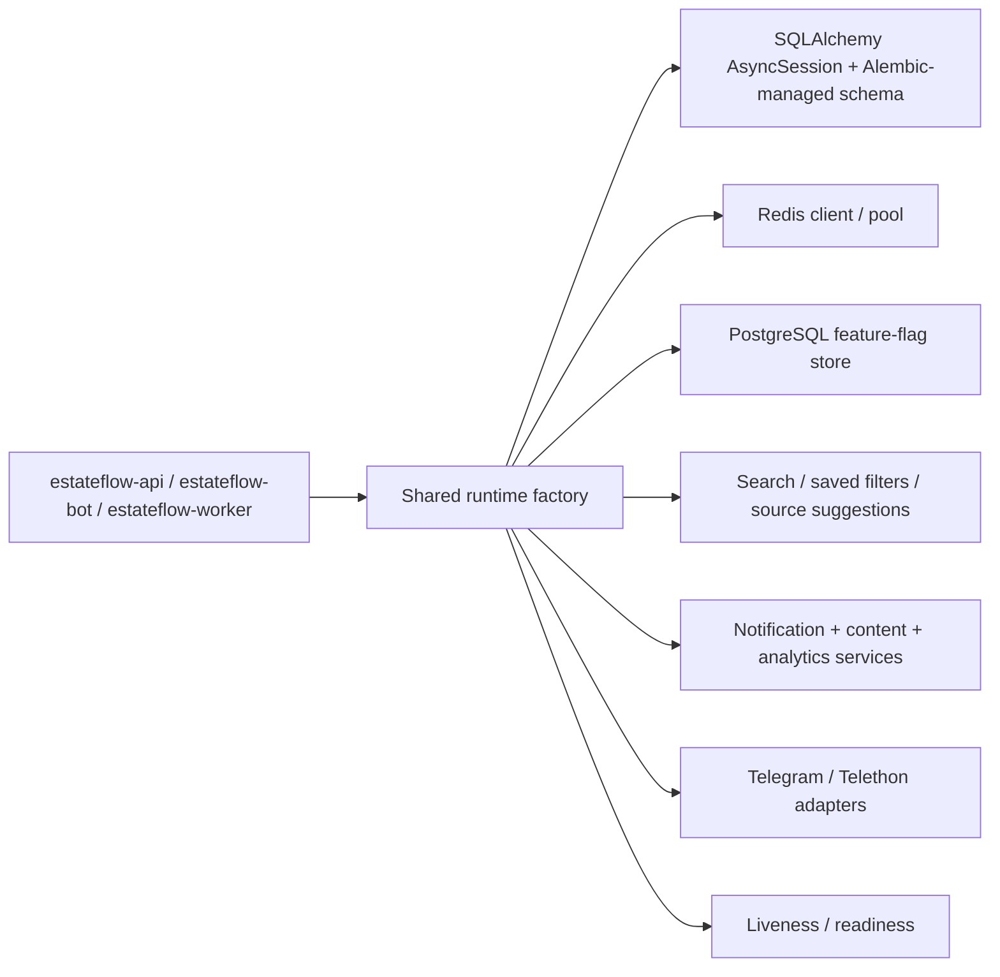

# Sprint 8 Remediation Handoff

## Xulosa

Sprint 8 review topilmalarini throwaway PostgreSQL va real pytest evidence bilan qayta tekshirdim. Fresh DB uchun Alembic head endi yagona source of truth, legacy SQL esa archive/reference sifatida qoldi. Data-loss shortcut ishlatilmadi.

## Runtime Composition



API, bot va worker alohida entrypointlarda ishlaydi. `create_app()` real runtime graphni composition root orqali ulanadi. Lifespan startupda DB va Redis client yaratadi, shutdownda deterministik yopadi. `ops_notifier` testlarda override qilinishi mumkin, lekin production runtime shared factorydan keladi.

## Alembic Workflow

### Fresh database

`alembic upgrade head` ishlaydi va joriy revision chain:

- `5fdae000458c`
- `9b77c0b3d5a1`
- `c4d8e7f1a2b3`
- `e7f2a1b3c4d5`
- `f8a3b2c4d5e6` (`head`)

Baseline `announcements.is_promoted` ni `NOT NULL DEFAULT false` bilan yaratadi.

### Legacy database bridge

Bridge yo‘li qat'iy:

1. `bridge-check` bilan explicit inspection qilinadi.
2. Raw legacy SQL `announcements.is_promoted` contractiga mos kelmasa, `stamp head` qilinmaydi.
3. Mos kelmaydigan legacy DB uchun explicit forward fix qo‘llanadi.
4. Faqat shundan keyin `bridge-stamp --confirmed` ruxsat etiladi.

`scripts/migration_smoke.psql` deprecated. Migration smoke uchun Alembic-based commandlar ishlatiladi.

## Auth Contract

- `POST /admin/source-suggestions` body orqali `user_id` qabul qilmaydi.
- Telegram bot flow `message.from_user.id` yoki server-validated trusted contextdan identity oladi.
- REST ingress kerak bo‘lsa Telegram WebApp `initData` yoki server-side authenticated context validated bo‘lishi shart.
- Admin actor client bodydan olinmaydi.
- Admin API token compare `secrets.compare_digest` orqali qilinadi.
- `expected_version` feature-flag update uchun majburiy.

## Persistent Flags Policy

- Feature flag state PostgreSQLda saqlanadi.
- Audit immutable va versioned.
- Concurrent update optimistic concurrency bilan himoyalangan.
- Restartdan keyin runtime state yo‘qolmaydi.
- Processlar yangi holatni DBdan ko‘radi.

## Evidence

### Fresh Alembic + bridge

Command:

```powershell
.venv\Scripts\python.exe -m alembic -c alembic.ini upgrade head
.venv\Scripts\python.exe -m alembic -c alembic.ini current
.venv\Scripts\python.exe scripts/schema_bridge_check.py --dsn postgresql://estateflow@127.0.0.1:55435/estateflow
```

Result:

- `alembic upgrade head` applies the chain through `f8a3b2c4d5e6`.
- `alembic current` returns `f8a3b2c4d5e6 (head)`.
- `schema_bridge_check.py` reported `schema matches ORM metadata and seed contract; safe to stamp after review.`

### Migration smoke

Command:

```powershell
.venv\Scripts\python.exe scripts/migration_smoke.py --dsn postgresql://estateflow@127.0.0.1:55435/estateflow
```

Result:

- Exit code `0`.
- JSON summary included:
  - `"revision": "f8a3b2c4d5e6"`
  - `"is_promoted_nullable": "NO"`
  - `"is_promoted_default": "false"`
  - `"approved_seed_count": 8`

### Runtime / regression tests

Command:

```powershell
.venv\Scripts\python.exe -m pytest -q tests/test_sprint3_migration.py tests/test_sprint7_release_readiness.py tests/test_sprint8_review_red.py tests/test_sprint8_alembic_integration.py tests/test_runtime_integration.py
.venv\Scripts\python.exe -m pytest -q
```

Result:

- Both commands passed.
- Full suite finished with skips only for Docker-gated smoke tests when appropriate.
- No failures remained after the fixes.

### Compose and lint

Command:

```powershell
docker compose config
.venv\Scripts\python.exe -m ruff check src/estateflow/api/app.py tests/conftest.py src/estateflow/db/schema_inspection.py src/estateflow/models/orm.py src/estateflow/db/migration_cli.py alembic/versions/0003_promote_is_promoted_not_null.py tests/test_sprint8_alembic_integration.py
```

Result:

- `docker compose config` rendered successfully.
- Ruff passed on the changed files.

## Known Risks

- Repository-wide strict MyPy gate is clean for `src` and the approved tests baseline.
- Legacy SQL files remain archived/reference material only. They are not the production source of truth.
- `bridge-stamp` must stay manual and inspection-gated. Never auto-stamp from startup or deployment bootstrap.
- Compose connects to the password-protected DigitalOcean PostgreSQL service; no trust-auth PostgreSQL container is used.
